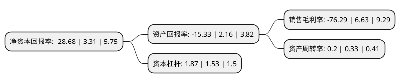

> 本页面由自动化程序生成于 2022年5月20日 01:14
> 内容可能存在错误，如有bug请提交issue至：https://github.com/Eroleice/doc-pi/issues
{.is-warning}

# 上市公司基本情况

## 基本资料

思创医惠科技股份有限公司（以下简称“思创医惠”）成立于2003年11月21日，杭州市。于2010年04月30日在深交所创业板上市。

思创医惠注册资本86,612.987万元，公司的主营业务是电子商品防盗系统产品的研发，生产和销售，细分产品为各类硬标签，射频软标签，声磁软标签等防盗标签和开锁器，解码器，检测器等配套设备，公司目前以EAS产品中的防盗标签为核心产品。以下是详细信息：

- 公司名称: 思创医惠科技股份有限公司
- 股票代码: 300078.SZ
- 所在地: 浙江 - 杭州市
- 成立日期: 2003年11月21日
- 注册资本: 86,612.987万元
- 法定代表人: 章笠中
- 主营业务: 公司的主营业务是电子商品防盗系统产品的研发，生产和销售，细分产品为各类硬标签，射频软标签，声磁软标签等防盗标签和开锁器，解码器，检测器等配套设备，公司目前以EAS产品中的防盗标签为核心产品
- 公司官网: www.sichuangyihui.com.cn
- 公司介绍: 公司是服务于零售业的全球著名品牌，同时专注于无线射频识别系统(RFID)定制化硬件产品和行业应用解决方案的开发与服务，是零售支持领域新理念的开拓者和引领者。公司为客户提供一站式的产品及服务。在工厂制造的来料管理、过程控制方面，在流通环节中的溯源管理、渠道窜货控制方面，以及在零售终端的门店盘货、防损、以及客户购物体验等整个供应链中充当着积极、专业、快速支持、高效服务的角色。在数字化信息时代，思创人在为企业提升品牌及销量方面提供坚强后盾的同时，也为零售业管理、营销、业绩的提升提供强大支持。公司2005年的瓶类防盗扣被欧洲《零售业技术》杂志评为年度最佳设计。

## 股东及高管情况

上市公司第一大股东为路楠，持股62,739,500股，占比7.24%，**疑似为**上市公司实际控制人。

截至2022年03月31日，上市公司的前十大股东中，共有4名自然人股东，3名机构股东，2个产品账户，1个海外主体，其中5%以上大股东共有2名。上市公司前十大股东明细如下：

> 未能通过持股比例判定出上市公司实际控制人（持股30%以上）
> 可能存在通过间接持股、联合持股、协议控制等方式拥有实际控制权的主体，具体请参考上市公司定期公告！
{.is-warning}

> 上市公司第一大股东持股不超过10%，请检查是否存在公司控制权风险！
{.is-danger}

> 截至2022年03月31日，上市公司前十大股东信息如下：

| 股东名称 | 持股数量（股） | 持股比例 |
| --- | --- | --- |
| 路楠 | 62,739,500 | 7.24% |
| 云海链控股股份有限公司 | 60,858,803 | 7.03% |
| 杭州思创医惠集团有限公司 | 30,053,809 | 3.47% |
| 章笠中 | 24,601,203 | 2.84% |
| 方振淳 | 23,231,471 | 2.68% |
| 浙江富浙股权投资基金管理有限公司-浙江深改产业发展合伙企业(有限合伙) | 13,452,914 | 1.55% |
| 全国社保基金一一八组合 | 6,457,399 | 0.75% |
| 杭州博泰投资管理有限公司 | 6,006,776 | 0.69% |
| 陈武峰 | 5,580,100 | 0.64% |
| 香港中央结算有限公司(陆股通) | 5,081,555 | 0.59% |

## 杜邦分析

> 数据列示周期：2021年 | 2020年 | 2019年
{.is-info}

上市公司的净资产收益率在近一年有所下降，下降幅度为-966.47%，其变化情况分解如下：
- 上市公司的销售毛利率在近一年下降了-1250.68%，可能是生产效率的下降、商品原材料价格上涨或商品价格的下跌所致。
- 上市公司的资产周转率在近一年下降了-39.39%，可能是源自于更慢的销售回款或库存管理效果下降。
- 上市公司的财务杠杆比率在近一年上升了22.22%，可能是增加负债扩大生产规模。

