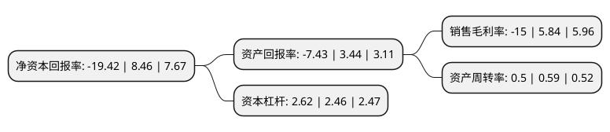

> 本页面由自动化程序生成于 2022年5月20日 01:14
> 内容可能存在错误，如有bug请提交issue至：https://github.com/Eroleice/doc-pi/issues
{.is-warning}

# 上市公司基本情况

## 基本资料

易联众信息技术股份有限公司（以下简称“易联众”）成立于2000年07月14日，厦门市。于2010年07月28日在深交所创业板上市。

易联众注册资本43,000万元，主要产品:智慧医院整体解决方案，健康城市解决方案，区域卫生平台整体方案，医改信息化整体解决方案，医保控费解决方案，基层卫生平台整体方案，各类互联网+移动医疗解决方案等。主营业务:医疗卫生领域业务，公共服务业务，产业金融业务，大数据业务等业务。以下是详细信息：

- 公司名称: 易联众信息技术股份有限公司
- 股票代码: 300096.SZ
- 所在地: 福建 - 厦门市
- 成立日期: 2000年07月14日
- 注册资本: 43,000万元
- 法定代表人: 张曦
- 主营业务: 主要产品:智慧医院整体解决方案，健康城市解决方案，区域卫生平台整体方案，医改信息化整体解决方案，医保控费解决方案，基层卫生平台整体方案，各类互联网+移动医疗解决方案等主营业务:医疗卫生领域业务，公共服务业务，产业金融业务，大数据业务等业务
- 公司官网: www.ylzinfo.com
- 公司介绍: 公司是国内民生信息服务行业第一家上市企业。公司秉承专注、创新、简捷之道，成立十多年来，专注于惠及人民群众生老病死、关系社会和谐发展的民生领域。凭借对行业的深刻理解及专业的技术研发能力，公司在核心技术领域及商业模式上持续创新并创造行业内多项第一，引领民生行业在社会管理及公共服务等方面迅速发展及深刻改变。公司携手合作伙伴共同构筑“民生信息服务云计算平台”面向政府、企业和社会公众提供金融社保卡、自助服务终端及在医疗健康、社会保障、就业服务、教育、住房等民生领域的易用便捷的全线产品和服务，致力于成为“中国最专业的民生行业应用解决方案提供商和领先的民生信息服务提供商”。

## 股东及高管情况

上市公司第一大股东为张曦，持股69,681,649股，占比16.21%，**疑似为**上市公司实际控制人。

截至2022年04月07日，上市公司的前十大股东中，共有5名自然人股东，4名机构股东，1个产品账户，其中5%以上大股东共有4名。上市公司前十大股东明细如下：

> 未能通过持股比例判定出上市公司实际控制人（持股30%以上）
> 可能存在通过间接持股、联合持股、协议控制等方式拥有实际控制权的主体，具体请参考上市公司定期公告！
{.is-warning}

> 截至2022年04月07日，上市公司前十大股东信息如下：

| 股东名称 | 持股数量（股） | 持股比例 |
| --- | --- | --- |
| 张曦 | 69,681,649 | 16.21% |
| 微医控股(浙江)有限公司 | 41,200,000 | 9.58% |
| 微医控股有限公司 | 41,200,000 | 9.58% |
| 西藏五维资产管理有限公司 | 23,400,000 | 5.44% |
| 厦门麟真贸易有限公司 | 16,384,218 | 3.81% |
| 林三 | 2,167,304 | 0.5% |
| 王志荣 | 1,667,600 | 0.39% |
| 黄文灿 | 1,622,246 | 0.38% |
| 吴跃良 | 1,521,000 | 0.35% |
| 中国银行股份有限公司-华夏行业景气混合型证券投资基金 | 1,440,300 | 0.33% |

## 利润表分析

上市公司2021年总收入为8.71亿元，净利润为-1.31亿元，**未实现盈利**。

## 杜邦分析

> 数据列示周期：2021年 | 2020年 | 2019年
{.is-info}

上市公司的净资产收益率在近一年有所下降，下降幅度为-329.55%，其变化情况分解如下：
- 上市公司的销售毛利率在近一年下降了-356.85%，可能是生产效率的下降、商品原材料价格上涨或商品价格的下跌所致。
- 上市公司的资产周转率在近一年下降了-15.25%，可能是源自于更慢的销售回款或库存管理效果下降。
- 上市公司的财务杠杆比率在近一年上升了6.5%，可能是增加负债扩大生产规模。

