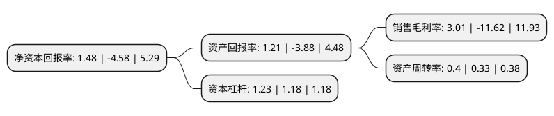

> 本页面由自动化程序生成于 2022年5月20日 01:15
> 内容可能存在错误，如有bug请提交issue至：https://github.com/Eroleice/doc-pi/issues
{.is-warning}

# 上市公司基本情况

## 基本资料

北京世纪瑞尔技术股份有限公司（以下简称“世纪瑞尔”）成立于1999年05月03日，北京市。于2010年12月22日在深交所创业板上市。

世纪瑞尔注册资本58,510.605万元，主要产品:铁路综合视频监控系统，铁路防灾安全监控系统，铁路综合监控系统平台，铁路通信监控系统等。主营业务:主营铁路行车安全监控系统，铁路和城市轨道交通乘客资讯系统产品以及铁路综合运维服务等。以下是详细信息：

- 公司名称: 北京世纪瑞尔技术股份有限公司
- 股票代码: 300150.SZ
- 所在地: 北京 - 北京市
- 成立日期: 1999年05月03日
- 注册资本: 58,510.605万元
- 法定代表人: 牛俊杰
- 主营业务: 主要产品:铁路综合视频监控系统，铁路防灾安全监控系统，铁路综合监控系统平台，铁路通信监控系统等主营业务:主营铁路行车安全监控系统，铁路和城市轨道交通乘客资讯系统产品以及铁路综合运维服务等
- 公司官网: www.c-real.com.cn
- 公司介绍: 公司是中国最早从事开发、生产和销售轨道交通数字通信产品和自动广播设备的高科技企业。公司所属行业是轨道交通，主营轨道交通领域的行车安全监控系统、乘客信息系统(PIS)、广播系统(PA)、综合运维服务、通信系统、其他信息系统产品、水利产品、通信运营商产品的生产、开发、销售，以及相关系统集成、技术培训、技术咨询、技术支持服务。公司自设立以来一直以铁路行车安全监控领域为立足点，遵循“夯实基础、逐步扩展”的发展策略参与并见证了轨道交通市场的发展。

## 股东及高管情况

上市公司第一大股东为牛俊杰，持股89,949,488股，占比15.37%，**疑似为**上市公司实际控制人。

截至2022年03月31日，上市公司的前十大股东中，共有7名自然人股东，2名机构股东，1个产品账户，其中5%以上大股东共有3名。上市公司前十大股东明细如下：

> 未能通过持股比例判定出上市公司实际控制人（持股30%以上）
> 可能存在通过间接持股、联合持股、协议控制等方式拥有实际控制权的主体，具体请参考上市公司定期公告！
{.is-warning}

> 截至2022年03月31日，上市公司前十大股东信息如下：

| 股东名称 | 持股数量（股） | 持股比例 |
| --- | --- | --- |
| 牛俊杰 | 89,949,488 | 15.37% |
| 王铁 | 71,534,273 | 12.23% |
| 山东铁路发展基金有限公司 | 57,799,421 | 9.88% |
| 上海君丰银泰投资合伙企业(有限合伙) | 15,858,764 | 2.71% |
| 吴水清 | 4,400,000 | 0.75% |
| 杭州兴利投资有限公司 | 4,000,000 | 0.68% |
| 刘尚军 | 3,455,239 | 0.59% |
| 朱陆虎 | 3,453,702 | 0.59% |
| 尉剑刚 | 3,440,000 | 0.59% |
| 李丰 | 3,440,000 | 0.59% |

## 利润表分析

上市公司2021年总收入为9.4亿元，净利润为0.28亿元，实现盈利。

## 杜邦分析

> 数据列示周期：2021年 | 2020年 | 2019年
{.is-info}

上市公司的净资产收益率在近一年有所下降，下降幅度为-132.31%，其变化情况分解如下：
- 上市公司的销售毛利率在近一年下降了-125.9%，可能是生产效率的下降、商品原材料价格上涨或商品价格的下跌所致。
- 上市公司的资产周转率在近一年上升了21.21%，可能是源自于更快的销售回款或库存管理效果提升。
- 上市公司的财务杠杆比率在近一年上升了4.24%，可能是增加负债扩大生产规模。

