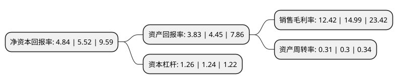

> 本页面由自动化程序生成于 2022年5月20日 01:15
> 内容可能存在错误，如有bug请提交issue至：https://github.com/Eroleice/doc-pi/issues
{.is-warning}

# 上市公司基本情况

## 基本资料

北京东方国信科技股份有限公司（以下简称“东方国信”）成立于1997年07月28日，北京市。于2011年01月25日在深交所创业板上市。

东方国信注册资本115,238.144万元，主要产品:大数据采集设备，大数据处理专用设备，大数据存储及计算，大数据管控，大数据分析，私有云平台，大数据展现及移动应用等。主营业务:为客户提供企业级大数据及云平台整体解决方案。公司主营的商业智能系统解决方案，可以细分为企业数据平台，数据分析平台和基于BI的CRM应用三类产品。以下是详细信息：

- 公司名称: 北京东方国信科技股份有限公司
- 股票代码: 300166.SZ
- 所在地: 北京 - 北京市
- 成立日期: 1997年07月28日
- 注册资本: 115,238.144万元
- 法定代表人: 管连平
- 主营业务: 主要产品:大数据采集设备，大数据处理专用设备，大数据存储及计算，大数据管控，大数据分析，私有云平台，大数据展现及移动应用等主营业务:为客户提供企业级大数据及云平台整体解决方案公司主营的商业智能系统解决方案，可以细分为企业数据平台，数据分析平台和基于BI的CRM应用三类产品
- 公司官网: www.bonc.com.cn
- 公司介绍: 公司主营业务是致力于为客户提供企业级大数据及云平台整体解决方案，基于大数据、云计算、人工智能和机器学习等世界前沿技术提供包括数据采集、数据存储计算、数据分析挖掘、数据应用、数据治理管控、云基础服务与应用开发平台、智慧城市等相关产品、服务与解决方案，帮助客户发掘数据深层次价值，提升IT资源利用率及服务能力，从而获得更高的生产效率和经营效益。公司构建了云化架构的大数据产品线，形成了体系化、自主化的大数据核心产品体系，涵盖了大数据采集设备、大数据处理专用设备、大数据存储及计算、大数据管控、大数据分析、私有云平台、大数据展现及移动应用等各个方面。通过多年的自主研发，公司对标国内外优秀软件与产品打造了大数据及云计算的核心产品能力，这些产品已经在众多行业客户中得到了广泛与成功的应用。

## 股东及高管情况

上市公司第一大股东为管连平，持股177,964,857股，占比15.44%，**疑似为**上市公司实际控制人。

截至2022年03月31日，上市公司的前十大股东中，共有4名自然人股东，2名机构股东，3个产品账户，1个海外主体，其中5%以上大股东共有2名。上市公司前十大股东明细如下：

> 未能通过持股比例判定出上市公司实际控制人（持股30%以上）
> 可能存在通过间接持股、联合持股、协议控制等方式拥有实际控制权的主体，具体请参考上市公司定期公告！
{.is-warning}

> 截至2022年03月31日，上市公司前十大股东信息如下：

| 股东名称 | 持股数量（股） | 持股比例 |
| --- | --- | --- |
| 管连平 | 177,964,857 | 15.44% |
| 霍卫平 | 130,162,360 | 11.3% |
| 香港中央结算有限公司(陆股通) | 11,388,548 | 0.99% |
| 章祺 | 9,380,435 | 0.81% |
| 新余仁邦时代投资管理有限公司 | 9,088,412 | 0.79% |
| 新余仁邦翰威投资管理有限公司 | 8,485,200 | 0.74% |
| 杨宏 | 7,635,331 | 0.66% |
| 国泰君安证券资管-山东铁路发展基金有限公司-国君资管2765单一资产管理计划 | 4,822,335 | 0.42% |
| 中国银行股份有限公司-华夏中证5G通信主题交易型开放式指数证券投资基金 | 4,574,713 | 0.4% |
| 中国农业银行股份有限公司-中证500交易型开放式指数证券投资基金 | 4,248,630 | 0.37% |

## 利润表分析

上市公司2021年总收入为24.69亿元，净利润为3.06亿元，实现盈利。

## 杜邦分析

> 数据列示周期：2021年 | 2020年 | 2019年
{.is-info}

上市公司的净资产收益率在近一年有所下降，下降幅度为-12.32%，其变化情况分解如下：
- 上市公司的销售毛利率在近一年下降了-17.14%，可能是生产效率的下降、商品原材料价格上涨或商品价格的下跌所致。
- 上市公司的资产周转率在近一年上升了3.33%，可能是源自于更快的销售回款或库存管理效果提升。
- 上市公司的财务杠杆比率在近一年上升了1.61%，可能是增加负债扩大生产规模。

