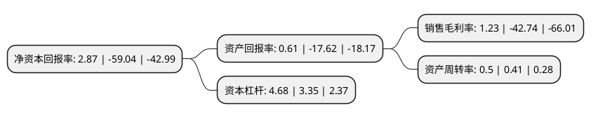

> 本页面由自动化程序生成于 2022年5月20日 01:15
> 内容可能存在错误，如有bug请提交issue至：https://github.com/Eroleice/doc-pi/issues
{.is-warning}

# 上市公司基本情况

## 基本资料

万达信息股份有限公司（以下简称“万达信息”）成立于1995年11月09日，上海市。于2011年01月25日在深交所创业板上市。

万达信息注册资本118,758.476万元，主要产品:健康云，医疗云，医药云，保险云和智慧城市运营中心。主营业务:系统建设，运营服务以及与社会各界广泛合作“互联网+”增值业务。以下是详细信息：

- 公司名称: 万达信息股份有限公司
- 股票代码: 300168.SZ
- 所在地: 上海 - 上海市
- 成立日期: 1995年11月09日
- 注册资本: 118,758.476万元
- 法定代表人: 胡宏伟
- 主营业务: 主要产品:健康云，医疗云，医药云，保险云和智慧城市运营中心主营业务:系统建设，运营服务以及与社会各界广泛合作“互联网+”增值业务
- 公司官网: www.wondersgroup.com
- 公司介绍: 公司是国内领先的智慧城市领军企业。公司业务由原来的软件开发、系统集成和运营服务(3S)逐步过渡到系统建设(原软件开发、系统集成)，运营服务(主要为SaaS模式的云服务)，以及与社会各界广泛合作“互联网+”增值业务。历经多年发展，公司在城市各行业积累了丰富经验，形成了突出的行业软件与服务优势。公司以行业核心业务为基石，重点发展公共服务在线运营，积极开拓线下闭环服务，不断使城市的运营效率得到提升，服务更为便捷，引领全国医疗健康、文化教育等行业的变革。公司自评审资质初始以来，历年被列为“国家规划布局内重点软件企业”，承担了多个国家核高基专项课题，拥有众多行业独立自主知识产权的软件产品。

## 股东及高管情况

上市公司第一大股东为中国人寿保险股份有限公司-传统-普通保险产品-005L-CT001深，持股156,488,470股，占比13.18%，**疑似为**上市公司实际控制人。

截至2022年03月31日，上市公司的前十大股东中，共有2名自然人股东，4名机构股东，3个产品账户，1名其他股东，其中5%以上大股东共有2名。上市公司前十大股东明细如下：

> 未能通过持股比例判定出上市公司实际控制人（持股30%以上）
> 可能存在通过间接持股、联合持股、协议控制等方式拥有实际控制权的主体，具体请参考上市公司定期公告！
{.is-warning}

> 截至2022年03月31日，上市公司前十大股东信息如下：

| 股东名称 | 持股数量（股） | 持股比例 |
| --- | --- | --- |
| 中国人寿保险股份有限公司-传统-普通保险产品-005L-CT001深 | 156,488,470 | 13.18% |
| 和谐健康保险股份有限公司-万能产品 | 117,190,000 | 9.87% |
| 中国人寿保险股份有限公司-分红-个人分红-005L-FH002深 | 59,260,000 | 4.99% |
| 上海市市场监督管理局监测评价中心 | 47,738,832 | 4.02% |
| 上海科技创业投资有限公司 | 36,674,000 | 3.09% |
| 陈耀远 | 23,714,290 | 2% |
| 朗新科技集团股份有限公司 | 17,430,000 | 1.47% |
| 信泰人寿保险股份有限公司-传统产品 | 14,026,824 | 1.18% |
| 陈洁 | 13,263,843 | 1.12% |
| 广发证券股份有限公司 | 12,024,846 | 1.01% |

## 利润表分析

上市公司2021年总收入为35.13亿元，净利润为0.43亿元，实现盈利。

## 杜邦分析

> 数据列示周期：2021年 | 2020年 | 2019年
{.is-info}

上市公司的净资产收益率在近一年有所下降，下降幅度为-104.86%，其变化情况分解如下：
- 上市公司的销售毛利率在近一年下降了-102.88%，可能是生产效率的下降、商品原材料价格上涨或商品价格的下跌所致。
- 上市公司的资产周转率在近一年上升了21.95%，可能是源自于更快的销售回款或库存管理效果提升。
- 上市公司的财务杠杆比率在近一年上升了39.7%，可能是增加负债扩大生产规模。

