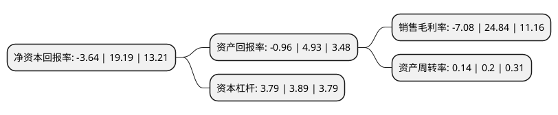

> 本页面由自动化程序生成于 2022年5月20日 01:15
> 内容可能存在错误，如有bug请提交issue至：https://github.com/Eroleice/doc-pi/issues
{.is-warning}

# 上市公司基本情况

## 基本资料

北京易华录信息技术股份有限公司（以下简称“易华录”）成立于2001年04月30日，北京市。于2011年05月05日在深交所创业板上市。

易华录注册资本66,581.431万元，主要产品:大数据基础设施，大数据应用产品。主营业务:通过建设政府大数据基础设施，打造数据湖生态运营，通过协同生态合作伙伴开发公安交通，公共安全，健康养老，政务，医疗，教育和信用等行业的大数据应用产品，从而通过数据湖应用服务提升政府城市治理能力，提高政府民生服务水平和质量，推动城市产业转型升级，实现政府用户强政，兴业，惠民的发展需求。以下是详细信息：

- 公司名称: 北京易华录信息技术股份有限公司
- 股票代码: 300212.SZ
- 所在地: 北京 - 北京市
- 成立日期: 2001年04月30日
- 注册资本: 66,581.431万元
- 法定代表人: 林拥军
- 主营业务: 主要产品:大数据基础设施，大数据应用产品主营业务:通过建设政府大数据基础设施，打造数据湖生态运营，通过协同生态合作伙伴开发公安交通，公共安全，健康养老，政务，医疗，教育和信用等行业的大数据应用产品，从而通过数据湖应用服务提升政府城市治理能力，提高政府民生服务水平和质量，推动城市产业转型升级，实现政府用户强政，兴业，惠民的发展需求
- 公司官网: www.ehualu.com
- 公司介绍: 公司以数据湖为主体，协同发展大交通、大安全、大健康业务的“1+3”发展战略，将大数据产业作为公司的核心发展内容，并围绕数据产生、数据采集、数据存储、数据运营与应用及数据安全等内容开展数据湖生态打造。公司主营业务为通过建设政府大数据基础设施，打造数据湖生态运营，通过协同生态合作伙伴开发公安交通、公共安全、健康养老、政务、医疗、教育和信用等行业的大数据应用产品，从而通过数据湖应用服务提升政府城市治理能力，提高政府民生服务水平和质量，推动城市产业转型升级，实现政府用户强政、兴业、惠民的发展需求。

## 股东及高管情况

上市公司第一大股东为中国华录集团有限公司，持股229,124,004股，占比34.41%，为上市公司实际控制人。

截至2022年03月31日，上市公司的前十大股东中，共有3名自然人股东，3名机构股东，3个产品账户，1个海外主体，其中5%以上大股东共有1名。上市公司前十大股东明细如下：

> 截至2022年03月31日，上市公司前十大股东信息如下：

| 股东名称 | 持股数量（股） | 持股比例 |
| --- | --- | --- |
| 中国华录集团有限公司 | 229,124,004 | 34.41% |
| 林拥军 | 28,209,628 | 4.24% |
| 华录资本控股有限公司 | 16,345,210 | 2.45% |
| 罗坚 | 12,072,433 | 1.81% |
| 香港中央结算有限公司(陆股通) | 12,052,739 | 1.81% |
| 上海浦东发展银行股份有限公司-广发小盘成长混合型证券投资基金(LOF) | 12,000,000 | 1.8% |
| 华夏人寿保险股份有限公司-自有资金 | 8,266,598 | 1.24% |
| 中国建设银行股份有限公司-广发多元新兴股票型证券投资基金 | 7,685,482 | 1.15% |
| 中国银行股份有限公司-华夏行业景气混合型证券投资基金 | 6,462,183 | 0.97% |
| 毕伟 | 5,620,000 | 0.84% |

## 杜邦分析

> 数据列示周期：2021年 | 2020年 | 2019年
{.is-info}

上市公司的净资产收益率在近一年有所下降，下降幅度为-118.97%，其变化情况分解如下：
- 上市公司的销售毛利率在近一年下降了-128.5%，可能是生产效率的下降、商品原材料价格上涨或商品价格的下跌所致。
- 上市公司的资产周转率在近一年下降了-30%，可能是源自于更慢的销售回款或库存管理效果下降。
- 上市公司的财务杠杆比率在近一年下降了-2.57%，可能是减少负债降低财务费用。

