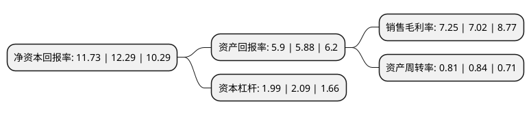

> 本页面由自动化程序生成于 2022年5月20日 01:16
> 内容可能存在错误，如有bug请提交issue至：https://github.com/Eroleice/doc-pi/issues
{.is-warning}

# 上市公司基本情况

## 基本资料

北京银信长远科技股份有限公司（以下简称“银信科技”）成立于2004年05月31日，北京市。于2011年06月15日在深交所创业板上市。

银信科技注册资本44,210.022万元，主要产品:IT基础设施服务。主营业务:面向政府和各类企事业单位数据中心IT基础设施提供一站式IT运维整体解决方案。以下是详细信息：

- 公司名称: 北京银信长远科技股份有限公司
- 股票代码: 300231.SZ
- 所在地: 北京 - 北京市
- 成立日期: 2004年05月31日
- 注册资本: 44,210.022万元
- 法定代表人: 詹立雄
- 主营业务: 主要产品:IT基础设施服务主营业务:面向政府和各类企事业单位数据中心IT基础设施提供一站式IT运维整体解决方案
- 公司官网: www.trustfar.cn
- 公司介绍: 公司是一家全国性、专业化的数据中心“一站式”IT运维服务商，主要面向政府和企事业单位数据中心IT基础设施提供第三方运维服务、智慧城市解决方案、系统集成服务、以及IT运维管理相关产品的研发与销售服务。凭借多年专业化服务，公司服务区域已经覆盖了全国100多个城市，并和工、农、中、建、交为首的中国各大商业银行建立起长期、稳定的合作关系，在IT运维服务要求最为苛刻的银行业中，占据有利的竞争优势地位。除此以外，银信科技的客户遍布中国移动、中国电信、中国联通、证券、保险、政府、电力、航空、商业、制造业等行业，客户数达500家。在智慧城市业务领域，公司依托深厚的技术研发能力和专业团队，在智慧城管、云计算、智慧交通、智慧医疗、智慧建筑、智慧教育、智慧能源、智慧环境、智慧旅游、智慧金融等领域形成了完整、先进的综合解决方案。公司继续追踪计算机技术的发展步伐，加强自主创新力度，探索云计算、大数据技术企业级的应用处理技术，深入在数据中心IT综合运维服务领域的扩展，努力成为本土数据中心IT运维服务商的典范。

## 股东及高管情况

上市公司第一大股东为詹立雄，持股100,473,520股，占比22.73%，**疑似为**上市公司实际控制人。

截至2022年03月31日，上市公司的前十大股东中，共有9名自然人股东，1个产品账户，其中5%以上大股东共有1名。上市公司前十大股东明细如下：

> 未能通过持股比例判定出上市公司实际控制人（持股30%以上）
> 可能存在通过间接持股、联合持股、协议控制等方式拥有实际控制权的主体，具体请参考上市公司定期公告！
{.is-warning}

> 截至2022年03月31日，上市公司前十大股东信息如下：

| 股东名称 | 持股数量（股） | 持股比例 |
| --- | --- | --- |
| 詹立雄 | 100,473,520 | 22.73% |
| 曾丹 | 6,136,800 | 1.39% |
| 上海纯达资产管理有限公司-纯达蓝宝石6号私募证券投资基金 | 4,652,500 | 1.05% |
| 乔明德 | 3,181,391 | 0.72% |
| 吕阿宝 | 1,673,800 | 0.38% |
| 于本宏 | 1,605,468 | 0.36% |
| 张霄凌 | 1,480,000 | 0.33% |
| 许炳兴 | 1,104,400 | 0.25% |
| 李毅 | 1,046,440 | 0.24% |
| 余琦 | 899,800 | 0.2% |

## 利润表分析

上市公司2021年总收入为23.48亿元，净利润为1.7亿元，实现盈利。

## 杜邦分析

> 数据列示周期：2021年 | 2020年 | 2019年
{.is-info}

上市公司的净资产收益率在近一年有所下降，下降幅度为-4.56%，其变化情况分解如下：
- 上市公司的销售毛利率在近一年上升了3.28%，可能是生产效率的提升、商品原材料价格下跌或商品价格的上涨所致。
- 上市公司的资产周转率在近一年下降了-3.57%，可能是源自于更慢的销售回款或库存管理效果下降。
- 上市公司的财务杠杆比率在近一年下降了-4.78%，可能是减少负债降低财务费用。

