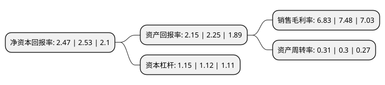

> 本页面由自动化程序生成于 2022年5月20日 01:16
> 内容可能存在错误，如有bug请提交issue至：https://github.com/Eroleice/doc-pi/issues
{.is-warning}

# 上市公司基本情况

## 基本资料

上海天玑科技股份有限公司（以下简称“天玑科技”）成立于2001年10月24日，上海市。于2011年07月19日在深交所创业板上市。

天玑科技注册资本31,345.749万元，主要产品:PBData数据库一体机。主营业务:IT支持与维护服务，IT外包服务，IT专业服务，IT软件服务，自有产品销售。以下是详细信息：

- 公司名称: 上海天玑科技股份有限公司
- 股票代码: 300245.SZ
- 所在地: 上海 - 上海市
- 成立日期: 2001年10月24日
- 注册资本: 31,345.749万元
- 法定代表人: 苏玉军
- 主营业务: 主要产品:PBData数据库一体机主营业务:IT支持与维护服务，IT外包服务，IT专业服务，IT软件服务，自有产品销售
- 公司官网: www.dnt.com.cn
- 公司介绍: 公司是中国领先的IT基础设施解决方案提供商，业务包括IT基础设施产品支持服务、IT基础设施专业服务和IT基础设施管理外包服务。公司是较早进入并长期专注于数据中心IT基础设施专业第三方服务市场，在中国数据中心IT基础设施专业第三方服务公司排名中居于领先地位，已为中国二十几个省级电信运营商提供IT运维和维保服务。公司已经完成必要的专业团队建设、IT基础设施管理和技术实施所需的软件工具开发能力、大型客户成功案例的积累。目前“天玑科技”品牌在数据中心IT基础设施专业第三方服务市场已形成良好的品牌形象。

## 股东及高管情况

上市公司第一大股东为深圳裕龙资本投资管理有限公司，持股26,255,000股，占比8.38%，**疑似为**上市公司实际控制人。

截至2022年04月28日，上市公司的前十大股东中，共有7名自然人股东，2名机构股东，1个产品账户，其中5%以上大股东共有1名。上市公司前十大股东明细如下：

> 未能通过持股比例判定出上市公司实际控制人（持股30%以上）
> 可能存在通过间接持股、联合持股、协议控制等方式拥有实际控制权的主体，具体请参考上市公司定期公告！
{.is-warning}

> 上市公司第一大股东持股不超过10%，请检查是否存在公司控制权风险！
{.is-danger}

> 截至2022年04月28日，上市公司前十大股东信息如下：

| 股东名称 | 持股数量（股） | 持股比例 |
| --- | --- | --- |
| 深圳裕龙资本投资管理有限公司 | 26,255,000 | 8.38% |
| 苏博 | 14,359,622 | 4.58% |
| 北京新润投资有限公司 | 11,745,000 | 3.75% |
| 邹月普 | 10,945,762 | 3.49% |
| 武汉昭融汇利投资管理有限责任公司-昭融汇利冬雅8号私募基金 | 10,000,000 | 3.19% |
| 朱明明 | 3,830,000 | 1.22% |
| 陆文雄 | 3,454,139 | 1.1% |
| 丁建祖 | 3,200,000 | 1.02% |
| 刘蓉蓉 | 2,762,800 | 0.88% |
| 杜力耘 | 2,563,632 | 0.82% |

## 利润表分析

上市公司2021年总收入为5.42亿元，净利润为0.37亿元，实现盈利。

## 杜邦分析

> 数据列示周期：2021年 | 2020年 | 2019年
{.is-info}

上市公司的净资产收益率在近一年有所下降，下降幅度为-2.37%，其变化情况分解如下：
- 上市公司的销售毛利率在近一年下降了-8.69%，可能是生产效率的下降、商品原材料价格上涨或商品价格的下跌所致。
- 上市公司的资产周转率在近一年上升了3.33%，可能是源自于更快的销售回款或库存管理效果提升。
- 上市公司的财务杠杆比率在近一年上升了2.68%，可能是增加负债扩大生产规模。

