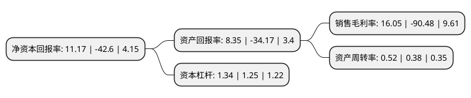

> 本页面由自动化程序生成于 2022年5月20日 01:16
> 内容可能存在错误，如有bug请提交issue至：https://github.com/Eroleice/doc-pi/issues
{.is-warning}

# 上市公司基本情况

## 基本资料

杭州初灵信息技术股份有限公司（以下简称“初灵信息”）成立于1999年12月10日，杭州市。于2011年08月03日在深交所创业板上市。

初灵信息注册资本21,998.99万元，主营业务为信息接入方案的设计及相应设备的研发，生产和销售。公司的主要产品包括广电宽带接入系统，大客户接入系统及机房设备管理系统三大类。以下是详细信息：

- 公司名称: 杭州初灵信息技术股份有限公司
- 股票代码: 300250.SZ
- 所在地: 浙江 - 杭州市
- 成立日期: 1999年12月10日
- 注册资本: 21,998.99万元
- 法定代表人: 洪爱金
- 主营业务: 主营业务为信息接入方案的设计及相应设备的研发，生产和销售公司的主要产品包括广电宽带接入系统，大客户接入系统及机房设备管理系统三大类
- 公司官网: www.cncr-it.com
- 公司介绍: 公司是专注于大数据接入设备的研发设计、制造和营销服务的国家高科技企业。公司自2011年上市以来，在原有大数据接入的产业基础上，积极布局大数据产业链，通过内沿式发展及外延式扩张，形成了大数据接入、大数据挖掘和分析、大数据应用和服务及逐步拥有数据源的生态链。公司先后并购了杭州博科思科技有限公司、深圳博瑞得科技有限公司，进军大数据的挖掘分析行业，同时延伸到运营商的数据服务；2016年并购了北京视达科科技有限公司，将大数据服务延伸到视频行业；同时收购了网经科技(苏州)有限公司，充实原有的大数据接入产业。公司积极参股以智能家居、智慧生活、智能机房以及征信等有数据源的公司，积极布局征信、广告类的大数据应用公司，并且已与贵阳的大数据交易所形成战略合作。

## 股东及高管情况

上市公司第一大股东为洪爱金，持股73,907,319股，占比33.6%，为上市公司实际控制人。

截至2022年03月31日，上市公司的前十大股东中，共有6名自然人股东，1名机构股东，2个产品账户，1个海外主体，其中5%以上大股东共有1名。上市公司前十大股东明细如下：

> 截至2022年03月31日，上市公司前十大股东信息如下：

| 股东名称 | 持股数量（股） | 持股比例 |
| --- | --- | --- |
| 洪爱金 | 73,907,319 | 33.6% |
| 浙江帝亨资产管理有限公司-帝亨钱塘6号私募证券投资基金 | 4,100,000 | 1.86% |
| 浙江银万斯特投资管理有限公司-银万全盈16号私募证券投资基金 | 2,337,940 | 1.06% |
| 沈爱华 | 950,000 | 0.43% |
| UBSAG | 727,235 | 0.33% |
| 崔蔚然 | 670,000 | 0.3% |
| 管洁明 | 632,300 | 0.29% |
| 海南川控实业有限公司 | 630,600 | 0.29% |
| 冀展清 | 621,900 | 0.28% |
| MORGANSTANLEY&CO.INTERNATIONALPLC. | 621,478 | 0.28% |

## 利润表分析

上市公司2021年总收入为4.86亿元，净利润为0.78亿元，实现盈利。

## 杜邦分析

> 数据列示周期：2021年 | 2020年 | 2019年
{.is-info}

上市公司的净资产收益率在近一年有所下降，下降幅度为-126.22%，其变化情况分解如下：
- 上市公司的销售毛利率在近一年下降了-117.74%，可能是生产效率的下降、商品原材料价格上涨或商品价格的下跌所致。
- 上市公司的资产周转率在近一年上升了36.84%，可能是源自于更快的销售回款或库存管理效果提升。
- 上市公司的财务杠杆比率在近一年上升了7.2%，可能是增加负债扩大生产规模。

