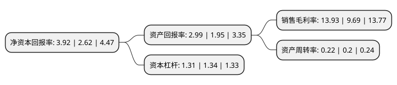

> 本页面由自动化程序生成于 2022年5月20日 01:16
> 内容可能存在错误，如有bug请提交issue至：https://github.com/Eroleice/doc-pi/issues
{.is-warning}

# 上市公司基本情况

## 基本资料

贵阳朗玛信息技术股份有限公司（以下简称“朗玛信息”）成立于1998年09月24日，贵阳市。于2012年02月16日在深交所创业板上市。

朗玛信息注册资本33,794.14万元，主营业务为医疗业务板块和电信业务板块，医疗业务板块主要包括有实体医院贵阳市第六医院，围绕实体医院开展的互联网医疗业务，流量领先的39健康网(启生信息)，医药流通业务等。电信业务板块主要有稳健的电话对对碰业务以及成长迅速的移动转售业务。以下是详细信息：

- 公司名称: 贵阳朗玛信息技术股份有限公司
- 股票代码: 300288.SZ
- 所在地: 贵州 - 贵阳市
- 成立日期: 1998年09月24日
- 注册资本: 33,794.14万元
- 法定代表人: 王伟
- 主营业务: 主营业务为医疗业务板块和电信业务板块，医疗业务板块主要包括有实体医院贵阳市第六医院，围绕实体医院开展的互联网医疗业务，流量领先的39健康网(启生信息)，医药流通业务等电信业务板块主要有稳健的电话对对碰业务以及成长迅速的移动转售业务
- 公司官网: www.longmaster.com.cn
- 公司介绍: 公司是贵州创业板上市的高科技先进企业。公司两大板块医疗+互联网医疗业务板块、电信增值业务板块持续稳定发展。医疗+互联网医疗板块坚持以互联网、大数据等技术作为医疗的“连接器”和“放大器”，通过外延式并购发展和内生式业务范围拓展，基本完成了包含医疗信息服务、医疗服务、医药流通、智能可穿戴设备等几个板块的布局，构建了信息互联网医疗生态圈。电信增值业务板块主要包含电话对对碰业务、移动转售业务。公司本着“敬畏医疗”的核心价值观，遵循互联网医疗的本质还是医疗的原则，连续多年入围中国互联网100强的互联网医疗企业；被国家部委联合认定为“国家规划布局内重点软件企业”和“贵州医疗健康云”建设运营单位。另外，公司运营着具有互联网思维的电话语音社区电话对对碰，与三大运营商建立了长期稳定的业务合作关系。

## 股东及高管情况

上市公司第一大股东为王伟，持股115,216,115股，占比34.09%，为上市公司实际控制人。

截至2022年03月31日，上市公司的前十大股东中，共有7名自然人股东，2名机构股东，1个产品账户，其中5%以上大股东共有1名。上市公司前十大股东明细如下：

> 截至2022年03月31日，上市公司前十大股东信息如下：

| 股东名称 | 持股数量（股） | 持股比例 |
| --- | --- | --- |
| 王伟 | 115,216,115 | 34.09% |
| 靳国文 | 14,205,811 | 4.2% |
| 刘玲 | 11,900,000 | 3.52% |
| 贵阳朗玛投资咨询企业(有限合伙) | 8,285,640 | 2.45% |
| 黄国宏 | 6,030,799 | 1.78% |
| 广州市玄元投资管理有限公司-玄元定增精选证券投资基金 | 4,279,900 | 1.27% |
| 史红军 | 3,351,500 | 0.99% |
| 宫龙 | 1,520,600 | 0.45% |
| 袁同合 | 980,000 | 0.29% |
| 中国国际金融香港资产管理有限公司-客户资金2 | 860,204 | 0.25% |

## 利润表分析

上市公司2021年总收入为4.05亿元，净利润为0.56亿元，实现盈利。

## 杜邦分析

> 数据列示周期：2021年 | 2020年 | 2019年
{.is-info}

上市公司的净资产收益率在近一年有所上升，上升幅度为49.62%，其变化情况分解如下：
- 上市公司的销售毛利率在近一年上升了43.76%，可能是生产效率的提升、商品原材料价格下跌或商品价格的上涨所致。
- 上市公司的资产周转率在近一年上升了10%，可能是源自于更快的销售回款或库存管理效果提升。
- 上市公司的财务杠杆比率在近一年下降了-2.24%，可能是减少负债降低财务费用。

