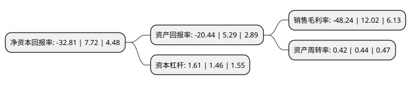

> 本页面由自动化程序生成于 2022年5月20日 01:16
> 内容可能存在错误，如有bug请提交issue至：https://github.com/Eroleice/doc-pi/issues
{.is-warning}

# 上市公司基本情况

## 基本资料

荣科科技股份有限公司（以下简称“荣科科技”）成立于2005年11月18日，沈阳市。于2012年02月16日在深交所创业板上市。

荣科科技注册资本63,923.757万元，IT服务，主要包括数据中心集成建设与运营维护的第三方服务，重点行业信息化解决方案以及金融IT外包服务以下是详细信息：

- 公司名称: 荣科科技股份有限公司
- 股票代码: 300290.SZ
- 所在地: 辽宁 - 沈阳市
- 成立日期: 2005年11月18日
- 注册资本: 63,923.757万元
- 法定代表人: 何任晖
- 主营业务: IT服务，主要包括数据中心集成建设与运营维护的第三方服务，重点行业信息化解决方案以及金融IT外包服务
- 公司官网: www.bringspring.com
- 公司介绍: 公司积极布局智慧医疗、健康数据和智能云服务两大领域，历经十余年创新努力，已成为国内医疗信息化产品门类齐全的供应商。通过有效的资本并购，公司融合贯通了医院多科室精细化管理系统的搭建，产品涵盖了从医院门急诊、重症科室管理、手术麻醉管理、数字病房，到助推医院评审管理、信息集成平台、DRGs应用，延伸至区域医疗等领域，可为医院提供完整、优质的信息化产品与服务。目前，荣科科技及旗下成员企业米健信息、神州视翰、美国享云、麦健医疗、今创科技、赛迈特锐、冠新软件已为中国近千家医疗机构提供产品与服务，助力医疗机构提升医疗服务的效率与质量，惠及更多民众健康。作为高新技术企业和国家规划布局内重点软件企业，荣科科技通过了ISO9001、ISO20000、ISO27001等质量体系认证，取得了信息系统集成及服务壹级资质、国家信息安全服务资质、软件能力成熟度模型CMMI认证、软件企业的双软认证等多项专业资质与认证。

## 股东及高管情况

上市公司第一大股东为河南信产数创私募股权投资基金合伙企业(有限合伙)，持股128,000,000股，占比20.02%，**疑似为**上市公司实际控制人。

截至2022年03月31日，上市公司的前十大股东中，共有3名自然人股东，4名机构股东，3个产品账户，其中5%以上大股东共有1名。上市公司前十大股东明细如下：

> 未能通过持股比例判定出上市公司实际控制人（持股30%以上）
> 可能存在通过间接持股、联合持股、协议控制等方式拥有实际控制权的主体，具体请参考上市公司定期公告！
{.is-warning}

> 截至2022年03月31日，上市公司前十大股东信息如下：

| 股东名称 | 持股数量（股） | 持股比例 |
| --- | --- | --- |
| 河南信产数创私募股权投资基金合伙企业(有限合伙) | 128,000,000 | 20.02% |
| 沈阳惜远石油化工有限公司 | 20,477,815 | 3.2% |
| 徐州瀚举创业投资合伙企业(有限合伙) | 15,923,076 | 2.49% |
| 辽宁国科实业有限公司 | 8,529,042 | 1.33% |
| 秦毅 | 8,343,800 | 1.31% |
| 李妙茹 | 6,163,300 | 0.96% |
| 孙平 | 4,541,150 | 0.71% |
| 浙江壹诺投资管理有限公司-壹诺千金六号私募证券投资基金 | 3,818,550 | 0.6% |
| 浙江壹诺投资管理有限公司-壹诺远见1号私募证券投资基金 | 3,549,900 | 0.56% |
| 上海鸿芊企业管理合伙企业(有限合伙) | 3,461,538 | 0.54% |

## 利润表分析

上市公司2021年总收入为8.17亿元，净利润为-3.95亿元，**未实现盈利**。

## 杜邦分析

> 数据列示周期：2021年 | 2020年 | 2019年
{.is-info}

上市公司的净资产收益率在近一年有所下降，下降幅度为-525%，其变化情况分解如下：
- 上市公司的销售毛利率在近一年下降了-501.33%，可能是生产效率的下降、商品原材料价格上涨或商品价格的下跌所致。
- 上市公司的资产周转率在近一年下降了-4.55%，可能是源自于更慢的销售回款或库存管理效果下降。
- 上市公司的财务杠杆比率在近一年上升了10.27%，可能是增加负债扩大生产规模。

