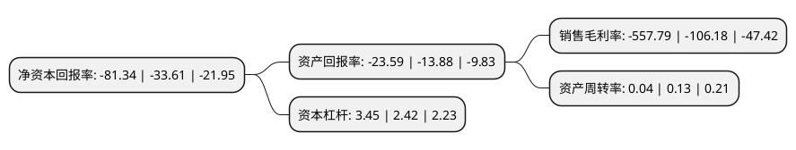

> 本页面由自动化程序生成于 2022年5月20日 01:16
> 内容可能存在错误，如有bug请提交issue至：https://github.com/Eroleice/doc-pi/issues
{.is-warning}

# 上市公司基本情况

## 基本资料

蓝盾信息安全技术股份有限公司（以下简称“*ST蓝盾”）成立于1999年10月29日，宜宾市。于2012年03月15日在深交所创业板上市。

*ST蓝盾注册资本124,985.421万元，主营业务为安全产品的研发，生产及销售，安全集成及安全服务。以下是详细信息：

- 公司名称: 蓝盾信息安全技术股份有限公司
- 股票代码: 300297.SZ
- 所在地: 四川 - 宜宾市
- 成立日期: 1999年10月29日
- 注册资本: 124,985.421万元
- 法定代表人: 陈伟纯
- 主营业务: 主营业务为安全产品的研发，生产及销售，安全集成及安全服务
- 公司官网: www.bluedon.com
- 公司介绍: 公司构建了以安全产品为基础，覆盖安全方案、安全服务、安全运营的完整业务生态，为各大行业客户提供一站式的信息安全整体解决方案。同时，公司也瞄准了信息安全外延不断扩大的趋势，通过“自主研发+投资并购”双轮驱动的方式，持续推进“大安全”产业发展战略，并以“技术升级”、“空间拓展”、“IT层级突破”三个维度为主线进行布局，构建了完整的“大安全”产业生态版图。公司始终以自主创新为发展源动力，以技术研发领先优势抢占市场，经过十多年的探索和积累，已掌握了信息安全领域内的主要核心技术，并实现了全线安全产品的人工智能化。公司目前掌握的主要技术处于国内领先地位，凭借领先的技术实力，公司先后承担并实施了包括国家公安部科技攻关项目在内的数十项国家级、部级、省市区级的重点信息安全科研项目，并为国家公安部等部委制定行业技术标准发挥了重要作用。

## 股东及高管情况

上市公司第一大股东为柯宗庆，持股121,653,375股，占比9.73%，**疑似为**上市公司实际控制人。

截至2022年04月28日，上市公司的前十大股东中，共有6名自然人股东，4名机构股东，其中5%以上大股东共有7名。上市公司前十大股东明细如下：

> 未能通过持股比例判定出上市公司实际控制人（持股30%以上）
> 可能存在通过间接持股、联合持股、协议控制等方式拥有实际控制权的主体，具体请参考上市公司定期公告！
{.is-warning}

> 上市公司第一大股东持股不超过10%，请检查是否存在公司控制权风险！
{.is-danger}

> 截至2022年04月28日，上市公司前十大股东信息如下：

| 股东名称 | 持股数量（股） | 持股比例 |
| --- | --- | --- |
| 柯宗庆 | 121,653,375 | 9.73% |
| 柯宗庆 | 121,653,375 | 9.73% |
| 柯宗贵 | 95,204,200 | 7.62% |
| 深圳市博益投资发展有限公司 | 94,400,000 | 7.55% |
| 深圳市博益投资发展有限公司 | 94,400,000 | 7.55% |
| 中经汇通有限责任公司 | 82,355,742 | 6.59% |
| 中经汇通有限责任公司 | 80,926,142 | 6.47% |
| 侯霞 | 9,900,000 | 0.79% |
| 艾绍前 | 2,360,000 | 0.19% |
| 冉小康 | 2,208,200 | 0.18% |

## 杜邦分析

> 数据列示周期：2021年 | 2020年 | 2019年
{.is-info}

上市公司的净资产收益率在近一年有所上升，上升幅度为142.01%，其变化情况分解如下：
- 上市公司的销售毛利率在近一年上升了425.32%，可能是生产效率的提升、商品原材料价格下跌或商品价格的上涨所致。
- 上市公司的资产周转率在近一年下降了-69.23%，可能是源自于更慢的销售回款或库存管理效果下降。
- 上市公司的财务杠杆比率在近一年上升了42.56%，可能是增加负债扩大生产规模。

