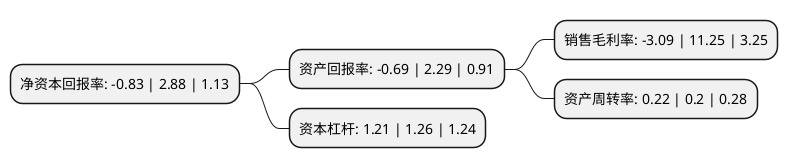

> 本页面由自动化程序生成于 2022年5月20日 01:16
> 内容可能存在错误，如有bug请提交issue至：https://github.com/Eroleice/doc-pi/issues
{.is-warning}

# 上市公司基本情况

## 基本资料

北京同有飞骥科技股份有限公司（以下简称“同有科技”）成立于1998年11月03日，北京市。于2012年03月21日在深交所创业板上市。

同有科技注册资本48,797.123万元，公司的主营业务为数据存储，数据保护，容灾等技术的研究，开发和应用。公司主要产品覆盖数据存储，数据保护，容灾三大领域的业务体系:数据存储主要包括NetStor磁盘存储系统，NetStor存储管理软件等产品，各类数据存储解决方案及相关技术服务;数据保护主要包括NetStor物理磁带库备份系统，NetStor虚拟磁带库备份系统和NetStor备份管理软件等产品，各类数据保护解决方案及相关技术服务;容灾主要包括NetStor应急容灾系统等产品，各类容灾解决方案及相关技术服务。以下是详细信息：

- 公司名称: 北京同有飞骥科技股份有限公司
- 股票代码: 300302.SZ
- 所在地: 北京 - 北京市
- 成立日期: 1998年11月03日
- 注册资本: 48,797.123万元
- 法定代表人: 周泽湘
- 主营业务: 公司的主营业务为数据存储，数据保护，容灾等技术的研究，开发和应用公司主要产品覆盖数据存储，数据保护，容灾三大领域的业务体系:数据存储主要包括NetStor磁盘存储系统，NetStor存储管理软件等产品，各类数据存储解决方案及相关技术服务;数据保护主要包括NetStor物理磁带库备份系统，NetStor虚拟磁带库备份系统和NetStor备份管理软件等产品，各类数据保护解决方案及相关技术服务;容灾主要包括NetStor应急容灾系统等产品，各类容灾解决方案及相关技术服务
- 公司官网: www.toyou.com.cn
- 公司介绍: 公司深耕存储行业几十年，是专注专业的大数据存储基础架构提供商。作为中国存储第一股，同有科技坚持以软件定义为基础、贴近应用为核心、满足客户需求为方向，为全球用户提供高效安全融合的存储服务。公司是业界少数拥有超过百项自主知识产权的专业存储厂商，也是国内完全拥有存储架构、存储管理软件及存储核心算法的自主研发企业。公司通过“内生+外延”战略，持续整合存储产业链资源，以最大的协同效应带动中国存储行业整体技术进步，为建设我国安全可控的信息安全体系提供有利支撑，促进国家大数据产业链与国家战略新兴产业的发展，开启存储产业的新篇章。

## 股东及高管情况

上市公司第一大股东为周泽湘，持股84,428,597股，占比17.3%，**疑似为**上市公司实际控制人。

截至2022年03月31日，上市公司的前十大股东中，共有8名自然人股东，2名机构股东，其中5%以上大股东共有3名。上市公司前十大股东明细如下：

> 未能通过持股比例判定出上市公司实际控制人（持股30%以上）
> 可能存在通过间接持股、联合持股、协议控制等方式拥有实际控制权的主体，具体请参考上市公司定期公告！
{.is-warning}

> 截至2022年03月31日，上市公司前十大股东信息如下：

| 股东名称 | 持股数量（股） | 持股比例 |
| --- | --- | --- |
| 周泽湘 | 84,428,597 | 17.3% |
| 佟易虹 | 58,445,119 | 11.98% |
| 杨永松 | 45,016,614 | 9.23% |
| 杨建利 | 13,682,976 | 2.8% |
| 齐宇思 | 5,312,700 | 1.09% |
| 沈晶 | 4,673,454 | 0.96% |
| 北京华创瑞驰科技中心(有限合伙) | 4,390,245 | 0.9% |
| 蒋志民 | 2,926,177 | 0.6% |
| 王磊 | 2,672,783 | 0.55% |
| 合肥红宝石创投股份有限公司 | 2,363,908 | 0.48% |

## 利润表分析

上市公司2021年总收入为3.9亿元，净利润为-0.13亿元，**未实现盈利**。

## 杜邦分析

> 数据列示周期：2021年 | 2020年 | 2019年
{.is-info}

上市公司的净资产收益率在近一年有所下降，下降幅度为-128.82%，其变化情况分解如下：
- 上市公司的销售毛利率在近一年下降了-127.47%，可能是生产效率的下降、商品原材料价格上涨或商品价格的下跌所致。
- 上市公司的资产周转率在近一年上升了10%，可能是源自于更快的销售回款或库存管理效果提升。
- 上市公司的财务杠杆比率在近一年下降了-3.97%，可能是减少负债降低财务费用。

