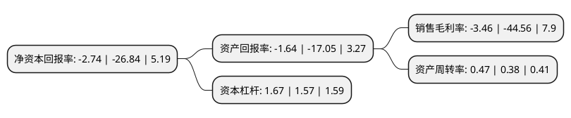

> 本页面由自动化程序生成于 2022年5月20日 01:16
> 内容可能存在错误，如有bug请提交issue至：https://github.com/Eroleice/doc-pi/issues
{.is-warning}

# 上市公司基本情况

## 基本资料

北京旋极信息技术股份有限公司（以下简称“旋极信息”）成立于1997年11月28日，北京市。于2012年06月08日在深交所创业板上市。

旋极信息注册资本172,759.06万元，主营范围为从事嵌入式系统的开发，生产，销售和技术服务业务。以下是详细信息：

- 公司名称: 北京旋极信息技术股份有限公司
- 股票代码: 300324.SZ
- 所在地: 北京 - 北京市
- 成立日期: 1997年11月28日
- 注册资本: 172,759.06万元
- 法定代表人: 陈为群
- 主营业务: 主营范围为从事嵌入式系统的开发，生产，销售和技术服务业务
- 公司官网: www.watertek.com
- 公司介绍: 公司是专业从事嵌入式系统领域的高科技公司。主要致力于提供面向国防军工的嵌入式系统测试产品及技术服务、嵌入式信息安全产品和嵌入式行业智能移动终端产品及技术服务。公司先后承担了国家科委的科技型中小企业技术创新基金立项证书(SIP流媒体通信应用系统)、北京市工促局的“国密算法税控U盘系统的升级改造”等多个重大科技攻关项目。公司是中关村科技园区高新技术企业、北京市双软认定企业、中关村信用联盟星级会员、国家军用标准GJB9001A质量体系认证企业、军工保密资格认证单位。公司还获得了国家密码管理局颁发的“商用密码产品销售许可证”、“商用密码产品生产定点单位”证书，航天一院合格供应商称号。2016年，公司收购泰豪智能100%股权，新增智慧能源、智慧建筑、智慧交通等业务。

## 股东及高管情况

上市公司第一大股东为陈江涛，持股299,500,423股，占比17.34%，**疑似为**上市公司实际控制人。

截至2022年03月31日，上市公司的前十大股东中，共有6名自然人股东，3名机构股东，1个产品账户，其中5%以上大股东共有1名。上市公司前十大股东明细如下：

> 未能通过持股比例判定出上市公司实际控制人（持股30%以上）
> 可能存在通过间接持股、联合持股、协议控制等方式拥有实际控制权的主体，具体请参考上市公司定期公告！
{.is-warning}

> 截至2022年03月31日，上市公司前十大股东信息如下：

| 股东名称 | 持股数量（股） | 持股比例 |
| --- | --- | --- |
| 陈江涛 | 299,500,423 | 17.34% |
| 北京达麟投资管理有限公司-新余京达投资管理中心(有限合伙) | 31,415,605 | 1.82% |
| 北京达麟投资管理有限公司-北京汇达高新投资基金中心(有限合伙) | 29,924,882 | 1.73% |
| 任元林 | 23,000,000 | 1.33% |
| 西藏泰豪智能技术有限公司 | 19,113,839 | 1.11% |
| 刘希平 | 18,542,317 | 1.07% |
| 长城证券股份有限公司 | 15,927,591 | 0.92% |
| 白巍 | 14,067,002 | 0.81% |
| 刘明 | 12,939,438 | 0.75% |
| 王建新 | 10,625,000 | 0.62% |

## 利润表分析

上市公司2021年总收入为31.71亿元，净利润为-1.1亿元，**未实现盈利**。

## 杜邦分析

> 数据列示周期：2021年 | 2020年 | 2019年
{.is-info}

上市公司的净资产收益率在近一年有所下降，下降幅度为-89.79%，其变化情况分解如下：
- 上市公司的销售毛利率在近一年下降了-92.24%，可能是生产效率的下降、商品原材料价格上涨或商品价格的下跌所致。
- 上市公司的资产周转率在近一年上升了23.68%，可能是源自于更快的销售回款或库存管理效果提升。
- 上市公司的财务杠杆比率在近一年上升了6.37%，可能是增加负债扩大生产规模。

