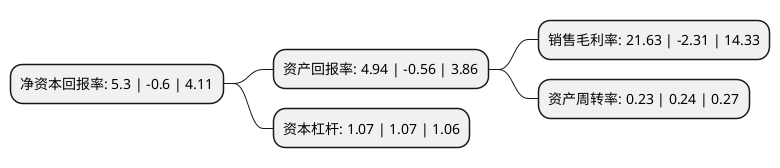

> 本页面由自动化程序生成于 2022年5月20日 01:16
> 内容可能存在错误，如有bug请提交issue至：https://github.com/Eroleice/doc-pi/issues
{.is-warning}

# 上市公司基本情况

## 基本资料

深圳兆日科技股份有限公司（以下简称“兆日科技”）成立于2003年04月16日，深圳市。于2012年06月28日在深交所创业板上市。

兆日科技注册资本33,600万元，公司自成立以来，一直专注于票据防伪领域，将现代密码技术为核心的信息安全技术应用于票据防伪，为客户提供基于密码技术的票据防伪产品和防伪解决方案。公司的主要产品包括用于金融票据防伪领域的“电子支付密码器系统”(包括电子支付密码器及电子支付密码核验设备等)，用于票据防伪系统的密码芯片以及用于税务发票防伪的税控安全组件等以下是详细信息：

- 公司名称: 深圳兆日科技股份有限公司
- 股票代码: 300333.SZ
- 所在地: 广东 - 深圳市
- 成立日期: 2003年04月16日
- 注册资本: 33,600万元
- 法定代表人: 魏恺言
- 主营业务: 公司自成立以来，一直专注于票据防伪领域，将现代密码技术为核心的信息安全技术应用于票据防伪，为客户提供基于密码技术的票据防伪产品和防伪解决方案公司的主要产品包括用于金融票据防伪领域的“电子支付密码器系统”(包括电子支付密码器及电子支付密码核验设备等)，用于票据防伪系统的密码芯片以及用于税务发票防伪的税控安全组件等
- 公司官网: www.sinosun.com.cn
- 公司介绍: 公司是一家以现代密码技术为基础，移动通讯技术为平台，支付安全为核心的国家高新技术企业。近几年，越来越多的商业银行表达出对公业务的移动化创新的需求。兆日科技推出的银企通平台以安全性设计为基础，打通了银行和企业、企业和企业、企业成员之间的通信，让银行可以基于银企通平台以模块化方式搭建创新业务，帮助银行迅速推出和迭代新业务。公司自成立以来，一直专注于现代密码技术为核心的应用开发，通过在现代密码、安全芯片、信息安全、安全通讯和自动识别等技术领域的不断创新，以及专业从事信息安全产品及安全通讯平台的研发、生产和销售所积累的人才、技术、管理和实践经验奠定了公司在国际、国内同行业的领先地位。

## 股东及高管情况

上市公司第一大股东为新疆晁骏股权投资有限公司，持股52,311,452股，占比15.57%，**疑似为**上市公司实际控制人。

截至2022年03月31日，上市公司的前十大股东中，共有8名自然人股东，1名机构股东，1名其他股东，其中5%以上大股东共有1名。上市公司前十大股东明细如下：

> 未能通过持股比例判定出上市公司实际控制人（持股30%以上）
> 可能存在通过间接持股、联合持股、协议控制等方式拥有实际控制权的主体，具体请参考上市公司定期公告！
{.is-warning}

> 截至2022年03月31日，上市公司前十大股东信息如下：

| 股东名称 | 持股数量（股） | 持股比例 |
| --- | --- | --- |
| 新疆晁骏股权投资有限公司 | 52,311,452 | 15.57% |
| 魏恺言 | 2,166,577 | 0.64% |
| 朱荣军 | 2,004,950 | 0.6% |
| 韩国银行-自有资金 | 1,696,500 | 0.5% |
| 刘育辰 | 1,400,000 | 0.42% |
| 张江 | 1,361,100 | 0.41% |
| 胡叶萍 | 1,173,200 | 0.35% |
| 罗香娥 | 1,010,700 | 0.3% |
| 刘素琴 | 997,800 | 0.3% |
| 刘小强 | 779,074 | 0.23% |

## 利润表分析

上市公司2021年总收入为2亿元，净利润为0.43亿元，实现盈利。

## 杜邦分析

> 数据列示周期：2021年 | 2020年 | 2019年
{.is-info}

上市公司的净资产收益率在近一年有所下降，下降幅度为-983.33%，其变化情况分解如下：
- 上市公司的销售毛利率在近一年下降了-1036.36%，可能是生产效率的下降、商品原材料价格上涨或商品价格的下跌所致。
- 上市公司的资产周转率在近一年下降了-4.17%，可能是源自于更慢的销售回款或库存管理效果下降。
- 上市公司的财务杠杆比率在近一年下降了0%，可能是减少负债降低财务费用。

