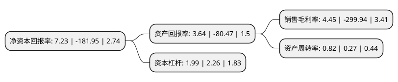

> 本页面由自动化程序生成于 2022年5月20日 01:16
> 内容可能存在错误，如有bug请提交issue至：https://github.com/Eroleice/doc-pi/issues
{.is-warning}

# 上市公司基本情况

## 基本资料

立方数科股份有限公司（以下简称“立方数科”）成立于1999年08月25日，北京市。于2012年08月01日在深交所创业板上市。

立方数科注册资本64,170.642万元，主要从事太空板(发泡水泥复合板)系列产品的研发，设计，生产，销售及安装。主营产品为太空板，系由周边钢围框，内置桁架与发泡水泥芯材及面层复合而成，集多项发明和实用新型专利于一体的高新技术产品，是公司独立研制开发的新型轻质建筑材料。以下是详细信息：

- 公司名称: 立方数科股份有限公司
- 股票代码: 300344.SZ
- 所在地: 北京 - 北京市
- 成立日期: 1999年08月25日
- 注册资本: 64,170.642万元
- 法定代表人: 汪逸
- 主营业务: 主要从事太空板(发泡水泥复合板)系列产品的研发，设计，生产，销售及安装主营产品为太空板，系由周边钢围框，内置桁架与发泡水泥芯材及面层复合而成，集多项发明和实用新型专利于一体的高新技术产品，是公司独立研制开发的新型轻质建筑材料
- 公司官网: www.taikongintel.com
- 公司介绍: 公司是专业从事太空板系列产品的研发、设计、生产、销售及安装的高新技术企业。主营产品太空板系由周边钢围框、内置桁架与发泡水泥芯材及面层复合而成，集多项发明和实用新型专利于一体的高新技术产品。公司产品为新型绿色建筑产品，通过了“中国环境标志(Ⅱ型)”的认证。公司建立了以发泡水泥技术、承重保温一体化技术、装配式住宅建造技术为核心的技术体系，拥有涉及太空板产品的28项专利及多项专有技术。公司是中国资源综合利用协会会员、北京市节能和资源综合利用协会副理事长单位，被评为“北京市循环经济试点单位”及“中关村国家自主创新示范区创新型试点企业”。

## 股东及高管情况

上市公司第一大股东为合肥岭岑科技咨询合伙企业(有限合伙)，持股148,834,450股，占比23.19%，**疑似为**上市公司实际控制人。

截至2022年03月31日，上市公司的前十大股东中，共有7名自然人股东，2名机构股东，1个产品账户，其中5%以上大股东共有3名。上市公司前十大股东明细如下：

> 未能通过持股比例判定出上市公司实际控制人（持股30%以上）
> 可能存在通过间接持股、联合持股、协议控制等方式拥有实际控制权的主体，具体请参考上市公司定期公告！
{.is-warning}

> 截至2022年03月31日，上市公司前十大股东信息如下：

| 股东名称 | 持股数量（股） | 持股比例 |
| --- | --- | --- |
| 合肥岭岑科技咨询合伙企业(有限合伙) | 148,834,450 | 23.19% |
| 樊志 | 70,264,265 | 10.95% |
| 樊立 | 70,053,450 | 10.92% |
| 宁波岭楠企业管理合伙企业(有限合伙) | 19,613,466 | 3.06% |
| 高原 | 7,308,300 | 1.14% |
| 上海阿杏投资管理有限公司-阿杏朝阳7号私募证券投资基金 | 4,354,500 | 0.68% |
| 顾静 | 3,297,300 | 0.51% |
| 尤芝志 | 2,660,000 | 0.41% |
| 汪逸 | 2,268,000 | 0.35% |
| 刘卫凯 | 2,150,000 | 0.34% |

## 利润表分析

上市公司2021年总收入为5.58亿元，净利润为0.24亿元，实现盈利。

## 杜邦分析

> 数据列示周期：2021年 | 2020年 | 2019年
{.is-info}

上市公司的净资产收益率在近一年有所下降，下降幅度为-103.97%，其变化情况分解如下：
- 上市公司的销售毛利率在近一年下降了-101.48%，可能是生产效率的下降、商品原材料价格上涨或商品价格的下跌所致。
- 上市公司的资产周转率在近一年上升了203.7%，可能是源自于更快的销售回款或库存管理效果提升。
- 上市公司的财务杠杆比率在近一年下降了-11.95%，可能是减少负债降低财务费用。

