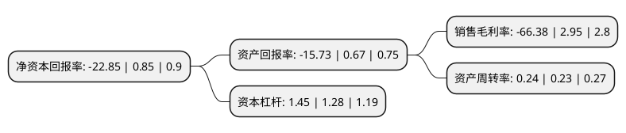

> 本页面由自动化程序生成于 2022年5月20日 01:17
> 内容可能存在错误，如有bug请提交issue至：https://github.com/Eroleice/doc-pi/issues
{.is-warning}

# 上市公司基本情况

## 基本资料

北京北信源软件股份有限公司（以下简称“北信源”）成立于1996年05月28日，北京市。于2012年09月12日在深交所创业板上市。

北信源注册资本144,982.409万元，主营产品为:终端安全管理产品，数据安全管理产品和安全管理平台产品等。主营业务为信息安全软件产品的研发，生产，销售及技术服务。以下是详细信息：

- 公司名称: 北京北信源软件股份有限公司
- 股票代码: 300352.SZ
- 所在地: 北京 - 北京市
- 成立日期: 1996年05月28日
- 注册资本: 144,982.409万元
- 法定代表人: 林皓
- 主营业务: 主营产品为:终端安全管理产品，数据安全管理产品和安全管理平台产品等主营业务为信息安全软件产品的研发，生产，销售及技术服务
- 公司官网: www.vrv.com.cn
- 公司介绍: 公司是信息安全产品及解决方案供应商，是国内终端安全管理领域的龙头企业。公司积极跟随行业发展趋势，充分利用平台优势，紧跟前沿技术，不断创新，围绕信息安全产业链，以及国家核心技术自主可控的发展要求，为客户提供涵盖安全的软件开发、维护服务、安全可控的解决方案以及安全系统集成在内的一整套信息化服务。目前公司产品体系已经完成“信息安全、大数据和互联网”格局的打造，使公司从传统的终端安全领导者逐步成为物联网时代下智慧安全的全面解决方案提供商。公司现为国家网络与信息安全通报中心技术支持单位、北京市关键信息基础设施网络安全检查工作技术支撑单位、国家规划布局重点软件企业、商用密码产品生产定点单位；通过CMMI-DEV-ML-3认证、信息安全等级保护安全建设服务机构能力评估认证、ISO9001:2015质量管理体系认证、信息安全管理体系认证；拥有计算机信息系统安全专用产品销售许可证、涉密信息系统产品检测证书、军用信息安全产品认证证书、商用密码产品销售许可证、涉密信息系统集成甲级资质证书、装备承制单位注册证书等权威机构颁发的产品及企业资质近百款。

## 股东及高管情况

上市公司第一大股东为林皓，持股314,291,355股，占比21.68%，**疑似为**上市公司实际控制人。

截至2022年03月31日，上市公司的前十大股东中，共有7名自然人股东，1名机构股东，1个产品账户，1个海外主体，其中5%以上大股东共有1名。上市公司前十大股东明细如下：

> 未能通过持股比例判定出上市公司实际控制人（持股30%以上）
> 可能存在通过间接持股、联合持股、协议控制等方式拥有实际控制权的主体，具体请参考上市公司定期公告！
{.is-warning}

> 截至2022年03月31日，上市公司前十大股东信息如下：

| 股东名称 | 持股数量（股） | 持股比例 |
| --- | --- | --- |
| 林皓 | 314,291,355 | 21.68% |
| 北信瑞丰基金-南京银行-中航信托-中航信托·天启(2016)163号南京高科华睿集合资金信托计划 | 24,789,392 | 1.71% |
| 王晓峰 | 5,645,669 | 0.39% |
| 孙燕琪 | 4,632,500 | 0.32% |
| 岳阳 | 3,942,600 | 0.27% |
| 吴荣 | 3,771,800 | 0.26% |
| 香港中央结算有限公司(陆股通) | 3,735,553 | 0.26% |
| 黄丽泉 | 3,245,500 | 0.22% |
| 佛山市顺德区矽华电子有限公司 | 3,116,600 | 0.21% |
| 林静虹 | 3,081,400 | 0.21% |

## 利润表分析

上市公司2021年总收入为6.75亿元，净利润为-4.49亿元，**未实现盈利**。

## 杜邦分析

> 数据列示周期：2021年 | 2020年 | 2019年
{.is-info}

上市公司的净资产收益率在近一年有所下降，下降幅度为-2788.24%，其变化情况分解如下：
- 上市公司的销售毛利率在近一年下降了-2350.17%，可能是生产效率的下降、商品原材料价格上涨或商品价格的下跌所致。
- 上市公司的资产周转率在近一年上升了4.35%，可能是源自于更快的销售回款或库存管理效果提升。
- 上市公司的财务杠杆比率在近一年上升了13.28%，可能是增加负债扩大生产规模。

