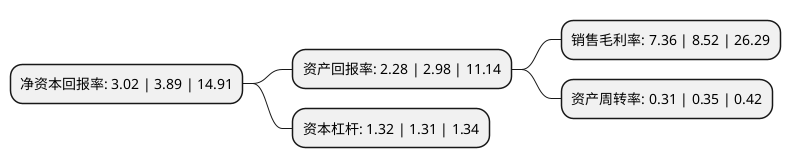

> 本页面由自动化程序生成于 2022年5月20日 01:17
> 内容可能存在错误，如有bug请提交issue至：https://github.com/Eroleice/doc-pi/issues
{.is-warning}

# 上市公司基本情况

## 基本资料

北京恒华伟业科技股份有限公司（以下简称“恒华科技”）成立于2000年11月23日，北京市。于2014年01月23日在深交所创业板上市。

恒华科技注册资本59,985.547万元，面向智能电网的信息化服务供应商，致力于运用信息技术，物联网技术，并秉承信息技术与物联网技术相结合的理念，为智能电网提供全生命周期的一体化，专业化信息服务。以下是详细信息：

- 公司名称: 北京恒华伟业科技股份有限公司
- 股票代码: 300365.SZ
- 所在地: 北京 - 北京市
- 成立日期: 2000年11月23日
- 注册资本: 59,985.547万元
- 法定代表人: 罗新伟
- 主营业务: 面向智能电网的信息化服务供应商，致力于运用信息技术，物联网技术，并秉承信息技术与物联网技术相结合的理念，为智能电网提供全生命周期的一体化，专业化信息服务
- 公司官网: www.ieforever.com
- 公司介绍: 公司创立于2000年11月，是深圳证券交易所A股(创业板)上市公司，位于中关村科技园区西城园，属于国家火炬计划重点高新技术企业、国家规划布局内重点软件企业，致力于成为“BIM平台软件及行业数字化应用和运营的服务商”。在整体战略目标引领下，公司集中各业务体系优势力量，聚焦行业细分领域，按照业务属性及专业化经营策略，构建了互为支撑的五大业务体系，以BIM平台及工具软件研发为核心，以设计咨询业务为技术支撑和工程示范，以行业资产数字化应用为载体，同时积极拓展大数据应用、数字教育等相关业务，为电力、水利、交通等行业信息化、数字化、智能化发展赋能。

## 股东及高管情况

上市公司第一大股东为江春华，持股94,027,137股，占比15.67%，**疑似为**上市公司实际控制人。

截至2022年03月31日，上市公司的前十大股东中，共有6名自然人股东，3个产品账户，1个海外主体，其中5%以上大股东共有5名。上市公司前十大股东明细如下：

> 未能通过持股比例判定出上市公司实际控制人（持股30%以上）
> 可能存在通过间接持股、联合持股、协议控制等方式拥有实际控制权的主体，具体请参考上市公司定期公告！
{.is-warning}

> 截至2022年03月31日，上市公司前十大股东信息如下：

| 股东名称 | 持股数量（股） | 持股比例 |
| --- | --- | --- |
| 江春华 | 94,027,137 | 15.67% |
| 罗新伟 | 76,404,216 | 12.74% |
| 方文 | 62,247,383 | 10.38% |
| 陈显龙 | 49,427,000 | 8.24% |
| 中泰证券资管-支持民企发展中泰资管2号FOF集合资管计划-证券行业支持民企发展系列之中泰资管12号单一资产管理计划 | 31,000,000 | 5.17% |
| 北京恒华伟业科技股份有限公司-2021年员工持股计划 | 8,283,604 | 1.38% |
| 杨志鹏 | 5,334,900 | 0.89% |
| 大家人寿保险股份有限公司-万能产品 | 4,206,000 | 0.7% |
| 高华-汇丰-GOLDMAN, SACHS & CO.LLC | 2,373,300 | 0.4% |
| 殷项琴 | 1,944,900 | 0.32% |

## 利润表分析

上市公司2021年总收入为8.72亿元，净利润为0.64亿元，实现盈利。

## 杜邦分析

> 数据列示周期：2021年 | 2020年 | 2019年
{.is-info}

上市公司的净资产收益率在近一年有所下降，下降幅度为-22.37%，其变化情况分解如下：
- 上市公司的销售毛利率在近一年下降了-13.62%，可能是生产效率的下降、商品原材料价格上涨或商品价格的下跌所致。
- 上市公司的资产周转率在近一年下降了-11.43%，可能是源自于更慢的销售回款或库存管理效果下降。
- 上市公司的财务杠杆比率在近一年上升了0.76%，可能是增加负债扩大生产规模。

