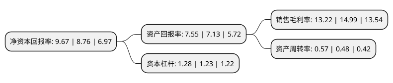

> 本页面由自动化程序生成于 2022年5月20日 01:17
> 内容可能存在错误，如有bug请提交issue至：https://github.com/Eroleice/doc-pi/issues
{.is-warning}

# 上市公司基本情况

## 基本资料

绿盟科技集团股份有限公司（以下简称“绿盟科技”）成立于2000年04月25日，北京市。于2014年01月29日在深交所创业板上市。

绿盟科技注册资本79,858.441万元，主营业务为信息安全产品的研发，生产，销售及提供专业安全服务。以下是详细信息：

- 公司名称: 绿盟科技集团股份有限公司
- 股票代码: 300369.SZ
- 所在地: 北京 - 北京市
- 成立日期: 2000年04月25日
- 注册资本: 79,858.441万元
- 法定代表人: 沈继业
- 主营业务: 主营业务为信息安全产品的研发，生产，销售及提供专业安全服务
- 公司官网: www.nsfocus.com
- 公司介绍: 公司是国内领先的企业级网络安全解决方案供应商。主要服务于政府、电信运营商、金融、能源、互联网等领域的企业级用户，向用户提供网络及终端安全产品、Web及应用安全产品、合规及安全管理产品等信息安全产品，并提供专业安全服务。公司建立并维护的全球最大的中文漏洞库已经成为业界广泛参考的标准，并承担了多项国家级重点科研项目。远程安全评估系统产品“极光”获英国西海岸实验室的Checkmark认证，入侵防御系统通过NSSLab测试并获得最高级别的推荐认证。公司建立了完善的专业安全服务体系(NSPS)，具备国内最高级安全服务资质，连续多年被评为“值得信赖的安全服务品牌”。

## 股东及高管情况

上市公司第一大股东为沈继业，持股80,250,145股，占比10.05%，**疑似为**上市公司实际控制人。

截至2022年03月31日，上市公司的前十大股东中，共有1名自然人股东，3名机构股东，6个产品账户，其中5%以上大股东共有4名。上市公司前十大股东明细如下：

> 未能通过持股比例判定出上市公司实际控制人（持股30%以上）
> 可能存在通过间接持股、联合持股、协议控制等方式拥有实际控制权的主体，具体请参考上市公司定期公告！
{.is-warning}

> 截至2022年03月31日，上市公司前十大股东信息如下：

| 股东名称 | 持股数量（股） | 持股比例 |
| --- | --- | --- |
| 沈继业 | 80,250,145 | 10.05% |
| 中电科(成都)股权投资基金管理有限公司-中电科(成都)网络安全股权投资基金合伙企业(有限合伙) | 55,984,059 | 7.01% |
| 中电科基金管理有限公司-中电电子信息产业投资基金(天津)合伙企业(有限合伙) | 55,097,548 | 6.9% |
| 启迪科技服务有限公司 | 42,565,553 | 5.33% |
| 南通金玖锐信投资管理有限公司-中汇金玖锐信定增3期私募股权投资基金 | 22,412,276 | 2.81% |
| 东方证券股份有限公司-中庚价值先锋股票型证券投资基金 | 19,519,344 | 2.44% |
| 雷岩投资有限公司 | 18,314,598 | 2.29% |
| 华润深国投信托有限公司-华润信托·慎知资产行知集合资金信托计划 | 15,798,901 | 1.98% |
| 中电科投资控股有限公司 | 13,048,060 | 1.63% |
| 广发证券股份有限公司-中庚小盘价值股票型证券投资基金 | 8,270,100 | 1.04% |

## 利润表分析

上市公司2021年总收入为26.08亿元，净利润为3.44亿元，实现盈利。

## 杜邦分析

> 数据列示周期：2021年 | 2020年 | 2019年
{.is-info}

上市公司的净资产收益率在近一年有所上升，上升幅度为10.39%，其变化情况分解如下：
- 上市公司的销售毛利率在近一年下降了-11.81%，可能是生产效率的下降、商品原材料价格上涨或商品价格的下跌所致。
- 上市公司的资产周转率在近一年上升了18.75%，可能是源自于更快的销售回款或库存管理效果提升。
- 上市公司的财务杠杆比率在近一年上升了4.07%，可能是增加负债扩大生产规模。

