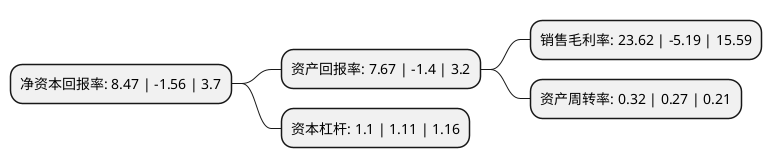

> 本页面由自动化程序生成于 2022年5月20日 01:17
> 内容可能存在错误，如有bug请提交issue至：https://github.com/Eroleice/doc-pi/issues
{.is-warning}

# 上市公司基本情况

## 基本资料

深圳市赢时胜信息技术股份有限公司（以下简称“赢时胜”）成立于2001年09月03日，深圳市。于2014年01月27日在深交所创业板上市。

赢时胜注册资本75,155.708万元，公司是致力于为金融机构及其高端客户的资产管理业务和托管业务提供整体信息化建设解决方案的应用软件及增值服务提供商。公司产品可广泛应用于金融行业研究，分析，投资，交易，风控，监督，清算，核算估值，绩效评估，存托管，数据整合等业务环节。以下是详细信息：

- 公司名称: 深圳市赢时胜信息技术股份有限公司
- 股票代码: 300377.SZ
- 所在地: 广东 - 深圳市
- 成立日期: 2001年09月03日
- 注册资本: 75,155.708万元
- 法定代表人: 唐球
- 主营业务: 公司是致力于为金融机构及其高端客户的资产管理业务和托管业务提供整体信息化建设解决方案的应用软件及增值服务提供商公司产品可广泛应用于金融行业研究，分析，投资，交易，风控，监督，清算，核算估值，绩效评估，存托管，数据整合等业务环节
- 公司官网: www.ysstech.com
- 公司介绍: 公司是国内知名的金融行业系统解决方案供应商，公司自成立以来一直紧随金融行业的发展，专注于金融行业信息系统的研究、开发及服务。公司客户涵盖银行、基金公司、证券公司、保险公司、信托公司、财务管理公司、全国社保等，公司目前主要专注于金融机构资产管理和资产托管业务系统的应用软件及服务。随着金融创新发展和大资管时代的到来，公司凭借多年来积累的丰富行业经验、人才优势、品牌优势，公司业务发展市场空间广阔，发展潜力巨大，近年来持续快速增长，公司上市后，积极布局互联网金融，将投资建设互联网金融大数据中心、互联网金融产品服务平台、大型金融机构云服务平台，公司科技金融的发展战略如虎添翼，公司是一个极具成长性的上市公司，同时也为公司员工的个人成长与事业发展提供了很好的发展平台。

## 股东及高管情况

上市公司第一大股东为唐球，持股102,290,131股，占比13.61%，**疑似为**上市公司实际控制人。

截至2022年03月31日，上市公司的前十大股东中，共有6名自然人股东，1名机构股东，3个产品账户，其中5%以上大股东共有1名。上市公司前十大股东明细如下：

> 未能通过持股比例判定出上市公司实际控制人（持股30%以上）
> 可能存在通过间接持股、联合持股、协议控制等方式拥有实际控制权的主体，具体请参考上市公司定期公告！
{.is-warning}

> 截至2022年03月31日，上市公司前十大股东信息如下：

| 股东名称 | 持股数量（股） | 持股比例 |
| --- | --- | --- |
| 唐球 | 102,290,131 | 13.61% |
| 恒生电子股份有限公司 | 29,680,000 | 3.95% |
| 鄢建红 | 28,617,288 | 3.81% |
| 周云杉 | 17,334,850 | 2.31% |
| 张列 | 12,457,729 | 1.66% |
| 黄熠 | 10,814,150 | 1.44% |
| 鄢建兵 | 9,369,750 | 1.25% |
| 上海通怡投资管理有限公司-通怡芙蓉8号私募证券投资基金 | 7,284,215 | 0.97% |
| 上海通怡投资管理有限公司-通怡芙蓉5号私募证券投资基金 | 7,183,600 | 0.96% |
| 上海通怡投资管理有限公司-通怡芙蓉11号私募证券投资基金 | 6,636,800 | 0.88% |

## 利润表分析

上市公司2021年总收入为10.29亿元，净利润为2.43亿元，实现盈利。

## 杜邦分析

> 数据列示周期：2021年 | 2020年 | 2019年
{.is-info}

上市公司的净资产收益率在近一年有所下降，下降幅度为-642.95%，其变化情况分解如下：
- 上市公司的销售毛利率在近一年下降了-555.11%，可能是生产效率的下降、商品原材料价格上涨或商品价格的下跌所致。
- 上市公司的资产周转率在近一年上升了18.52%，可能是源自于更快的销售回款或库存管理效果提升。
- 上市公司的财务杠杆比率在近一年下降了-0.9%，可能是减少负债降低财务费用。

