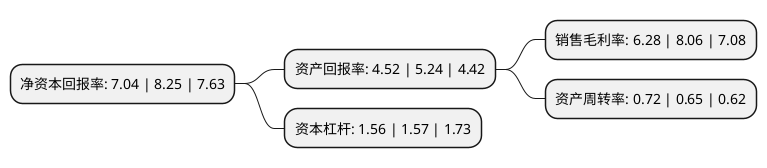

> 本页面由自动化程序生成于 2022年5月20日 01:17
> 内容可能存在错误，如有bug请提交issue至：https://github.com/Eroleice/doc-pi/issues
{.is-warning}

# 上市公司基本情况

## 基本资料

鼎捷软件股份有限公司（以下简称“鼎捷软件”）成立于2001年12月26日，上海市。于2014年01月27日在深交所创业板上市。

鼎捷软件注册资本26,644.135万元，主营业务是以自制ERP软件为核心的企业管理软件的研发，销售，实施及服务以下是详细信息：

- 公司名称: 鼎捷软件股份有限公司
- 股票代码: 300378.SZ
- 所在地: 上海 - 上海市
- 成立日期: 2001年12月26日
- 注册资本: 26,644.135万元
- 法定代表人: 叶子祯
- 主营业务: 主营业务是以自制ERP软件为核心的企业管理软件的研发，销售，实施及服务
- 公司官网: www.digiwin.com.cn
- 公司介绍: 公司主要以制造业、流通业及微型企业的信息化建设与管理软件应用咨询、销售与服务为主营业务。公司自1982年成立以来，已为国内外超过50,000多家企业成功提供专业的企业管理软件产品与服务。作为本土优秀的ERP产品与服务提供商，近年来公司在“智能+”整体战略布局下，确立“一线三环互联”战略路径，恪守“创造客户数字价值”企业使命，在提供虚实融通的智能+整合方案与创新应用的同时，回归企业经营本质，通过以效益为导向的价值服务协助用户应用价值的真正落地。面对融合自动化、信息化以及物联网、云计算、大数据的转型浪潮，公司不断开拓并积累在制造、流通两大产业领域的核心竞争力，立足应用价值战略基石，为企业提供可效益落地的智能+整合方案与服务，帮助企业积极变革运营模式，实践智能+转型。

## 股东及高管情况

上市公司第一大股东为富士康工业互联网股份有限公司，持股39,971,265股，占比15%，**疑似为**上市公司实际控制人。

截至2022年05月13日，上市公司的前十大股东中，共有2名机构股东，5个产品账户，3个海外主体，其中5%以上大股东共有2名。上市公司前十大股东明细如下：

> 未能通过持股比例判定出上市公司实际控制人（持股30%以上）
> 可能存在通过间接持股、联合持股、协议控制等方式拥有实际控制权的主体，具体请参考上市公司定期公告！
{.is-warning}

> 截至2022年05月13日，上市公司前十大股东信息如下：

| 股东名称 | 持股数量（股） | 持股比例 |
| --- | --- | --- |
| 富士康工业互联网股份有限公司 | 39,971,265 | 15% |
| TOPPARTNERHOLDINGLIMITED | 19,712,242 | 7.4% |
| STEPBESTHOLDINGLIMITED | 13,220,924 | 4.96% |
| 中国工商银行股份有限公司-财通资管价值成长混合型证券投资基金 | 8,028,900 | 3.01% |
| TALENTGAINDEVELOPMENTSLIMITED | 5,097,477 | 1.91% |
| 平安基金-中国平安人寿保险股份有限公司-平安人寿-平安基金权益委托投资1号单一资产管理计划 | 4,031,661 | 1.51% |
| 中国农业银行股份有限公司-财通资管价值发现混合型证券投资基金 | 2,820,503 | 1.06% |
| 中国工商银行股份有限公司-财通资管均衡价值一年持有期混合型证券投资基金 | 2,553,284 | 0.96% |
| 华泰证券股份有限公司 | 2,323,583 | 0.87% |
| 中国农业银行股份有限公司-财通资管宸瑞一年持有期混合型证券投资基金 | 1,823,422 | 0.68% |

## 利润表分析

上市公司2021年总收入为17.88亿元，净利润为1.12亿元，实现盈利。

## 杜邦分析

> 数据列示周期：2021年 | 2020年 | 2019年
{.is-info}

上市公司的净资产收益率在近一年有所下降，下降幅度为-14.67%，其变化情况分解如下：
- 上市公司的销售毛利率在近一年下降了-22.08%，可能是生产效率的下降、商品原材料价格上涨或商品价格的下跌所致。
- 上市公司的资产周转率在近一年上升了10.77%，可能是源自于更快的销售回款或库存管理效果提升。
- 上市公司的财务杠杆比率在近一年下降了-0.64%，可能是减少负债降低财务费用。

