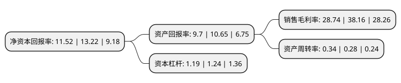

> 本页面由自动化程序生成于 2022年5月20日 01:17
> 内容可能存在错误，如有bug请提交issue至：https://github.com/Eroleice/doc-pi/issues
{.is-warning}

# 上市公司基本情况

## 基本资料

北京东方通科技股份有限公司（以下简称“东方通”）成立于1997年08月11日，北京市。于2014年01月28日在深交所创业板上市。

东方通注册资本45,853.713万元，主营业务:中间件产品的研发，销售和相关技术服务，报告期内公司营业收入基本全部来自于中间件软件产品的销售及相关技术服务。以下是详细信息：

- 公司名称: 北京东方通科技股份有限公司
- 股票代码: 300379.SZ
- 所在地: 北京 - 北京市
- 成立日期: 1997年08月11日
- 注册资本: 45,853.713万元
- 法定代表人: 黄永军
- 主营业务: 主营业务:中间件产品的研发，销售和相关技术服务，报告期内公司营业收入基本全部来自于中间件软件产品的销售及相关技术服务
- 公司官网: www.tongtech.com
- 公司介绍: 公司是领先的基础软件和信息安全解决方案提供商。通过先进的软件产品和技术，东方通为客户提供安全可靠的中间件、信息安全、创新应用产品与解决方案，帮助用户实现业务创新、安全管控和数据的共享与价值挖掘。公司连续多年被认定为“国家规划布局内重点软件企业”，被商务部、国资委认证为“企业信用评价AAA级信用企业”。在技术领域，公司是Java技术国际标准组织JCP和全国信息技术标准化委员会的核心成员，参与了JavaEE、中间件、SOA、智慧城市等国际及国内标准制定。同时，公司是“核高基”国家重大科技专项的研制单位，曾荣获国务院颁发的“国家科技进步二等奖”。作为国产中间件的开拓者和领导者，东方通中间件、信息安全软件等软件产品及解决方案在国内数千个行业业务中被广泛应用，拥有2000多家金融、通信、政府、能源、交通等企业级用户和500多家合作伙伴。

## 股东及高管情况

上市公司第一大股东为黄永军，持股36,190,823股，占比7.89%，**疑似为**上市公司实际控制人。

截至2022年03月31日，上市公司的前十大股东中，共有5名自然人股东，1名机构股东，4个产品账户，其中5%以上大股东共有1名。上市公司前十大股东明细如下：

> 未能通过持股比例判定出上市公司实际控制人（持股30%以上）
> 可能存在通过间接持股、联合持股、协议控制等方式拥有实际控制权的主体，具体请参考上市公司定期公告！
{.is-warning}

> 上市公司第一大股东持股不超过10%，请检查是否存在公司控制权风险！
{.is-danger}

> 截至2022年03月31日，上市公司前十大股东信息如下：

| 股东名称 | 持股数量（股） | 持股比例 |
| --- | --- | --- |
| 黄永军 | 36,190,823 | 7.89% |
| 北京东方通科技股份有限公司-第一期员工持股计划 | 13,533,906 | 2.95% |
| 交通银行-汇丰晋信动态策略混合型证券投资基金 | 11,457,548 | 2.5% |
| 宁波市星通投资管理有限公司 | 10,410,000 | 2.27% |
| 中国建设银行股份有限公司-华商智能生活灵活配置混合型证券投资基金 | 7,030,282 | 1.53% |
| 吴志辉 | 5,785,339 | 1.26% |
| 朱海东 | 5,361,260 | 1.17% |
| 浙商银行股份有限公司-华商新能源汽车混合型证券投资基金 | 5,127,083 | 1.12% |
| 李惠敏 | 4,710,000 | 1.03% |
| 牛合庆 | 4,191,988 | 0.91% |

## 利润表分析

上市公司2021年总收入为8.63亿元，净利润为2.48亿元，实现盈利。

## 杜邦分析

> 数据列示周期：2021年 | 2020年 | 2019年
{.is-info}

上市公司的净资产收益率在近一年有所下降，下降幅度为-12.86%，其变化情况分解如下：
- 上市公司的销售毛利率在近一年下降了-24.69%，可能是生产效率的下降、商品原材料价格上涨或商品价格的下跌所致。
- 上市公司的资产周转率在近一年上升了21.43%，可能是源自于更快的销售回款或库存管理效果提升。
- 上市公司的财务杠杆比率在近一年下降了-4.03%，可能是减少负债降低财务费用。

