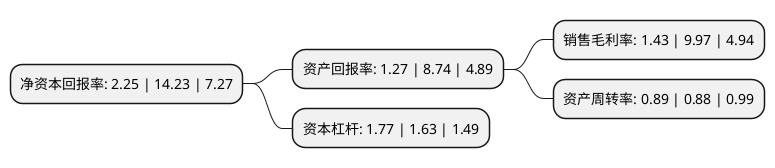

> 本页面由自动化程序生成于 2022年5月20日 01:17
> 内容可能存在错误，如有bug请提交issue至：https://github.com/Eroleice/doc-pi/issues
{.is-warning}

# 上市公司基本情况

## 基本资料

上海安硕信息技术股份有限公司（以下简称“安硕信息”）成立于2001年09月25日，上海市。于2014年01月28日在深交所创业板上市。

安硕信息注册资本14,100.975万元，公司的主营业务为向以银行为主的金融机构提供信贷资产管理及风险管理领域的一体化IT解决方案，包括软件开发，实施，维护，业务咨询和相关服务。公司目前主要有四大类产品和服务:信贷管理系统，风险管理系统，数据仓库和商业智能系统，其他管理系统。以下是详细信息：

- 公司名称: 上海安硕信息技术股份有限公司
- 股票代码: 300380.SZ
- 所在地: 上海 - 上海市
- 成立日期: 2001年09月25日
- 注册资本: 14,100.975万元
- 法定代表人: 高勇
- 主营业务: 公司的主营业务为向以银行为主的金融机构提供信贷资产管理及风险管理领域的一体化IT解决方案，包括软件开发，实施，维护，业务咨询和相关服务公司目前主要有四大类产品和服务:信贷管理系统，风险管理系统，数据仓库和商业智能系统，其他管理系统
- 公司官网: www.amarsoft.com
- 公司介绍: 公司是国内知名金融IT上市公司，中国领先的金融资产风险管理整体解决方案提供商之一。目前，安硕信息拥有系列化的信贷管理系统、风险管理系统、信托管理系统、P2P网贷系统、供应链融资系统等自主可控的软件产品，多年来持续为各类金融及非金融客户提供业务咨询、系统开发与实施、数据服务等服务，包括国有商业银行、股份制商业银行、外资银行、城商行、农商行、农信社、信托公司、保险公司、证券公司、互联网金融、上市企业等在内的金融机构和非金融机构客户数百家，在国内金融信贷风控领域市场占有率领先。

## 股东及高管情况

上市公司第一大股东为上海安硕科技发展有限公司，持股43,164,542股，占比30.61%，为上市公司实际控制人。

截至2022年03月31日，上市公司的前十大股东中，共有9名自然人股东，1名机构股东，其中5%以上大股东共有3名。上市公司前十大股东明细如下：

> 截至2022年03月31日，上市公司前十大股东信息如下：

| 股东名称 | 持股数量（股） | 持股比例 |
| --- | --- | --- |
| 上海安硕科技发展有限公司 | 43,164,542 | 30.61% |
| 高勇 | 10,132,650 | 7.19% |
| 高鸣 | 9,654,476 | 6.85% |
| 翟涛 | 4,238,882 | 3.01% |
| 侯小东 | 2,345,378 | 1.66% |
| 祝若川 | 2,029,274 | 1.44% |
| 杨俊武 | 879,200 | 0.62% |
| 洪海 | 654,400 | 0.46% |
| 顾振国 | 515,900 | 0.37% |
| 魏治毅 | 464,338 | 0.33% |

## 利润表分析

上市公司2021年总收入为7.55亿元，净利润为0.1亿元，实现盈利。

## 杜邦分析

> 数据列示周期：2021年 | 2020年 | 2019年
{.is-info}

上市公司的净资产收益率在近一年有所下降，下降幅度为-84.19%，其变化情况分解如下：
- 上市公司的销售毛利率在近一年下降了-85.66%，可能是生产效率的下降、商品原材料价格上涨或商品价格的下跌所致。
- 上市公司的资产周转率在近一年上升了1.14%，可能是源自于更快的销售回款或库存管理效果提升。
- 上市公司的财务杠杆比率在近一年上升了8.59%，可能是增加负债扩大生产规模。

