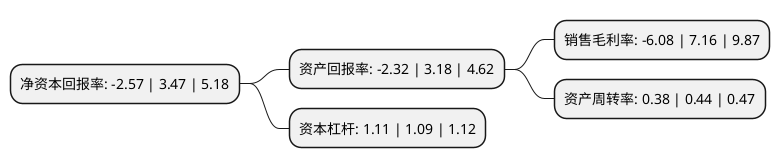

> 本页面由自动化程序生成于 2022年5月20日 01:17
> 内容可能存在错误，如有bug请提交issue至：https://github.com/Eroleice/doc-pi/issues
{.is-warning}

# 上市公司基本情况

## 基本资料

飞天诚信科技股份有限公司（以下简称“飞天诚信”）成立于1998年06月16日，北京市。于2014年06月26日在深交所创业板上市。

飞天诚信注册资本41,804.4万元，主要从事以身份认证为主的信息安全产品的研发，生产，销售和服务，主营产品包括:ePass系列USB Key，OTP系列动态令牌，ROCKEY系列软件加密锁，飞天智能卡及读写器等。以下是详细信息：

- 公司名称: 飞天诚信科技股份有限公司
- 股票代码: 300386.SZ
- 所在地: 北京 - 北京市
- 成立日期: 1998年06月16日
- 注册资本: 41,804.4万元
- 法定代表人: 黄煜
- 主营业务: 主要从事以身份认证为主的信息安全产品的研发，生产，销售和服务，主营产品包括:ePass系列USB Key，OTP系列动态令牌，ROCKEY系列软件加密锁，飞天智能卡及读写器等
- 公司官网: www.ftsafe.com.cn
- 公司介绍: 公司是全球领先的智能卡操作系统及数字安全系统整体解决方案的提供商和服务商。公司自成立以来始终专注于智能卡核心技术的研究和发展，坚持自主创新的发展战略，在身份识别、交易安全、智能支付、云安全、金融行业创新营销、版权保护等多个领域提供完整的服务和解决方案。公司凭借过硬的技术和研发实力，不断创新，不断推出技术先进、性能稳定的信息安全产品和服务，为全球用户提供值得信赖的信息安全产品和解决方案。公司以北京总部为中心，在广州、上海、成都、武汉设立了华南、华东、西南、华中营销中心，在深圳、杭州和昆明等多个地区建立了办事处，在亚洲、欧洲、大洋洲、美洲等全球范围内建立起市场推广和营销服务体系，并配有专业的系统解决方案和服务团队，公司产品销售至全球80多个国家和地区，积累了金融、政府、邮政、电信、交通、互联网等领域6000余家客户。其中，银行客户覆盖最为广泛，为包括工行、建行、农行、中行、交通银行等在内的200余家银行的网上银行系统安全提供完善的解决方案和专业的技术服务，是国内银行客户数最多的智能网络身份认证产品提供商。

## 股东及高管情况

上市公司第一大股东为黄煜，持股126,700,046股，占比30.31%，为上市公司实际控制人。

截至2022年04月29日，上市公司的前十大股东中，共有9名自然人股东，1个海外主体，其中5%以上大股东共有5名。上市公司前十大股东明细如下：

> 截至2022年04月29日，上市公司前十大股东信息如下：

| 股东名称 | 持股数量（股） | 持股比例 |
| --- | --- | --- |
| 黄煜 | 126,700,046 | 30.31% |
| 陆舟 | 52,634,756 | 12.59% |
| 陆舟 | 52,634,756 | 12.59% |
| 李伟 | 50,349,061 | 12.04% |
| 李伟 | 50,085,061 | 11.9808% |
| 韩雪峰 | 9,453,892 | 2.26% |
| 于华章 | 2,013,704 | 0.48% |
| 香港中央结算有限公司(陆股通) | 1,857,661 | 0.44% |
| 常鑫民 | 686,364 | 0.16% |
| 赵尧珂 | 639,000 | 0.15% |

## 利润表分析

上市公司2021年总收入为7.79亿元，净利润为-0.48亿元，**未实现盈利**。

## 杜邦分析

> 数据列示周期：2021年 | 2020年 | 2019年
{.is-info}

上市公司的净资产收益率在近一年有所下降，下降幅度为-174.06%，其变化情况分解如下：
- 上市公司的销售毛利率在近一年下降了-184.92%，可能是生产效率的下降、商品原材料价格上涨或商品价格的下跌所致。
- 上市公司的资产周转率在近一年下降了-13.64%，可能是源自于更慢的销售回款或库存管理效果下降。
- 上市公司的财务杠杆比率在近一年上升了1.83%，可能是增加负债扩大生产规模。

