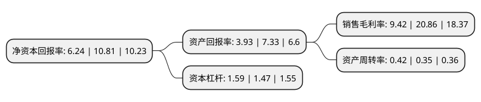

> 本页面由自动化程序生成于 2022年5月20日 01:17
> 内容可能存在错误，如有bug请提交issue至：https://github.com/Eroleice/doc-pi/issues
{.is-warning}

# 上市公司基本情况

## 基本资料

成都运达科技股份有限公司（以下简称“运达科技”）成立于2006年03月10日，成都市。于2015年04月23日在深交所创业板上市。

运达科技注册资本44,737.6万元，主营业务为运用信息技术提供轨道交通机务运用安全相关的技术和解决方案，为轨道交通提供更安全，更高效的营运保障。主要产品包括三大类:轨道交通运营仿真培训系统，机车车辆车载监测与控制设备和机车车辆整备与检修作业控制系统，应用领域和服务对象主要为全国各铁路局，铁路机务段，检修基地，城轨车辆部门，各类铁路技术学校等。以下是详细信息：

- 公司名称: 成都运达科技股份有限公司
- 股票代码: 300440.SZ
- 所在地: 四川 - 成都市
- 成立日期: 2006年03月10日
- 注册资本: 44,737.6万元
- 法定代表人: 何鸿云
- 主营业务: 主营业务为运用信息技术提供轨道交通机务运用安全相关的技术和解决方案，为轨道交通提供更安全，更高效的营运保障主要产品包括三大类:轨道交通运营仿真培训系统，机车车辆车载监测与控制设备和机车车辆整备与检修作业控制系统，应用领域和服务对象主要为全国各铁路局，铁路机务段，检修基地，城轨车辆部门，各类铁路技术学校等
- 公司官网: www.yd-tec.com
- 公司介绍: 公司是一家轨道交通车辆检测与控制设备供应商，专注于轨道交通车辆检测与控制设备系统的研发、生产和销售。凭借多年的技术积累，公司成为国内轨道交通机务运用安全系统领域内少数拥有核心自主知识产权和自主生产能力的高科技企业之一。公司主要产品包括轨道交通运营仿真培训系统、轨道交通车载监测与控制系统、轨道交通检测与控制系统、轨道交通信息化系统。作为国内较早从事轨道交通车辆检测与控制设备系统研制的专业厂商，依靠不断自主创新，经过多年的发展，公司技术研发实力已在业内处于领先地位，轨道交通运营仿真培训系统已经占据了国内主要市场，承建了世界规模最大、培训功能最全的司机驾驶仿真系统——武汉高铁训练段；轨道交通车载监测与控制系统、轨道交通检测与控制系统在细分领域也有较高市场占有率。公司拥有强大的技术研发、创新及产业化能力。

## 股东及高管情况

上市公司第一大股东为成都运达创新科技集团有限公司，持股214,357,778股，占比47.91%，为上市公司实际控制人。

截至2022年04月29日，上市公司的前十大股东中，共有6名自然人股东，3名机构股东，1个产品账户，其中5%以上大股东共有1名。上市公司前十大股东明细如下：

> 截至2022年04月29日，上市公司前十大股东信息如下：

| 股东名称 | 持股数量（股） | 持股比例 |
| --- | --- | --- |
| 成都运达创新科技集团有限公司 | 214,357,778 | 47.91% |
| 曲水知创永盛企业管理有限公司 | 9,037,976 | 2.02% |
| 成都大诚投资有限公司 | 3,786,864 | 0.85% |
| 高蕾 | 2,563,300 | 0.57% |
| 华能贵诚信托有限公司-华能信托·嘉会10号集合资金信托计划 | 2,276,486 | 0.51% |
| 刘勤 | 2,021,100 | 0.45% |
| 陈曦 | 1,486,100 | 0.33% |
| 侯立军 | 1,335,458 | 0.3% |
| 苏菠 | 1,298,044 | 0.29% |
| 刁晓梅 | 1,264,800 | 0.28% |

## 利润表分析

上市公司2021年总收入为9.06亿元，净利润为0.85亿元，实现盈利。

## 杜邦分析

> 数据列示周期：2021年 | 2020年 | 2019年
{.is-info}

上市公司的净资产收益率在近一年有所下降，下降幅度为-42.28%，其变化情况分解如下：
- 上市公司的销售毛利率在近一年下降了-54.84%，可能是生产效率的下降、商品原材料价格上涨或商品价格的下跌所致。
- 上市公司的资产周转率在近一年上升了20%，可能是源自于更快的销售回款或库存管理效果提升。
- 上市公司的财务杠杆比率在近一年上升了8.16%，可能是增加负债扩大生产规模。

