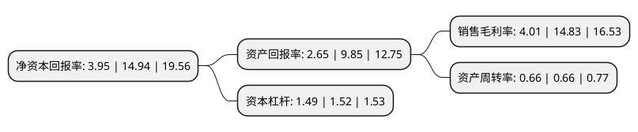

> 本页面由自动化程序生成于 2022年5月20日 01:17
> 内容可能存在错误，如有bug请提交issue至：https://github.com/Eroleice/doc-pi/issues
{.is-warning}

# 上市公司基本情况

## 基本资料

深信服科技股份有限公司（以下简称“深信服”）成立于2000年12月25日，深圳市。于2018年05月16日在深交所创业板上市。

深信服注册资本41,565.163万元，主营业务:向企业级用户提供信息安全，云计算，企业级无线相关的产品和解决方案。以下是详细信息：

- 公司名称: 深信服科技股份有限公司
- 股票代码: 300454.SZ
- 所在地: 广东 - 深圳市
- 成立日期: 2000年12月25日
- 注册资本: 41,565.163万元
- 法定代表人: 何朝曦
- 主营业务: 主营业务:向企业级用户提供信息安全，云计算，企业级无线相关的产品和解决方案
- 公司官网: www.sangfor.com.cn
- 公司介绍: 公司专注于软件和信息技术服务行业，致力于让政府部门、事业单位和各类企业等在内的企业级用户的IT更简单、更安全、更有价值，当前主营业务为向前述企业级用户提供信息安全、云计算、企业级无线相关的产品和解决方案。公司从2012年开始布局云计算业务，目前已完成企业级云、专属云、桌面云三朵云的业务布局，向企业级用户提供超融合一体机、云管理平台、企业级云平台、跨云管理平台、云终端、桌面云一体机、分布式存储等多款产品和解决方案，为政府单位、教育机构、医疗机构、金融机构、各类型企业等单位提供从桌面到数据中心，从本地到云端，从私有云、行业云到混合云的完整云计算解决方案及服务，致力于让用户的关键业务上云更简单、IT服务更高效、IT更具价值创造力。公司是第一批国家高新技术企业，先后获得“深圳市重点软件企业”、“国家规划布局内重点软件企业”等荣誉。

## 股东及高管情况

上市公司第一大股东为何朝曦，持股84,240,000股，占比20.27%，**疑似为**上市公司实际控制人。

截至2022年03月31日，上市公司的前十大股东中，共有6名自然人股东，2个产品账户，2个海外主体，其中5%以上大股东共有4名。上市公司前十大股东明细如下：

> 未能通过持股比例判定出上市公司实际控制人（持股30%以上）
> 可能存在通过间接持股、联合持股、协议控制等方式拥有实际控制权的主体，具体请参考上市公司定期公告！
{.is-warning}

> 截至2022年03月31日，上市公司前十大股东信息如下：

| 股东名称 | 持股数量（股） | 持股比例 |
| --- | --- | --- |
| 何朝曦 | 84,240,000 | 20.27% |
| 熊武 | 73,008,000 | 17.56% |
| 冯毅 | 33,696,000 | 8.11% |
| 香港中央结算有限公司(陆股通) | 27,368,426 | 6.58% |
| DIAMOND BRIGHT INTERNATIONAL LIMITED | 10,585,682 | 2.55% |
| 交通银行股份有限公司-万家行业优选混合型证券投资基金(LOF) | 8,833,330 | 2.13% |
| 张开翼 | 7,340,100 | 1.77% |
| 夏伟伟 | 6,874,700 | 1.65% |
| 招商银行股份有限公司-兴全合润混合型证券投资基金 | 5,782,871 | 1.39% |
| 邓文俊 | 4,158,800 | 1% |

## 利润表分析

上市公司2021年总收入为68.04亿元，净利润为2.72亿元，实现盈利。

## 杜邦分析

> 数据列示周期：2021年 | 2020年 | 2019年
{.is-info}

上市公司的净资产收益率在近一年有所下降，下降幅度为-73.56%，其变化情况分解如下：
- 上市公司的销售毛利率在近一年下降了-72.96%，可能是生产效率的下降、商品原材料价格上涨或商品价格的下跌所致。
- 上市公司的资产周转率在近一年下降了0%，可能是源自于更慢的销售回款或库存管理效果下降。
- 上市公司的财务杠杆比率在近一年下降了-1.97%，可能是减少负债降低财务费用。

