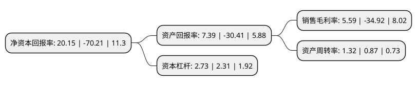

> 本页面由自动化程序生成于 2022年5月20日 01:17
> 内容可能存在错误，如有bug请提交issue至：https://github.com/Eroleice/doc-pi/issues
{.is-warning}

# 上市公司基本情况

## 基本资料

高伟达软件股份有限公司（以下简称“高伟达”）成立于2003年04月11日，北京市。于2015年05月28日在深交所创业板上市。

高伟达注册资本44,676.226万元，主营业务:公司主要向以银行，保险，证券等为主的金融企业客户提供IT解决方案，IT运维服务以及系统集成服务，业务涵盖了从IT系统规划，IT基础架构建设，到应用软件开发实施，以及IT运营维护管理在内的，覆盖IT系统全生命周期的IT服务。以下是详细信息：

- 公司名称: 高伟达软件股份有限公司
- 股票代码: 300465.SZ
- 所在地: 北京 - 北京市
- 成立日期: 2003年04月11日
- 注册资本: 44,676.226万元
- 法定代表人: 于伟
- 主营业务: 主营业务:公司主要向以银行，保险，证券等为主的金融企业客户提供IT解决方案，IT运维服务以及系统集成服务，业务涵盖了从IT系统规划，IT基础架构建设，到应用软件开发实施，以及IT运营维护管理在内的，覆盖IT系统全生命周期的IT服务
- 公司官网: www.git.com.cn
- 公司介绍: 公司是中国领先的金融信息化软件产品和综合服务提供商。公司下设9家子公司，并设有北京、南京、上海、武汉、成都、厦门、广州7个软件中心，从地域上覆盖全国范围，以期在最短的时间内为所有的客户提供最迅速、最高效的技术服务。公司现有主营业务分为两大块：金融信息化和金融科技服务、移动互联网营销。金融信息化和金融科技服务是向以银行、保险、证券为主的金融企业客户提供IT解决方案、IT运维服务以及系统集成服务。移动互联网营销亦称为移动大数据精准营销，就是以国际移动互联网络为基础，利用数字化的信息和移动互联网络媒体的交互性来实现营销目标的一种新型的市场营销方式。公司是北京市高新技术企业，拥有CMMI3级资质和国家工业和信息化部颁发的系统集成一级资质。

## 股东及高管情况

上市公司第一大股东为鹰潭市鹰高投资咨询有限公司，持股101,886,476股，占比22.81%，**疑似为**上市公司实际控制人。

截至2022年03月31日，上市公司的前十大股东中，共有7名自然人股东，2名机构股东，1个产品账户，其中5%以上大股东共有2名。上市公司前十大股东明细如下：

> 未能通过持股比例判定出上市公司实际控制人（持股30%以上）
> 可能存在通过间接持股、联合持股、协议控制等方式拥有实际控制权的主体，具体请参考上市公司定期公告！
{.is-warning}

> 截至2022年03月31日，上市公司前十大股东信息如下：

| 股东名称 | 持股数量（股） | 持股比例 |
| --- | --- | --- |
| 鹰潭市鹰高投资咨询有限公司 | 101,886,476 | 22.81% |
| 银联科技有限公司 | 37,101,580 | 8.3% |
| 吴东魁 | 2,947,800 | 0.66% |
| 田亚南 | 1,769,900 | 0.4% |
| 焦平 | 1,768,420 | 0.4% |
| 孙光英 | 1,703,900 | 0.38% |
| 郝明 | 1,529,100 | 0.34% |
| 平安资管-建设银行-平安资产创赢122号资产管理产品 | 1,500,000 | 0.34% |
| 张少光 | 1,135,000 | 0.25% |
| 陈传兴 | 1,123,000 | 0.25% |

## 利润表分析

上市公司2021年总收入为22.78亿元，净利润为1.27亿元，实现盈利。

## 杜邦分析

> 数据列示周期：2021年 | 2020年 | 2019年
{.is-info}

上市公司的净资产收益率在近一年有所下降，下降幅度为-128.7%，其变化情况分解如下：
- 上市公司的销售毛利率在近一年下降了-116.01%，可能是生产效率的下降、商品原材料价格上涨或商品价格的下跌所致。
- 上市公司的资产周转率在近一年上升了51.72%，可能是源自于更快的销售回款或库存管理效果提升。
- 上市公司的财务杠杆比率在近一年上升了18.18%，可能是增加负债扩大生产规模。

