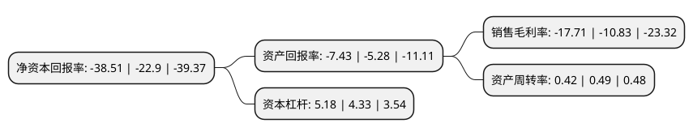

> 本页面由自动化程序生成于 2022年5月20日 01:17
> 内容可能存在错误，如有bug请提交issue至：https://github.com/Eroleice/doc-pi/issues
{.is-warning}

# 上市公司基本情况

## 基本资料

上海信联信息发展股份有限公司（以下简称“信息发展”）成立于1997年10月29日，上海市。于2015年06月11日在深交所创业板上市。

信息发展注册资本20,513.538万元，主要产品:向客户提供信息化系统规划咨询，软硬件产品开发，系统集成，运行维护和推广等相关整体解决方案。主营业务:从事面向档案，食品流通追溯，政法等领域的信息化系统开发与服务。以下是详细信息：

- 公司名称: 上海信联信息发展股份有限公司
- 股票代码: 300469.SZ
- 所在地: 上海 - 上海市
- 成立日期: 1997年10月29日
- 注册资本: 20,513.538万元
- 法定代表人: 张曙华
- 主营业务: 主要产品:向客户提供信息化系统规划咨询，软硬件产品开发，系统集成，运行维护和推广等相关整体解决方案主营业务:从事面向档案，食品流通追溯，政法等领域的信息化系统开发与服务
- 公司官网: www.cesgroup.com.cn
- 公司介绍: 公司是一家应用区块链、物联网、人工智能等技术，面向智慧食安、智慧档案、智慧政法、智慧政务提供行业专有云和大数据的综合解决方案服务商。经过多年匠心耕耘，依托优势的行业地位、强大的市场开拓能力、持续的研发创新能力、快速反应和高效的服务体系，信息发展已经成为食品安全信息化领域、档案信息化领域、政法信息化领域、政务信息化领域国内知名企业。公司拥有包括国家高新技术企业证书、国家软件企业证书、国家火炬计划重点高新技术企业证书、国家计算机信息系统集成资质、涉密资质(三项甲级)、建筑智能化工程设计与施工资质等重要资质，通过了ISO9001:2008质量管理体系认证、ISO27001:2005信息安全管理体系认证、ISO14001:2004环境管理体系认证、ISO27001:2005信息安全管理体系认证、ISO20000-1:2005IT服务管理体系符合标准认证、能力成熟度集成模型CMMI5认证，可承接业务范围广。

## 股东及高管情况

上市公司第一大股东为上海中信电子发展有限公司，持股27,394,345股，占比13.35%，**疑似为**上市公司实际控制人。

截至2022年03月31日，上市公司的前十大股东中，共有4名自然人股东，4名机构股东，2个产品账户，其中5%以上大股东共有3名。上市公司前十大股东明细如下：

> 未能通过持股比例判定出上市公司实际控制人（持股30%以上）
> 可能存在通过间接持股、联合持股、协议控制等方式拥有实际控制权的主体，具体请参考上市公司定期公告！
{.is-warning}

> 截至2022年03月31日，上市公司前十大股东信息如下：

| 股东名称 | 持股数量（股） | 持股比例 |
| --- | --- | --- |
| 上海中信电子发展有限公司 | 27,394,345 | 13.35% |
| 张曙华 | 20,640,279 | 10.06% |
| 交通运输通信信息集团上海股权投资基金管理有限公司-交信北斗(嘉兴)股权投资有限公司 | 19,692,999 | 9.6% |
| 福建胜奇投资有限公司 | 7,003,606 | 3.41% |
| 闽侯快马投资合伙企业(普通合伙) | 3,890,044 | 1.9% |
| 浙江永安资本管理有限公司 | 2,690,000 | 1.31% |
| 深圳市羽迪资产管理有限公司-羽迪景文私募证券投资基金 | 2,649,330 | 1.29% |
| 孙正贵 | 2,081,600 | 1.01% |
| 杨安荣 | 2,000,740 | 0.98% |
| 杨娟 | 1,543,706 | 0.75% |

## 利润表分析

上市公司2021年总收入为4.21亿元，净利润为-0.75亿元，**未实现盈利**。

## 杜邦分析

> 数据列示周期：2021年 | 2020年 | 2019年
{.is-info}

上市公司的净资产收益率在近一年有所上升，上升幅度为68.17%，其变化情况分解如下：
- 上市公司的销售毛利率在近一年上升了63.53%，可能是生产效率的提升、商品原材料价格下跌或商品价格的上涨所致。
- 上市公司的资产周转率在近一年下降了-14.29%，可能是源自于更慢的销售回款或库存管理效果下降。
- 上市公司的财务杠杆比率在近一年上升了19.63%，可能是增加负债扩大生产规模。

