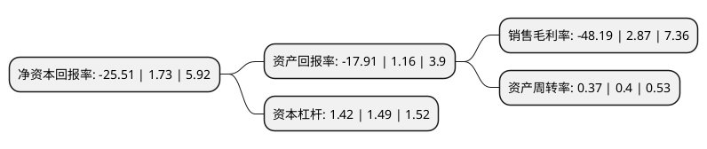

> 本页面由自动化程序生成于 2022年5月20日 01:18
> 内容可能存在错误，如有bug请提交issue至：https://github.com/Eroleice/doc-pi/issues
{.is-warning}

# 上市公司基本情况

## 基本资料

神思电子技术股份有限公司（以下简称“神思电子”）成立于2004年12月27日，济南市。于2015年06月12日在深交所创业板上市。

神思电子注册资本19,704.087万元，主要产品:三个梯次9项类别:第一个梯次为身份认证业务，包括传统身份认证及互联网身份认证;第二个梯次为行业深耕业务，包括移动展业，便捷支付，计算机视觉与银医自助;第三个梯次为人工智能(智能认知)业务，包括行业服务机器人，智能知识管理系统与自助设备智能化升级。主营业务;智能身份认证终端和行业应用软件的研发，生产，销售与服务。以下是详细信息：

- 公司名称: 神思电子技术股份有限公司
- 股票代码: 300479.SZ
- 所在地: 山东 - 济南市
- 成立日期: 2004年12月27日
- 注册资本: 19,704.087万元
- 法定代表人: 王继春
- 主营业务: 主要产品:三个梯次9项类别:第一个梯次为身份认证业务，包括传统身份认证及互联网身份认证;第二个梯次为行业深耕业务，包括移动展业，便捷支付，计算机视觉与银医自助;第三个梯次为人工智能(智能认知)业务，包括行业服务机器人，智能知识管理系统与自助设备智能化升级主营业务;智能身份认证终端和行业应用软件的研发，生产，销售与服务
- 公司官网: www.sdses.com
- 公司介绍: 公司是国内领先的身份识别解决方案的提供商和服务商，正在实施“从行业深耕到行业贯通、从身份识别到智能认知”升级战略，继续在身份识别相关领域提供具备人工智能特征的行业解决方案一站式服务。公司的主营业务划分为三个梯次9项类别：第一个梯次为身份认证业务；第二个梯次为行业深耕业务；第三个梯次为人工智能(智能认知)业务。公司各项主营业务之间互相关联，技术、模块、方案相互穿透融合。公司是公安部认证的居民身份证阅读机具定点生产企业，多系列自主知识产权的身份认证终端与行业应用软件，为中国行业信息化、行业实名制、社会安全和诚信体系建设做出了积极贡献。经过多年积累，公司具备一定研究开发经验的专业人才，配置有国内先进水平的开发工具与测试环境，拥有自主知识产权的嵌入式操作系统以及嵌入式系统开发、应用软件开发、智能卡应用、生物特征识别、电子支付等五方面专门技术，一直服务于行业客户，在行业服务的深度上较一般互联网企业有比较优势。

## 股东及高管情况

上市公司第一大股东为山东神思科技投资有限公司，持股54,808,748股，占比27.82%，**疑似为**上市公司实际控制人。

截至2022年03月31日，上市公司的前十大股东中，共有1名自然人股东，2名机构股东，6个产品账户，1个海外主体，其中5%以上大股东共有2名。上市公司前十大股东明细如下：

> 未能通过持股比例判定出上市公司实际控制人（持股30%以上）
> 可能存在通过间接持股、联合持股、协议控制等方式拥有实际控制权的主体，具体请参考上市公司定期公告！
{.is-warning}

> 截至2022年03月31日，上市公司前十大股东信息如下：

| 股东名称 | 持股数量（股） | 持股比例 |
| --- | --- | --- |
| 山东神思科技投资有限公司 | 54,808,748 | 27.82% |
| 济南胜悦投资管理有限公司-济南玖悦股权投资基金合伙企业(有限合伙) | 11,088,498 | 5.63% |
| 山东山科创新股权投资有限公司 | 5,309,734 | 2.69% |
| 财通基金-华泰证券股份有限公司-财通基金君享永熙单一资产管理计划 | 2,035,398 | 1.03% |
| JPMORGANCHASEBANK,NATIONALASSOCIATION | 1,825,911 | 0.93% |
| 宁波宁聚资产管理中心(有限合伙)-宁聚映山红4号私募证券投资基金 | 1,769,911 | 0.9% |
| 范医东 | 1,769,911 | 0.9% |
| 财通基金-东兴证券股份有限公司-财通基金东兴2号单一资产管理计划 | 530,973 | 0.27% |
| 财通基金-建信理财“诚鑫”多元配置混合类最低持有2年开放式产品-财通基金建兴诚鑫多元开放1号单一资产管理计划 | 442,478 | 0.22% |
| 财通基金-黄聿成-财通基金理享1号单一资产管理计划 | 442,478 | 0.22% |

## 利润表分析

上市公司2021年总收入为3.66亿元，净利润为-1.77亿元，**未实现盈利**。

## 杜邦分析

> 数据列示周期：2021年 | 2020年 | 2019年
{.is-info}

上市公司的净资产收益率在近一年有所下降，下降幅度为-1574.57%，其变化情况分解如下：
- 上市公司的销售毛利率在近一年下降了-1779.09%，可能是生产效率的下降、商品原材料价格上涨或商品价格的下跌所致。
- 上市公司的资产周转率在近一年下降了-7.5%，可能是源自于更慢的销售回款或库存管理效果下降。
- 上市公司的财务杠杆比率在近一年下降了-4.7%，可能是减少负债降低财务费用。

