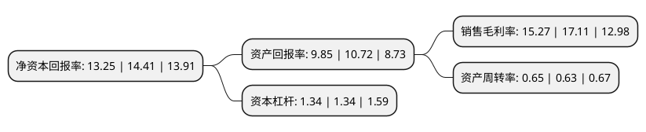

> 本页面由自动化程序生成于 2022年5月20日 01:18
> 内容可能存在错误，如有bug请提交issue至：https://github.com/Eroleice/doc-pi/issues
{.is-warning}

# 上市公司基本情况

## 基本资料

中科创达软件股份有限公司（以下简称“中科创达”）成立于2008年03月07日，北京市。于2015年12月10日在深交所创业板上市。

中科创达注册资本42,505.788万元，主营产品;软件开发服务，联合实验室，软件产品及软硬件一体化解决方案;主营业务为移动智能终端操作系统产品的研发，销售及提供相关技术服务。以下是详细信息：

- 公司名称: 中科创达软件股份有限公司
- 股票代码: 300496.SZ
- 所在地: 北京 - 北京市
- 成立日期: 2008年03月07日
- 注册资本: 42,505.788万元
- 法定代表人: 赵鸿飞
- 主营业务: 主营产品;软件开发服务，联合实验室，软件产品及软硬件一体化解决方案;主营业务为移动智能终端操作系统产品的研发，销售及提供相关技术服务
- 公司官网: www.thundersoft.com
- 公司介绍: 公司是全球领先的智能平台技术提供商。自2008年成立以来，公司致力于提供卓越的智能终端操作系统平台技术及解决方案，助力并加速智能手机、智能物联网、智能汽车等领域的产品化与技术创新。源于多年在Android、Linux、Windows和HTML5等操作系统技术的研发与创新，中科创达形成了从硬件驱动、操作系统内核、中间件到上层应用全面的技术体系。积累了丰富的研发经验和众多自有知识产权，具备强有力的技术开发和服务能力。核心技术涵盖了通信协议栈、深度学习、图形图像算法、操作系统优化和安全技术等多个方面。中科创达与智能终端产业链中的芯片、元器件、终端、软件与互联网厂商以及运营商等全球领先企业拥有紧密的合作关系，具有独特的垂直整合优势。

## 股东及高管情况

上市公司第一大股东为赵鸿飞，持股122,351,063股，占比28.78%，**疑似为**上市公司实际控制人。

截至2022年03月31日，上市公司的前十大股东中，共有2名自然人股东，1名机构股东，6个产品账户，1个海外主体，其中5%以上大股东共有2名。上市公司前十大股东明细如下：

> 未能通过持股比例判定出上市公司实际控制人（持股30%以上）
> 可能存在通过间接持股、联合持股、协议控制等方式拥有实际控制权的主体，具体请参考上市公司定期公告！
{.is-warning}

> 截至2022年03月31日，上市公司前十大股东信息如下：

| 股东名称 | 持股数量（股） | 持股比例 |
| --- | --- | --- |
| 赵鸿飞 | 122,351,063 | 28.78% |
| 香港中央结算有限公司(陆股通) | 38,411,197 | 9.04% |
| 越超有限公司 | 11,335,155 | 2.67% |
| 全国社保基金一一零组合 | 10,555,253 | 2.48% |
| 陈晓华 | 7,532,329 | 1.77% |
| 全国社保基金四零六组合 | 6,850,730 | 1.61% |
| 中国农业银行股份有限公司-嘉实新兴产业股票型证券投资基金 | 6,396,440 | 1.5% |
| 中国农业银行股份有限公司-嘉实核心成长混合型证券投资基金 | 5,619,051 | 1.32% |
| 招商银行股份有限公司-嘉实远见精选两年持有期混合型证券投资基金 | 4,879,679 | 1.15% |
| 中国农业银行股份有限公司-国泰智能汽车股票型证券投资基金 | 4,256,986 | 1% |

## 利润表分析

上市公司2021年总收入为41.26亿元，净利润为6.3亿元，实现盈利。

## 杜邦分析

> 数据列示周期：2021年 | 2020年 | 2019年
{.is-info}

上市公司的净资产收益率在近一年有所下降，下降幅度为-8.05%，其变化情况分解如下：
- 上市公司的销售毛利率在近一年下降了-10.75%，可能是生产效率的下降、商品原材料价格上涨或商品价格的下跌所致。
- 上市公司的资产周转率在近一年上升了3.17%，可能是源自于更快的销售回款或库存管理效果提升。
- 上市公司的财务杠杆比率在近一年下降了0%，可能是减少负债降低财务费用。

