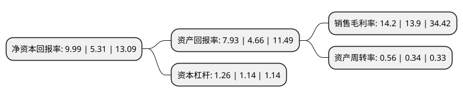

> 本页面由自动化程序生成于 2022年5月20日 01:18
> 内容可能存在错误，如有bug请提交issue至：https://github.com/Eroleice/doc-pi/issues
{.is-warning}

# 上市公司基本情况

## 基本资料

上海维宏电子科技股份有限公司（以下简称“维宏股份”）成立于2007年06月04日，上海市。于2016年04月19日在深交所创业板上市。

维宏股份注册资本9,091.2万元，主营业务为研发，生产和销售工业运动控制系统。公司主要产品包括雕刻雕铣设备控制系统，切割设备控制系统，机械手控制系统三大类，均服务于新型自动化机械设备。以下是详细信息：

- 公司名称: 上海维宏电子科技股份有限公司
- 股票代码: 300508.SZ
- 所在地: 上海 - 上海市
- 成立日期: 2007年06月04日
- 注册资本: 9,091.2万元
- 法定代表人: 汤同奎
- 主营业务: 主营业务为研发，生产和销售工业运动控制系统公司主要产品包括雕刻雕铣设备控制系统，切割设备控制系统，机械手控制系统三大类，均服务于新型自动化机械设备
- 公司官网: www.weihong.com.cn
- 公司介绍: 公司是一家专业提供运动控制系统解决方案的高科技企业，公司拥有雄厚的研发力量和高素质的服务队伍，以快捷的速度，专业的视角，严谨的态度为客户提供优质、便捷、高效的产品和服务。目前公司已经发展为一家以各类数控机床控制系统为主的专业运动控制系统供应商。公司坚持“诚信为本，客户至上”的信念，努力打造民族品牌的优秀数控产品，为用户提供品质优异、性能出众的数控系统。公司自成立以来，一直专心致力于开发运动控制产品，在立足于传统雕刻机与雕铣机控制系统的基础上，不断开拓产品应用领域，开发了软硬件合一的一体机运动控制系统，因为性能优异、价格合理，被众多整机生产厂家选用，经过公司与这些整机厂商的共同努力，公司运动控制系统已经广泛应用于加工中心、激光加工、水射流加工、铣床、模具制造、广告制作、机械加工、玻璃石材加工等众多行业。

## 股东及高管情况

上市公司第一大股东为汤同奎，持股30,320,891股，占比33.35%，为上市公司实际控制人。

截至2022年03月31日，上市公司的前十大股东中，共有9名自然人股东，1个产品账户，其中5%以上大股东共有2名。上市公司前十大股东明细如下：

> 截至2022年03月31日，上市公司前十大股东信息如下：

| 股东名称 | 持股数量（股） | 持股比例 |
| --- | --- | --- |
| 汤同奎 | 30,320,891 | 33.35% |
| 郑之开 | 26,269,091 | 28.9% |
| 胡小琴 | 3,457,000 | 3.8% |
| 郑晓冬 | 1,360,000 | 1.5% |
| 宋秀龙 | 610,100 | 0.67% |
| 赵东京 | 577,050 | 0.63% |
| 牟凤林 | 530,080 | 0.58% |
| 中国建设银行股份有限公司-中欧电子信息产业沪港深股票型证券投资基金 | 448,470 | 0.49% |
| 马任远 | 325,000 | 0.36% |
| 曾广生 | 260,600 | 0.29% |

## 利润表分析

上市公司2021年总收入为4.13亿元，净利润为0.58亿元，实现盈利。

## 杜邦分析

> 数据列示周期：2021年 | 2020年 | 2019年
{.is-info}

上市公司的净资产收益率在近一年有所上升，上升幅度为88.14%，其变化情况分解如下：
- 上市公司的销售毛利率在近一年上升了2.16%，可能是生产效率的提升、商品原材料价格下跌或商品价格的上涨所致。
- 上市公司的资产周转率在近一年上升了64.71%，可能是源自于更快的销售回款或库存管理效果提升。
- 上市公司的财务杠杆比率在近一年上升了10.53%，可能是增加负债扩大生产规模。

