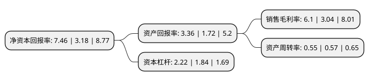

> 本页面由自动化程序生成于 2022年5月20日 01:18
> 内容可能存在错误，如有bug请提交issue至：https://github.com/Eroleice/doc-pi/issues
{.is-warning}

# 上市公司基本情况

## 基本资料

科大国创软件股份有限公司（以下简称“科大国创”）成立于2000年11月06日，合肥市。于2016年07月08日在深交所创业板上市。

科大国创注册资本24,388.586万元，公司专业从事行业软件产品研发，生产和销售，提供IT解决方案，以及相关的信息系统集成，咨询与技术服务。公司主要产品包括行业应用软件和行业平台软件。以下是详细信息：

- 公司名称: 科大国创软件股份有限公司
- 股票代码: 300520.SZ
- 所在地: 安徽 - 合肥市
- 成立日期: 2000年11月06日
- 注册资本: 24,388.586万元
- 法定代表人: 董永东
- 主营业务: 公司专业从事行业软件产品研发，生产和销售，提供IT解决方案，以及相关的信息系统集成，咨询与技术服务公司主要产品包括行业应用软件和行业平台软件
- 公司官网: www.kdgcsoft.com
- 公司介绍: 公司是一家专业从事信息领域的技术研究与产品开发，面向大型行业进行信息化建设与咨询、应用软件开发与服务的国家重点软件企业、国家高新技术企业，是中国信息技术产品研发与整体解决方案领先供应商。公司获准建立了国家博士后科研工作站、安徽省计算与通讯软件重点实验室、安徽省电信软件工程研究中心、安徽省电信软件工程技术研究中心、安徽省企业技术中心。经过多年市场打造，公司已经从一家专业从事计算机软件研究性的公司，成长为国内大型行业应用软件产品与服务的领先供应商。未来公司致力于成具有自主知识产权、技术领先、服务创新的国际著名高科技企业。2018年，公司收购了贵博新能，贵博新能是一家专业从事新能源汽车电池管理系统技术及相关产品的研发、生产、销售和技术服务的高新技术企业，致力于成为以电池管理系统为核心的新能源汽车电源系统总成提供商。公司将成功切入新能源汽车BMS领域，实现公司现有数据采集、存储、管理和分析业务链向数据产生端进行延伸，为公司智能汽车领域和智能交通领域的智能应用软件产品开发打下坚实的基础。

## 股东及高管情况

上市公司第一大股东为合肥国创智能科技有限公司，持股61,125,439股，占比25.0631%，**疑似为**上市公司实际控制人。

截至2022年04月21日，上市公司的前十大股东中，共有5名自然人股东，4名机构股东，1个产品账户，其中5%以上大股东共有5名。上市公司前十大股东明细如下：

> 未能通过持股比例判定出上市公司实际控制人（持股30%以上）
> 可能存在通过间接持股、联合持股、协议控制等方式拥有实际控制权的主体，具体请参考上市公司定期公告！
{.is-warning}

> 截至2022年04月21日，上市公司前十大股东信息如下：

| 股东名称 | 持股数量（股） | 持股比例 |
| --- | --- | --- |
| 合肥国创智能科技有限公司 | 61,125,439 | 25.0631% |
| 合肥国创智能科技有限公司 | 61,125,439 | 25.06% |
| 孙路 | 16,419,401 | 6.7324% |
| 孙路 | 16,419,401 | 6.73% |
| 董永东 | 12,955,978 | 5.3123% |
| 中科大资产经营有限责任公司 | 6,846,120 | 2.81% |
| 合肥贵博股权投资合伙企业(有限合伙) | 4,970,800 | 2.04% |
| 华富嘉业投资管理有限公司-安徽安华创新三期风险投资基金有限公司 | 4,391,877 | 1.8% |
| 史兴领 | 4,332,187 | 1.78% |
| 徐根义 | 1,716,150 | 0.7% |

## 利润表分析

上市公司2021年总收入为17.19亿元，净利润为1.04亿元，实现盈利。

## 杜邦分析

> 数据列示周期：2021年 | 2020年 | 2019年
{.is-info}

上市公司的净资产收益率在近一年有所上升，上升幅度为134.59%，其变化情况分解如下：
- 上市公司的销售毛利率在近一年上升了100.66%，可能是生产效率的提升、商品原材料价格下跌或商品价格的上涨所致。
- 上市公司的资产周转率在近一年下降了-3.51%，可能是源自于更慢的销售回款或库存管理效果下降。
- 上市公司的财务杠杆比率在近一年上升了20.65%，可能是增加负债扩大生产规模。

