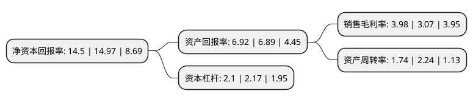

> 本页面由自动化程序生成于 2022年5月20日 01:18
> 内容可能存在错误，如有bug请提交issue至：https://github.com/Eroleice/doc-pi/issues
{.is-warning}

# 上市公司基本情况

## 基本资料

北京先进数通信息技术股份公司（以下简称“先进数通”）成立于2000年10月31日，北京市。于2016年09月13日在深交所创业板上市。

先进数通注册资本30,745.83万元，公司是国内银行业IT服务行业的重要参与者，主要提供面向商业银行为主的IT解决方案及服务，包括软件解决方案，IT基础设施建设及IT运维服务。以下是详细信息：

- 公司名称: 北京先进数通信息技术股份公司
- 股票代码: 300541.SZ
- 所在地: 北京 - 北京市
- 成立日期: 2000年10月31日
- 注册资本: 30,745.83万元
- 法定代表人: 李铠
- 主营业务: 公司是国内银行业IT服务行业的重要参与者，主要提供面向商业银行为主的IT解决方案及服务，包括软件解决方案，IT基础设施建设及IT运维服务
- 公司官网: www.adtec.com.cn
- 公司介绍: 公司是国内银行业IT服务行业的重要参与者，主要提供面向商业银行为主的IT解决方案及服务，包括软件解决方案、IT基础设施建设及IT运维服务。在IT基础设施建设及IT运维服务业务领域，公司拥有工信部计算机系统集成一级资质，主要服务于大型商业银行，是国内少数几家同时为工商银行、建设银行、农业银行、中国银行、交通银行、邮政储蓄银行提供IT基础设施建设及运维服务的服务商之一。公司是北京市高新技术企业，并拥有CMMIL3、ISO9001、ISO20000、ISO27001等核心资质认证。近年来，公司良好的品牌形象有力地促进了公司拓展和维护银行业及其他行业的优质客户，特别是IT系统建设需求快速发展的中小银行客户，形成了全面的市场覆盖，使公司的客户资源与品牌优势持续提升。

## 股东及高管情况

上市公司第一大股东为范丽明，持股17,334,752股，占比5.64%，**疑似为**上市公司实际控制人。

截至2022年03月31日，上市公司的前十大股东中，共有10名自然人股东，其中5%以上大股东共有2名。上市公司前十大股东明细如下：

> 未能通过持股比例判定出上市公司实际控制人（持股30%以上）
> 可能存在通过间接持股、联合持股、协议控制等方式拥有实际控制权的主体，具体请参考上市公司定期公告！
{.is-warning}

> 上市公司第一大股东持股不超过10%，请检查是否存在公司控制权风险！
{.is-danger}

> 截至2022年03月31日，上市公司前十大股东信息如下：

| 股东名称 | 持股数量（股） | 持股比例 |
| --- | --- | --- |
| 范丽明 | 17,334,752 | 5.64% |
| 李铠 | 15,771,658 | 5.13% |
| 林鸿 | 15,004,693 | 4.88% |
| 朱胡勇 | 8,626,958 | 2.81% |
| 罗云波 | 7,966,258 | 2.59% |
| 金麟 | 6,541,159 | 2.13% |
| 韩燕婴 | 4,596,431 | 1.49% |
| 杨格平 | 3,846,702 | 1.25% |
| 林波 | 2,515,777 | 0.82% |
| 谢智勇 | 2,417,611 | 0.79% |

## 利润表分析

上市公司2021年总收入为39.13亿元，净利润为1.55亿元，实现盈利。

## 杜邦分析

> 数据列示周期：2021年 | 2020年 | 2019年
{.is-info}

上市公司的净资产收益率在近一年有所下降，下降幅度为-3.14%，其变化情况分解如下：
- 上市公司的销售毛利率在近一年上升了29.64%，可能是生产效率的提升、商品原材料价格下跌或商品价格的上涨所致。
- 上市公司的资产周转率在近一年下降了-22.32%，可能是源自于更慢的销售回款或库存管理效果下降。
- 上市公司的财务杠杆比率在近一年下降了-3.23%，可能是减少负债降低财务费用。

