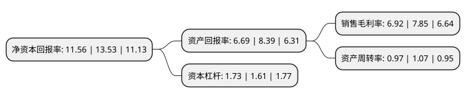

> 本页面由自动化程序生成于 2022年5月20日 01:18
> 内容可能存在错误，如有bug请提交issue至：https://github.com/Eroleice/doc-pi/issues
{.is-warning}

# 上市公司基本情况

## 基本资料

新晨科技股份有限公司（以下简称“新晨科技”）成立于1998年01月24日，北京市。于2016年09月20日在深交所创业板上市。

新晨科技注册资本30,005.606万元，主营业务主要从事面向银行业客户，空中交通管理行业客户，政府机构以及大中型国有企事业单位等进行相关行业应用软件的开发与设计，提供业务处理，数据交换和整合，系统集成以及技术支持和系统运行维护等服务。主要产品:软件开发业务产品，系统集成业务，专业技术服务。以下是详细信息：

- 公司名称: 新晨科技股份有限公司
- 股票代码: 300542.SZ
- 所在地: 北京 - 北京市
- 成立日期: 1998年01月24日
- 注册资本: 30,005.606万元
- 法定代表人: 康路
- 主营业务: 主营业务主要从事面向银行业客户，空中交通管理行业客户，政府机构以及大中型国有企事业单位等进行相关行业应用软件的开发与设计，提供业务处理，数据交换和整合，系统集成以及技术支持和系统运行维护等服务主要产品:软件开发业务产品，系统集成业务，专业技术服务
- 公司官网: www.brilliance.com.cn
- 公司介绍: 公司是以自主研发的新晨交换平台为基础面向重点行业进行应用软件开发并提供相应信息化解决方案和服务的供应商。自创立伊始，公司一直以高新技术领域为起点，为客户提供具有行业领先水平的IT产品与解决方案。公司获得了信息产业部颁发的“信息系统集成及服务(壹级)资质认证”证书；北京市科学技术委员会颁发的软件企业认定证书和高新技术企业认定证书；北京市武器装备科研生产单位保密资格审查认证委员会颁发的“武器装备科研生产单位保密资格(二级)资质”证书。新晨科技已通过了ISO9001：2000国际质量管理体系认证、美国专业评估机构进行的CMM2级评估。

## 股东及高管情况

上市公司第一大股东为李福华，持股43,592,250股，占比14.53%，**疑似为**上市公司实际控制人。

截至2022年04月27日，上市公司的前十大股东中，共有9名自然人股东，1个产品账户，其中5%以上大股东共有6名。上市公司前十大股东明细如下：

> 未能通过持股比例判定出上市公司实际控制人（持股30%以上）
> 可能存在通过间接持股、联合持股、协议控制等方式拥有实际控制权的主体，具体请参考上市公司定期公告！
{.is-warning}

> 截至2022年04月27日，上市公司前十大股东信息如下：

| 股东名称 | 持股数量（股） | 持股比例 |
| --- | --- | --- |
| 李福华 | 43,592,250 | 14.53% |
| 康路 | 39,282,750 | 13.09% |
| 康路 | 39,282,750 | 13.09% |
| 徐连平 | 32,540,850 | 10.84% |
| 张燕生 | 32,501,164 | 10.83% |
| 蒋琳华 | 26,489,450 | 8.8282% |
| 上海呈瑞投资管理有限公司-呈瑞精选5号私募证券投资基金 | 3,668,200 | 1.22% |
| 程希庆 | 2,566,600 | 0.86% |
| 李芸华 | 1,596,300 | 0.53% |
| 陆素芬 | 1,223,600 | 0.41% |

## 利润表分析

上市公司2021年总收入为10.61亿元，净利润为0.73亿元，实现盈利。

## 杜邦分析

> 数据列示周期：2021年 | 2020年 | 2019年
{.is-info}

上市公司的净资产收益率在近一年有所下降，下降幅度为-14.56%，其变化情况分解如下：
- 上市公司的销售毛利率在近一年下降了-11.85%，可能是生产效率的下降、商品原材料价格上涨或商品价格的下跌所致。
- 上市公司的资产周转率在近一年下降了-9.35%，可能是源自于更慢的销售回款或库存管理效果下降。
- 上市公司的财务杠杆比率在近一年上升了7.45%，可能是增加负债扩大生产规模。

