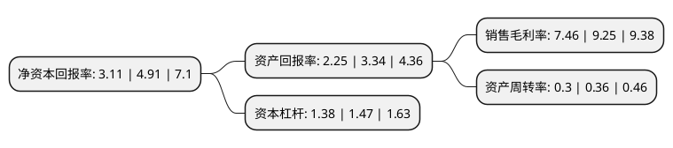

> 本页面由自动化程序生成于 2022年5月20日 01:18
> 内容可能存在错误，如有bug请提交issue至：https://github.com/Eroleice/doc-pi/issues
{.is-warning}

# 上市公司基本情况

## 基本资料

浙江和仁科技股份有限公司（以下简称“和仁科技”）成立于2010年10月26日，杭州市。于2016年10月18日在深交所创业板上市。

和仁科技注册资本26,499.544万元，主营业务:医疗机构临床医疗管理信息系统及数字化场景应用系统的研发销售，实施集成，服务支持。核心产品主要涵盖以下两类:(一)临床医疗管理信息系统，主要包括电子病历，医疗信息集成平台，临床数据中心，临床路径系统，一体化医护工作站，移动护理系统等电子病历及应用延伸系统和将商业分析(BI)，企业资源计划(ERP)，客户关系管理(CRM)等企业经营管理理念运用于医疗机构日常运营的管理应用系统;(二)数字化场景应用系统，主要包括一体化手术室系统，远程协同医疗系统，医疗机构运营控制系统等将临床医疗管理信息系统应用于不同医疗服务场所而形成的个性化信息管理应用系统。以下是详细信息：

- 公司名称: 浙江和仁科技股份有限公司
- 股票代码: 300550.SZ
- 所在地: 浙江 - 杭州市
- 成立日期: 2010年10月26日
- 注册资本: 26,499.544万元
- 法定代表人: 杨一兵
- 主营业务: 主营业务:医疗机构临床医疗管理信息系统及数字化场景应用系统的研发销售，实施集成，服务支持核心产品主要涵盖以下两类:(一)临床医疗管理信息系统，主要包括电子病历，医疗信息集成平台，临床数据中心，临床路径系统，一体化医护工作站，移动护理系统等电子病历及应用延伸系统和将商业分析(BI)，企业资源计划(ERP)，客户关系管理(CRM)等企业经营管理理念运用于医疗机构日常运营的管理应用系统;(二)数字化场景应用系统，主要包括一体化手术室系统，远程协同医疗系统，医疗机构运营控制系统等将临床医疗管理信息系统应用于不同医疗服务场所而形成的个性化信息管理应用系统
- 公司官网: www.herenit.com
- 公司介绍: 公司是一家具有核心产品的数字医疗信息服务提供商。公司为国内数字化医院建设、区域卫生信息化建设、个人健康管理提供最先进、最全面的整体解决方案，为客户提供包括专业咨询、战略规划、总包集成、软件授权、系统托管、增值服务在内的一站式信息化服务。公司的医疗卫生信息平台是以患者主索引、分布式文档存储、CDA、统一术语等核心组件搭建的符合国家卫生部标准、遵循国际规范的互联互通的数据中心和业务服务平台。公司被评定为“浙江省智慧医疗技术创新综合试点”企业，已获得了100多项技术成果，健全了公司资质和知识产权体系，成为智慧医疗建设的中坚力量。

## 股东及高管情况

上市公司第一大股东为杭州磐源投资有限公司，持股116,454,980股，占比43.95%，为上市公司实际控制人。

截至2022年03月31日，上市公司的前十大股东中，共有6名自然人股东，4名机构股东，其中5%以上大股东共有2名。上市公司前十大股东明细如下：

> 截至2022年03月31日，上市公司前十大股东信息如下：

| 股东名称 | 持股数量（股） | 持股比例 |
| --- | --- | --- |
| 杭州磐源投资有限公司 | 116,454,980 | 43.95% |
| 杭州磐鸿投资管理合伙企业(有限合伙) | 14,240,800 | 5.37% |
| 武汉雷石瑞丰股权投资合伙企业(有限合伙) | 7,840,000 | 2.96% |
| 尤飞煌 | 6,266,247 | 2.36% |
| 廖群娣 | 3,729,531 | 1.41% |
| 青岛城投金融控股集团有限公司 | 3,569,607 | 1.35% |
| 王秀梅 | 3,207,373 | 1.21% |
| 李圣锦 | 3,150,327 | 1.19% |
| 解光玖 | 3,032,215 | 1.14% |
| 袁晓 | 3,000,000 | 1.13% |

## 利润表分析

上市公司2021年总收入为4.64亿元，净利润为0.34亿元，实现盈利。

## 杜邦分析

> 数据列示周期：2021年 | 2020年 | 2019年
{.is-info}

上市公司的净资产收益率在近一年有所下降，下降幅度为-36.66%，其变化情况分解如下：
- 上市公司的销售毛利率在近一年下降了-19.35%，可能是生产效率的下降、商品原材料价格上涨或商品价格的下跌所致。
- 上市公司的资产周转率在近一年下降了-16.67%，可能是源自于更慢的销售回款或库存管理效果下降。
- 上市公司的财务杠杆比率在近一年下降了-6.12%，可能是减少负债降低财务费用。

