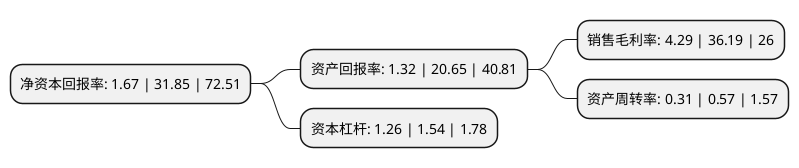

> 本页面由自动化程序生成于 2022年5月20日 01:18
> 内容可能存在错误，如有bug请提交issue至：https://github.com/Eroleice/doc-pi/issues
{.is-warning}

# 上市公司基本情况

## 基本资料

北京万集科技股份有限公司（以下简称“万集科技”）成立于1994年11月02日，北京市。于2016年10月21日在深交所创业板上市。

万集科技注册资本21,313.311万元，主要产品:动态称重系列与专用短程通信系列;主营业务:为公路交通和城市交通客户提供动态称重，专用短程通信两大系列产品的研发和生产。以下是详细信息：

- 公司名称: 北京万集科技股份有限公司
- 股票代码: 300552.SZ
- 所在地: 北京 - 北京市
- 成立日期: 1994年11月02日
- 注册资本: 21,313.311万元
- 法定代表人: 翟军
- 主营业务: 主要产品:动态称重系列与专用短程通信系列;主营业务:为公路交通和城市交通客户提供动态称重，专用短程通信两大系列产品的研发和生产
- 公司官网: www.wanji.net.cn
- 公司介绍: 公司是专业从事智能交通系统(ITS)技术研发、产品制造、技术服务的国家高新技术企业。公司研发出以动态称重、专用短程通信、激光检测、汽车电子标识、智能网联汽车为核心技术的全系列多种产品，在智能交通信息采集与处理行业取得了领先的市场地位。基于对动态称重技术的成熟应用，公司推出了秤台式、弯板式、联体秤、轴组秤、整车式、便携式等系列产品，覆盖高速公路计重收费、公路超限超载治理、道路桥梁保护、道路安全执法等应用领域，并为用户提供多样化的系统解决方案。凭借雄厚的研发实力、多年的技术积淀和大量的研发投入，万集科技在传感器设计、数据采集、核心算法及系统控制等技术方面取得创造性突破，已成为国内市场最大的动态称重设备供应商之一。公司是国家火炬计划重点高新技术企业、北京科技研究开发机构和北京市企业技术中心，拥有建筑企业资质和计算机系统集成资质，并通过了ISO9001质量管理认证。公司获得了中关村“十百千工程企业”、“北京市软件和信息服务业四个一批工程企业”、“中关村高成长企业TOP100”、“中关村瞪羚计划重点培育企业”等多项荣誉，及中国智能交通协会科学技术奖、北京公路学会科学技术奖等多个奖励。

## 股东及高管情况

上市公司第一大股东为翟军，持股99,154,836股，占比46.52%，为上市公司实际控制人。

截至2022年03月31日，上市公司的前十大股东中，共有6名自然人股东，2名机构股东，2个产品账户，其中5%以上大股东共有2名。上市公司前十大股东明细如下：

> 截至2022年03月31日，上市公司前十大股东信息如下：

| 股东名称 | 持股数量（股） | 持股比例 |
| --- | --- | --- |
| 翟军 | 99,154,836 | 46.52% |
| 崔学军 | 10,677,114 | 5.01% |
| 中国邮政储蓄银行股份有限公司-东方新能源汽车主题混合型证券投资基金 | 5,607,665 | 2.63% |
| 田林岩 | 3,733,097 | 1.75% |
| 国信证券股份有限公司 | 2,226,773 | 1.04% |
| 济南瑞和投资合伙企业(有限合伙) | 1,942,117 | 0.91% |
| 刘会喜 | 1,817,190 | 0.85% |
| 财通基金-上海银行-财通基金玉泉870号单一资产管理计划 | 1,523,229 | 0.71% |
| 赵爱立 | 1,061,614 | 0.5% |
| 霍建勋 | 1,061,614 | 0.5% |

## 利润表分析

上市公司2021年总收入为9.44亿元，净利润为0.4亿元，实现盈利。

## 杜邦分析

> 数据列示周期：2021年 | 2020年 | 2019年
{.is-info}

上市公司的净资产收益率在近一年有所下降，下降幅度为-94.76%，其变化情况分解如下：
- 上市公司的销售毛利率在近一年下降了-88.15%，可能是生产效率的下降、商品原材料价格上涨或商品价格的下跌所致。
- 上市公司的资产周转率在近一年下降了-45.61%，可能是源自于更慢的销售回款或库存管理效果下降。
- 上市公司的财务杠杆比率在近一年下降了-18.18%，可能是减少负债降低财务费用。

