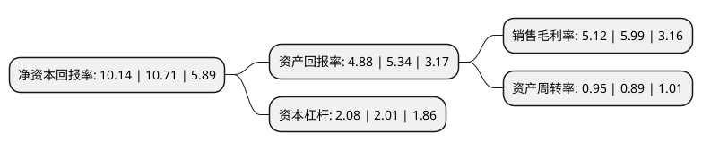

> 本页面由自动化程序生成于 2022年5月20日 01:18
> 内容可能存在错误，如有bug请提交issue至：https://github.com/Eroleice/doc-pi/issues
{.is-warning}

# 上市公司基本情况

## 基本资料

丝路视觉科技股份有限公司（以下简称“丝路视觉”）成立于2000年03月23日，深圳市。于2016年11月04日在深交所创业板上市。

丝路视觉注册资本11,937.688万元，主营业务:CG技术为基础的数字视觉综合服务业务，是专业化，全国性的CG视觉服务提供商，高新技术企业。主要产品:各类视觉效果图像;动画影片，广告，特效和各类CG多媒体内容;数字化的展厅，展馆，展览，发布会，主题活动等。以下是详细信息：

- 公司名称: 丝路视觉科技股份有限公司
- 股票代码: 300556.SZ
- 所在地: 广东 - 深圳市
- 成立日期: 2000年03月23日
- 注册资本: 11,937.688万元
- 法定代表人: 李萌迪
- 主营业务: 主营业务:CG技术为基础的数字视觉综合服务业务，是专业化，全国性的CG视觉服务提供商，高新技术企业主要产品:各类视觉效果图像;动画影片，广告，特效和各类CG多媒体内容;数字化的展厅，展馆，展览，发布会，主题活动等
- 公司官网: www.silkroadcg.com
- 公司介绍: 公司作为全国性的专业数字视觉综合服务供应商，立足于视觉科技与应用行业，专注于CG应用领域，以创意为核心、市场需求为导向，主要利用计算机图形图像技术进行视觉设计和创作，将CG技术与艺术相结合，依托长期积累的技术实力和前瞻性的创意设计能力，为建筑、设计、展馆、广告、动漫、影视、文体娱乐活动等行业的客户提供涵盖CG静态、CG动态、CG视觉场景业务的数字视觉综合服务。公司主要产品均通过CG(COMPUTER GRAPHICS)技术手段实现，即利用计算机技术进行数字化的图像设计和视觉艺术创作。根据表现形式、行业运用的不同，丝路视觉业务板块目前分为：数字营销、展览展示、设计可视化三大业务。

## 股东及高管情况

上市公司第一大股东为李萌迪，持股26,564,550股，占比22.25%，**疑似为**上市公司实际控制人。

截至2022年03月31日，上市公司的前十大股东中，共有10名自然人股东，其中5%以上大股东共有1名。上市公司前十大股东明细如下：

> 未能通过持股比例判定出上市公司实际控制人（持股30%以上）
> 可能存在通过间接持股、联合持股、协议控制等方式拥有实际控制权的主体，具体请参考上市公司定期公告！
{.is-warning}

> 截至2022年03月31日，上市公司前十大股东信息如下：

| 股东名称 | 持股数量（股） | 持股比例 |
| --- | --- | --- |
| 李萌迪 | 26,564,550 | 22.25% |
| 李朋辉 | 2,947,300 | 2.47% |
| 郑薪薪 | 714,700 | 0.6% |
| 王秀琴 | 675,000 | 0.57% |
| 康玉路 | 562,500 | 0.47% |
| 岳峰 | 553,275 | 0.46% |
| 王茂菱 | 550,000 | 0.46% |
| 胡晶华 | 472,500 | 0.4% |
| 钟志辉 | 466,000 | 0.39% |
| 余先梅 | 462,500 | 0.39% |

## 利润表分析

上市公司2021年总收入为13.88亿元，净利润为0.71亿元，实现盈利。

## 杜邦分析

> 数据列示周期：2021年 | 2020年 | 2019年
{.is-info}

上市公司的净资产收益率在近一年有所下降，下降幅度为-5.32%，其变化情况分解如下：
- 上市公司的销售毛利率在近一年下降了-14.52%，可能是生产效率的下降、商品原材料价格上涨或商品价格的下跌所致。
- 上市公司的资产周转率在近一年上升了6.74%，可能是源自于更快的销售回款或库存管理效果提升。
- 上市公司的财务杠杆比率在近一年上升了3.48%，可能是增加负债扩大生产规模。

