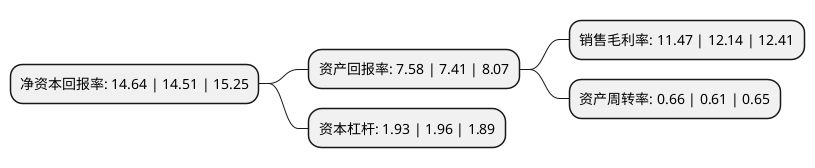

> 本页面由自动化程序生成于 2022年5月20日 01:18
> 内容可能存在错误，如有bug请提交issue至：https://github.com/Eroleice/doc-pi/issues
{.is-warning}

# 上市公司基本情况

## 基本资料

北京数字认证股份有限公司（以下简称“数字认证”）成立于2001年02月28日，北京市。于2016年12月23日在深交所创业板上市。

数字认证注册资本18,000万元，主营业务:提供电子认证服务，电子认证产品及可管理的信息安全服务;主要产品:电子认证服务，安全集成，安全资讯及运维服务。以下是详细信息：

- 公司名称: 北京数字认证股份有限公司
- 股票代码: 300579.SZ
- 所在地: 北京 - 北京市
- 成立日期: 2001年02月28日
- 注册资本: 18,000万元
- 法定代表人: 詹榜华
- 主营业务: 主营业务:提供电子认证服务，电子认证产品及可管理的信息安全服务;主要产品:电子认证服务，安全集成，安全资讯及运维服务
- 公司官网: www.bjca.cn
- 公司介绍: 公司是北京市国有资产经营有限责任公司控股的国有企业，是国内领先的信息安全解决方案提供商，主要业务为电子认证服务、电子认证产品及可管理的信息安全服务。公司为用户提供涵盖电子认证服务和电子认证产品的整体解决方案，建立起覆盖全国的电子认证服务网络和较完善的电子认证产品体系。应用领域覆盖政府、金融、医疗卫生、彩票、电信等市场，在电子政务领域的市场占有率位居行业前列，并已在医疗信息化、网上保险、互联网彩票等重点新兴应用领域建立了市场领先优势。公司是高新技术企业和软件企业，是具有工业和信息化部颁发的电子认证服务许可证资质，国家密码管理局颁发的商用密码销售、使用许可资质和电子政务电子认证服务许可资质、卫生系统电子认证服务资质的电子认证服务商;是具有国家风险评估资质、国家应急处理资质、国家信息安全服务安全工程类资质和北京市信息安全服务资质的信息安全服务提供商。

## 股东及高管情况

上市公司第一大股东为北京市国有资产经营有限责任公司，持股47,237,193股，占比26.24%，**疑似为**上市公司实际控制人。

截至2022年03月31日，上市公司的前十大股东中，共有5名自然人股东，4名机构股东，1个海外主体，其中5%以上大股东共有2名。上市公司前十大股东明细如下：

> 未能通过持股比例判定出上市公司实际控制人（持股30%以上）
> 可能存在通过间接持股、联合持股、协议控制等方式拥有实际控制权的主体，具体请参考上市公司定期公告！
{.is-warning}

> 截至2022年03月31日，上市公司前十大股东信息如下：

| 股东名称 | 持股数量（股） | 持股比例 |
| --- | --- | --- |
| 北京市国有资产经营有限责任公司 | 47,237,193 | 26.24% |
| 首都信息发展股份有限公司 | 47,223,931 | 26.24% |
| 詹榜华 | 4,804,967 | 2.67% |
| 上海西上海投资发展有限公司 | 3,552,100 | 1.97% |
| 上海西上海资产经营有限公司 | 3,292,725 | 1.83% |
| 徐敏 | 2,155,150 | 1.2% |
| 林雪焰 | 1,238,936 | 0.69% |
| 香港中央结算有限公司(陆股通) | 1,119,074 | 0.62% |
| 杨华均 | 765,576 | 0.43% |
| 黄娜 | 731,350 | 0.41% |

## 利润表分析

上市公司2021年总收入为10.26亿元，净利润为1.17亿元，实现盈利。

## 杜邦分析

> 数据列示周期：2021年 | 2020年 | 2019年
{.is-info}

上市公司的净资产收益率在近一年有所上升，上升幅度为0.9%，其变化情况分解如下：
- 上市公司的销售毛利率在近一年下降了-5.52%，可能是生产效率的下降、商品原材料价格上涨或商品价格的下跌所致。
- 上市公司的资产周转率在近一年上升了8.2%，可能是源自于更快的销售回款或库存管理效果提升。
- 上市公司的财务杠杆比率在近一年下降了-1.53%，可能是减少负债降低财务费用。

