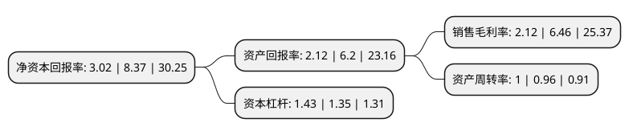

> 本页面由自动化程序生成于 2022年5月20日 01:19
> 内容可能存在错误，如有bug请提交issue至：https://github.com/Eroleice/doc-pi/issues
{.is-warning}

# 上市公司基本情况

## 基本资料

诚迈科技(南京)股份有限公司（以下简称“诚迈科技”）成立于2006年09月01日，南京市。于2017年01月20日在深交所创业板上市。

诚迈科技注册资本16,003.593万元，公司是移动智能终端软件和技术解决方案主要提供商，主营业务为移动智能终端相关的软件研发，销售及技术服务。以下是详细信息：

- 公司名称: 诚迈科技(南京)股份有限公司
- 股票代码: 300598.SZ
- 所在地: 江苏 - 南京市
- 成立日期: 2006年09月01日
- 注册资本: 16,003.593万元
- 法定代表人: 王继平
- 主营业务: 公司是移动智能终端软件和技术解决方案主要提供商，主营业务为移动智能终端相关的软件研发，销售及技术服务
- 公司官网: www.archermind.com
- 公司介绍: 公司成立于2006年9月，智能科技专家，专注于智能手机、智能汽车、智能硬件、人工智能以及移动互联网领域的嵌入式软件技术研发与创新，致力于为客户提供全生命周期的解决方案。公司总部位于中国南京，在成都、武汉、西安、芜湖等地设立了研发中心，在北京、上海等一线城市为客户提供技术资源服务，在美国、德国、日本、印度等国家设立海外资源中心，服务于众多世界500强客户。公司与主流知名移动芯片厂商、移动终端设备厂商、汽车厂商以及移动互联网厂商建立了长期稳定的合作关系。公司通过了CMMI5、信息系统集成及服务资质二级认证、质量、信息安全、环境、健康职业等管理体系认证。

## 股东及高管情况

上市公司第一大股东为南京德博投资管理有限公司，持股47,418,445股，占比29.63%，**疑似为**上市公司实际控制人。

截至2022年03月31日，上市公司的前十大股东中，共有3名自然人股东，3名机构股东，1个产品账户，3个海外主体，其中5%以上大股东共有1名。上市公司前十大股东明细如下：

> 未能通过持股比例判定出上市公司实际控制人（持股30%以上）
> 可能存在通过间接持股、联合持股、协议控制等方式拥有实际控制权的主体，具体请参考上市公司定期公告！
{.is-warning}

> 截至2022年03月31日，上市公司前十大股东信息如下：

| 股东名称 | 持股数量（股） | 持股比例 |
| --- | --- | --- |
| 南京德博投资管理有限公司 | 47,418,445 | 29.63% |
| 南京泰泽投资管理中心(有限合伙) | 7,440,225 | 4.65% |
| ScentshillCapitalI,Limited | 7,396,869 | 4.62% |
| 南京观晨投资管理中心(有限合伙) | 3,999,805 | 2.5% |
| 宋鲁燕 | 749,900 | 0.47% |
| ScentshillCapitalII,Limited | 604,887 | 0.38% |
| 诺德基金-东海证券股份有限公司-诺德基金浦江4号单一资产管理计划 | 555,000 | 0.35% |
| 张泽明 | 461,989 | 0.29% |
| 香港中央结算有限公司(陆股通) | 436,863 | 0.27% |
| 王志荣 | 355,800 | 0.22% |

## 利润表分析

上市公司2021年总收入为14.24亿元，净利润为0.3亿元，实现盈利。

## 杜邦分析

> 数据列示周期：2021年 | 2020年 | 2019年
{.is-info}

上市公司的净资产收益率在近一年有所下降，下降幅度为-63.92%，其变化情况分解如下：
- 上市公司的销售毛利率在近一年下降了-67.18%，可能是生产效率的下降、商品原材料价格上涨或商品价格的下跌所致。
- 上市公司的资产周转率在近一年上升了4.17%，可能是源自于更快的销售回款或库存管理效果提升。
- 上市公司的财务杠杆比率在近一年上升了5.93%，可能是增加负债扩大生产规模。

