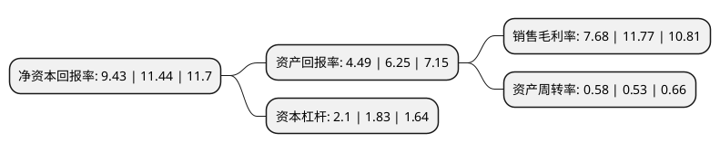

> 本页面由自动化程序生成于 2022年5月20日 01:19
> 内容可能存在错误，如有bug请提交issue至：https://github.com/Eroleice/doc-pi/issues
{.is-warning}

# 上市公司基本情况

## 基本资料

恒锋信息科技股份有限公司（以下简称“恒锋信息”）成立于1995年10月27日，福州市。于2017年02月08日在深交所创业板上市。

恒锋信息注册资本16,456.462万元，主营业务:提供智慧城市行业综合解决方案。公司以智能建筑为载体，为民生(科，教，文，卫)，公共安全(公，检，法，军，警)，城市服务(园区，金融，政务)等众多应用领域的客户提供设计咨询，系统集成，软硬件开发，管理运维等全过程信息技术服务。公司主要产品:智慧城市行业综合解决方案的基本框架，公司智慧城市综合解决方案的典型行业应用。以下是详细信息：

- 公司名称: 恒锋信息科技股份有限公司
- 股票代码: 300605.SZ
- 所在地: 福建 - 福州市
- 成立日期: 1995年10月27日
- 注册资本: 16,456.462万元
- 法定代表人: 魏晓曦
- 主营业务: 主营业务:提供智慧城市行业综合解决方案公司以智能建筑为载体，为民生(科，教，文，卫)，公共安全(公，检，法，军，警)，城市服务(园区，金融，政务)等众多应用领域的客户提供设计咨询，系统集成，软硬件开发，管理运维等全过程信息技术服务公司主要产品:智慧城市行业综合解决方案的基本框架，公司智慧城市综合解决方案的典型行业应用
- 公司官网: www.i-hengfeng.com
- 公司介绍: 公司定位为智慧城市信息服务提供商，向客户提供信息服务的规划设计咨询、软硬件开发、系统集成、运维托管等全过程信息技术服务。公司提供的产品主要服务于智慧城市中民生、公共安全、城市服务三大领域。公司是中国优秀的智慧城市信息服务提供商、是国家高新技术企业，为民生、公共安全和城市服务等领域客户提供快捷、专业、精益求精的信息服务，并荣获“中国软件行业优秀服务提供商”、“中国智慧城市领军企业”、“中国智慧城市创新企业”、“福建省软件骨干企业”、“中国智能建筑行业百强企业”、“中国机房工程企业30强”等荣誉。

## 股东及高管情况

上市公司第一大股东为魏晓曦，持股49,556,246股，占比30.11%，为上市公司实际控制人。

截至2022年03月31日，上市公司的前十大股东中，共有8名自然人股东，1名机构股东，1个产品账户，其中5%以上大股东共有2名。上市公司前十大股东明细如下：

> 截至2022年03月31日，上市公司前十大股东信息如下：

| 股东名称 | 持股数量（股） | 持股比例 |
| --- | --- | --- |
| 魏晓曦 | 49,556,246 | 30.11% |
| 欧霖杰 | 17,717,800 | 10.77% |
| 魏晓婷 | 6,839,340 | 4.16% |
| 福州赢华投资管理有限公司-赢华福慧双增5号私募证券投资基金 | 2,065,100 | 1.25% |
| 廖伟俭 | 1,521,300 | 0.92% |
| 上海榕辉实业有限公司 | 1,291,246 | 0.78% |
| 荆涛 | 1,228,770 | 0.75% |
| 陈祥娜 | 1,214,900 | 0.74% |
| 王晖 | 850,000 | 0.52% |
| 陈朝学 | 685,268 | 0.42% |

## 利润表分析

上市公司2021年总收入为6.12亿元，净利润为0.47亿元，实现盈利。

## 杜邦分析

> 数据列示周期：2021年 | 2020年 | 2019年
{.is-info}

上市公司的净资产收益率在近一年有所下降，下降幅度为-17.57%，其变化情况分解如下：
- 上市公司的销售毛利率在近一年下降了-34.75%，可能是生产效率的下降、商品原材料价格上涨或商品价格的下跌所致。
- 上市公司的资产周转率在近一年上升了9.43%，可能是源自于更快的销售回款或库存管理效果提升。
- 上市公司的财务杠杆比率在近一年上升了14.75%，可能是增加负债扩大生产规模。

