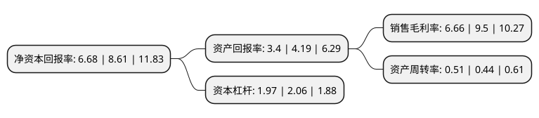

> 本页面由自动化程序生成于 2022年5月20日 01:19
> 内容可能存在错误，如有bug请提交issue至：https://github.com/Eroleice/doc-pi/issues
{.is-warning}

# 上市公司基本情况

## 基本资料

北京思特奇信息技术股份有限公司（以下简称“思特奇”）成立于1995年12月25日，北京市。于2017年02月13日在深交所创业板上市。

思特奇注册资本20,991.007万元，公司的主营业务包括:为中国移动，中国联通，中国电信和广电网络等电信运营商提供客户关系管理，大数据，计费，移动互联网和业务保障等核心业务系统的全面解决方案，包括系统咨询，规划和产品的开发，升级，服务;提供公有云和大数据的服务和运营，以及公有云和大数据体系下的通用平台产品;提供基于移动互联网云和大数据的中小企业服务。以下是详细信息：

- 公司名称: 北京思特奇信息技术股份有限公司
- 股票代码: 300608.SZ
- 所在地: 北京 - 北京市
- 成立日期: 1995年12月25日
- 注册资本: 20,991.007万元
- 法定代表人: 吴飞舟
- 主营业务: 公司的主营业务包括:为中国移动，中国联通，中国电信和广电网络等电信运营商提供客户关系管理，大数据，计费，移动互联网和业务保障等核心业务系统的全面解决方案，包括系统咨询，规划和产品的开发，升级，服务;提供公有云和大数据的服务和运营，以及公有云和大数据体系下的通用平台产品;提供基于移动互联网云和大数据的中小企业服务
- 公司官网: www.si-tech.com.cn
- 公司介绍: 公司是一家致力于电信行业的软件开发和服务提供商，逐渐成长为国内领先的电信运营商核心业务系统软件厂商。公司拥有优秀的技术水平、周密的项目管理、完善的支持服务专注于运营商的业务支撑体系的研究与开发；同时，更以领先的软件产品研发和业务规划、咨询、集成能力服务于中外运营商。公司将秉承“智慧、创新、精准、高效、便捷、快乐”的发展理念，紧跟产业步伐，拓展新兴市场，统筹推进，用创新的理念、独特的方法、有机的组织，打造东方文化背景下，提供一流软件产品和优质服务的现代化企业。

## 股东及高管情况

上市公司第一大股东为吴飞舟，持股62,318,671股，占比29.72%，**疑似为**上市公司实际控制人。

截至2022年03月31日，上市公司的前十大股东中，共有7名自然人股东，3名机构股东，其中5%以上大股东共有1名。上市公司前十大股东明细如下：

> 未能通过持股比例判定出上市公司实际控制人（持股30%以上）
> 可能存在通过间接持股、联合持股、协议控制等方式拥有实际控制权的主体，具体请参考上市公司定期公告！
{.is-warning}

> 截至2022年03月31日，上市公司前十大股东信息如下：

| 股东名称 | 持股数量（股） | 持股比例 |
| --- | --- | --- |
| 吴飞舟 | 62,318,671 | 29.72% |
| 北京中盛华宇技术合伙企业(有限合伙) | 3,610,358 | 1.72% |
| 王剑 | 2,426,000 | 1.16% |
| 姚国宁 | 2,098,662 | 1% |
| 北京中盛鸿祥技术合伙企业(有限合伙) | 1,245,369 | 0.59% |
| 徐正 | 1,132,500 | 0.54% |
| 施强鹏 | 966,200 | 0.46% |
| 北京天益瑞泰技术合伙企业(有限合伙) | 942,847 | 0.45% |
| 郭旭 | 877,832 | 0.42% |
| 荆涛 | 774,784 | 0.37% |

## 利润表分析

上市公司2021年总收入为9.04亿元，净利润为0.6亿元，实现盈利。

## 杜邦分析

> 数据列示周期：2021年 | 2020年 | 2019年
{.is-info}

上市公司的净资产收益率在近一年有所下降，下降幅度为-22.42%，其变化情况分解如下：
- 上市公司的销售毛利率在近一年下降了-29.89%，可能是生产效率的下降、商品原材料价格上涨或商品价格的下跌所致。
- 上市公司的资产周转率在近一年上升了15.91%，可能是源自于更快的销售回款或库存管理效果提升。
- 上市公司的财务杠杆比率在近一年下降了-4.37%，可能是减少负债降低财务费用。

