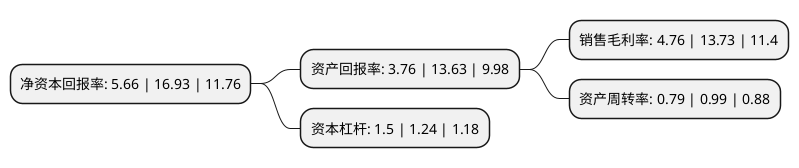

> 本页面由自动化程序生成于 2022年5月20日 01:19
> 内容可能存在错误，如有bug请提交issue至：https://github.com/Eroleice/doc-pi/issues
{.is-warning}

# 上市公司基本情况

## 基本资料

万兴科技集团股份有限公司（以下简称“万兴科技”）成立于2003年09月28日，拉萨市。于2018年01月18日在深交所创业板上市。

万兴科技注册资本12,989.801万元，主营业务:从事消费类软件研发，销售及提供相应技术支持服务。主要产品:围绕个人，家庭消费者应用而设计的与生活，娱乐，工作等相关的软件产品，主要包括多媒体类，跨端数据管理类和数字文档类三大类。以下是详细信息：

- 公司名称: 万兴科技集团股份有限公司
- 股票代码: 300624.SZ
- 所在地: 西藏 - 拉萨市
- 成立日期: 2003年09月28日
- 注册资本: 12,989.801万元
- 法定代表人: 吴太兵
- 主营业务: 主营业务:从事消费类软件研发，销售及提供相应技术支持服务主要产品:围绕个人，家庭消费者应用而设计的与生活，娱乐，工作等相关的软件产品，主要包括多媒体类，跨端数据管理类和数字文档类三大类
- 公司官网: www.wondershare.cn
- 公司介绍: 公司成立于2003年，并于2018年登陆A股创业板，是全球领先的新生代数字创意赋能者，致力于成为全世界范围内有特色、有影响力的百年软件老店。公司以“让世界更有创意”为使命，面向全球海量新生代互联网用户提供潮流前沿、简单便捷的数字创意软件产品与服务，赋能人们在数字时代与众不同地进行创意表达，帮助每一个新生代创作者将头脑中的灵感变为可见的现实。万兴科技也是中国政府认定的“国家规划布局内重点软件企业”，连续跻身“德勤高科技高成长亚太区500强”、“福布斯中国最具发展潜力企业”等荣誉榜。当前，万兴科技持续深耕数字创意软件领域，围绕“视频创意、绘图创意、文档创意、实用工具”持续拓宽数字创意新生态战略版图，积极推动技术创新与质量提升，推出超百款数字创意软件产品，包括：万兴喵影、Wondershare Filmora、StoryChic、Beat.ly、亿图图示、亿图脑图、墨刀、万兴PDF、万兴易修、万兴恢复专家等明星产品，深受海内外用户欢迎。公司正以前瞻的视野推进全球化布局，研发总部位于深圳，并在北京、长沙、杭州、温哥华、东京等地设有运营中心，业务范围遍及全球200多个国家和地区。万兴科技不断提升产品研发和创新能力，大力进行团队精英化建设，并以独具特色的“三勤六和”村落式文化，为员工打造释放个体价值的成长平台，为团队注入独立思考、勤奋务实、与时俱进的精神活力。在平等、开放、协作、共享的人文理念下，万兴人不断成长，共同朝着“百年万兴、全球万兴”梦想笃定前行。

## 股东及高管情况

上市公司第一大股东为吴太兵，持股23,128,560股，占比17.81%，**疑似为**上市公司实际控制人。

截至2022年03月31日，上市公司的前十大股东中，共有4名自然人股东，3名机构股东，2个产品账户，1个海外主体，其中5%以上大股东共有2名。上市公司前十大股东明细如下：

> 未能通过持股比例判定出上市公司实际控制人（持股30%以上）
> 可能存在通过间接持股、联合持股、协议控制等方式拥有实际控制权的主体，具体请参考上市公司定期公告！
{.is-warning}

> 截至2022年03月31日，上市公司前十大股东信息如下：

| 股东名称 | 持股数量（股） | 持股比例 |
| --- | --- | --- |
| 吴太兵 | 23,128,560 | 17.81% |
| 宿迁兴亿网络科技有限公司 | 18,929,004 | 14.57% |
| 香港中央结算有限公司(陆股通) | 6,297,538 | 4.85% |
| 宿迁家兴网络科技有限公司 | 3,702,970 | 2.85% |
| 石世红 | 1,500,000 | 1.15% |
| 刘穗龙 | 1,097,900 | 0.85% |
| 中国工商银行-汇添富优势精选混合型证券投资基金 | 705,593 | 0.54% |
| 中国工商银行-汇添富美丽30混合型证券投资基金 | 500,000 | 0.38% |
| 浙江华睿盛银创业投资有限公司 | 480,000 | 0.37% |
| 罗敏芳 | 450,000 | 0.35% |

## 利润表分析

上市公司2021年总收入为10.29亿元，净利润为0.49亿元，实现盈利。

## 杜邦分析

> 数据列示周期：2021年 | 2020年 | 2019年
{.is-info}

上市公司的净资产收益率在近一年有所下降，下降幅度为-66.57%，其变化情况分解如下：
- 上市公司的销售毛利率在近一年下降了-65.33%，可能是生产效率的下降、商品原材料价格上涨或商品价格的下跌所致。
- 上市公司的资产周转率在近一年下降了-20.2%，可能是源自于更慢的销售回款或库存管理效果下降。
- 上市公司的财务杠杆比率在近一年上升了20.97%，可能是增加负债扩大生产规模。

