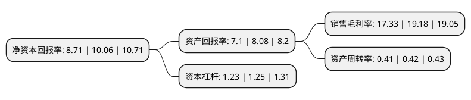

> 本页面由自动化程序生成于 2022年5月20日 01:19
> 内容可能存在错误，如有bug请提交issue至：https://github.com/Eroleice/doc-pi/issues
{.is-warning}

# 上市公司基本情况

## 基本资料

彩讯科技股份有限公司（以下简称“彩讯股份”）成立于2004年01月06日，深圳市。于2018年03月23日在深交所创业板上市。

彩讯股份注册资本44,401.11万元，公司主要为国内通信，能源，零售，金融，教育等行业的大中型企业，政府企业客户提供基于邮件系统，云存储，协同办公，大数据平台及应用，电子渠道建设和运营支撑，数字营销等产品的互联网应用平台的建设及运营支撑服务，具体包括软件产品开发与销售，技术服务和系统集成。以下是详细信息：

- 公司名称: 彩讯科技股份有限公司
- 股票代码: 300634.SZ
- 所在地: 广东 - 深圳市
- 成立日期: 2004年01月06日
- 注册资本: 44,401.11万元
- 法定代表人: 杨良志
- 主营业务: 公司主要为国内通信，能源，零售，金融，教育等行业的大中型企业，政府企业客户提供基于邮件系统，云存储，协同办公，大数据平台及应用，电子渠道建设和运营支撑，数字营销等产品的互联网应用平台的建设及运营支撑服务，具体包括软件产品开发与销售，技术服务和系统集成
- 公司官网: www.richinfo.cn
- 公司介绍: 公司是国家规划布局重点软件企业之一，致力于成长为中国领先的产业互联网服务提供商。公司成立多年以来，专注互联网领域的软件开发和业务运营，秉持“创新移动互联，超越客户期望”的理念，和“一流技术、周到服务、协作共赢”的精神，为通信行业、能源行业、交通行业、金融行业等广大客户开发并运营互联网应用平台、企业协作和营销平台、企业级大数据应用平台。公司引进一系列成熟的项目管理平台建立了一套完整的项目管理体系，拥有CMMI-4认证，为国家高新技术企业认证。

## 股东及高管情况

上市公司第一大股东为深圳市百砻技术有限公司，持股89,972,600股，占比20.26%，**疑似为**上市公司实际控制人。

截至2022年03月31日，上市公司的前十大股东中，共有3名自然人股东，6名机构股东，1个产品账户，其中5%以上大股东共有4名。上市公司前十大股东明细如下：

> 未能通过持股比例判定出上市公司实际控制人（持股30%以上）
> 可能存在通过间接持股、联合持股、协议控制等方式拥有实际控制权的主体，具体请参考上市公司定期公告！
{.is-warning}

> 截至2022年03月31日，上市公司前十大股东信息如下：

| 股东名称 | 持股数量（股） | 持股比例 |
| --- | --- | --- |
| 深圳市百砻技术有限公司 | 89,972,600 | 20.26% |
| 深圳市万融技术有限公司 | 68,372,600 | 15.4% |
| 永新县光彩信息科技研究中心(有限合伙) | 36,351,310 | 8.19% |
| 广东达盛房地产有限公司 | 24,550,421 | 5.53% |
| 杨良志 | 21,600,000 | 4.86% |
| 永新县明彩信息科技研究中心(有限合伙) | 19,974,017 | 4.5% |
| 永新县瑞彩信息科技研究中心(有限合伙) | 13,923,865 | 3.14% |
| 车荣全 | 10,115,026 | 2.28% |
| 李黎军 | 8,177,933 | 1.84% |
| 广东恒健资产管理有限公司-广东恒会股权投资基金(有限合伙) | 6,250,000 | 1.41% |

## 利润表分析

上市公司2021年总收入为8.87亿元，净利润为1.53亿元，实现盈利。

## 杜邦分析

> 数据列示周期：2021年 | 2020年 | 2019年
{.is-info}

上市公司的净资产收益率在近一年有所下降，下降幅度为-13.42%，其变化情况分解如下：
- 上市公司的销售毛利率在近一年下降了-9.65%，可能是生产效率的下降、商品原材料价格上涨或商品价格的下跌所致。
- 上市公司的资产周转率在近一年下降了-2.38%，可能是源自于更慢的销售回款或库存管理效果下降。
- 上市公司的财务杠杆比率在近一年下降了-1.6%，可能是减少负债降低财务费用。

