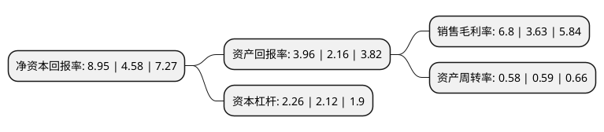

> 本页面由自动化程序生成于 2022年5月20日 01:19
> 内容可能存在错误，如有bug请提交issue至：https://github.com/Eroleice/doc-pi/issues
{.is-warning}

# 上市公司基本情况

## 基本资料

浙江正元智慧科技股份有限公司（以下简称“正元智慧”）成立于2000年03月13日，杭州市。于2017年04月21日在深交所创业板上市。

正元智慧注册资本13,794.036万元，公司主营业务为智慧一卡通系统的设计，研发，生产，销售，服务及增值运营。公司共拥有超过百种软硬件产品，形成了以智慧一卡通系统建设，智慧一卡通增值服务与运营，智能控业务为主的集软件平台，终端产品，服务及综合解决方案的产品体系。以下是详细信息：

- 公司名称: 浙江正元智慧科技股份有限公司
- 股票代码: 300645.SZ
- 所在地: 浙江 - 杭州市
- 成立日期: 2000年03月13日
- 注册资本: 13,794.036万元
- 法定代表人: 陈坚
- 主营业务: 公司主营业务为智慧一卡通系统的设计，研发，生产，销售，服务及增值运营公司共拥有超过百种软硬件产品，形成了以智慧一卡通系统建设，智慧一卡通增值服务与运营，智能控业务为主的集软件平台，终端产品，服务及综合解决方案的产品体系
- 公司官网: www.hzsun.com
- 公司介绍: 公司是国家火炬计划重点高新技术企业、国家规划布局内重点软件企业。作为智能卡应用行业领航者、智慧教育集大成者、智慧城市践行者，公司通过聚合支付、生物识别、大数据、物联网、移动互联、量子加密及区块链等新兴技术的研究应用，以及移动智能终端设备、可穿戴设备的产品开发，着力为教育、电力、医疗卫生、政府军警及大型企事业、园区社区提供智慧一卡通、物联网产品、解决方案与运维服务。公司拥有自主研发生产的百余项软件著作权、专利及多系列核心硬件产品，以“智慧的架构、智慧的服务、智慧的管理、智慧的运维、智慧的感知”的平台设计，在行业内处于领先地位。产品通过公安部、人民银行认证，先后获得“武警部队科技进步一等奖”、“国家金卡工程金蚂蚁奖”、“中国国际软件博览会金奖”。

## 股东及高管情况

上市公司第一大股东为杭州正元企业管理咨询有限公司，持股36,680,617股，占比26.59%，**疑似为**上市公司实际控制人。

截至2022年03月31日，上市公司的前十大股东中，共有7名自然人股东，3名机构股东，其中5%以上大股东共有1名。上市公司前十大股东明细如下：

> 未能通过持股比例判定出上市公司实际控制人（持股30%以上）
> 可能存在通过间接持股、联合持股、协议控制等方式拥有实际控制权的主体，具体请参考上市公司定期公告！
{.is-warning}

> 截至2022年03月31日，上市公司前十大股东信息如下：

| 股东名称 | 持股数量（股） | 持股比例 |
| --- | --- | --- |
| 杭州正元企业管理咨询有限公司 | 36,680,617 | 26.59% |
| 杭州易康投资管理有限公司 | 6,183,662 | 4.48% |
| 李琳 | 3,689,762 | 2.67% |
| 杭州正浩投资管理有限公司 | 2,562,081 | 1.86% |
| 董书倩 | 2,026,950 | 1.47% |
| 郭明珠 | 1,331,485 | 0.97% |
| 刘大江 | 1,309,100 | 0.95% |
| 邵萍 | 803,602 | 0.58% |
| 边萌 | 769,200 | 0.56% |
| 张亮 | 604,176 | 0.44% |

## 利润表分析

上市公司2021年总收入为9.47亿元，净利润为0.64亿元，实现盈利。

## 杜邦分析

> 数据列示周期：2021年 | 2020年 | 2019年
{.is-info}

上市公司的净资产收益率在近一年有所上升，上升幅度为95.41%，其变化情况分解如下：
- 上市公司的销售毛利率在近一年上升了87.33%，可能是生产效率的提升、商品原材料价格下跌或商品价格的上涨所致。
- 上市公司的资产周转率在近一年下降了-1.69%，可能是源自于更慢的销售回款或库存管理效果下降。
- 上市公司的财务杠杆比率在近一年上升了6.6%，可能是增加负债扩大生产规模。

