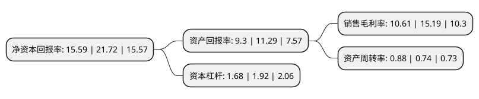

> 本页面由自动化程序生成于 2022年5月20日 01:19
> 内容可能存在错误，如有bug请提交issue至：https://github.com/Eroleice/doc-pi/issues
{.is-warning}

# 上市公司基本情况

## 基本资料

北京宇信科技集团股份有限公司（以下简称“宇信科技”）成立于2006年10月19日，北京市。于2018年11月07日在深交所创业板上市。

宇信科技注册资本71,162.614万元，主营业务:从事向以银行为主的金融机构提供包括咨询，软件产品，软件开发和实施，运营维护，系统集成等信息化服务。公司主营业务包括软件开发及服务，系统集成销售及服务，其他主营业务三大类。截至2017年6月30日，公司产品已覆盖渠道，业务和管理类主要产品，并在相关产品上有着较高的市场占有率及市场排名。以下是详细信息：

- 公司名称: 北京宇信科技集团股份有限公司
- 股票代码: 300674.SZ
- 所在地: 北京 - 北京市
- 成立日期: 2006年10月19日
- 注册资本: 71,162.614万元
- 法定代表人: 洪卫东
- 主营业务: 主营业务:从事向以银行为主的金融机构提供包括咨询，软件产品，软件开发和实施，运营维护，系统集成等信息化服务公司主营业务包括软件开发及服务，系统集成销售及服务，其他主营业务三大类截至2017年6月30日，公司产品已覆盖渠道，业务和管理类主要产品，并在相关产品上有着较高的市场占有率及市场排名
- 公司官网: www.yusys.com.cn
- 公司介绍: 公司是中国金融IT服务领军企业，主要从事向以银行为主的金融机构提供包括咨询、软件产品、软件开发和实施、运营维护、系统集成等信息化服务。公司在客户关系管理、移动金融、呼叫中心、柜台交易以及系统增值服务等领域也拥有业界领先的产品并保持着强劲的增长势头，是中国银行业IT解决方案市场中的领军者，是产品种类全，专业化程度高，具品牌影响力的IT供应商之一。公司成立至今，一直将以银行为主的金融机构作为主要服务对象，凭借行业领先的技术优势及良好的服务意识，在金融领域内积累了大量具有长期稳定合作关系的客户。公司为高新技术企业，拥有CMMI3认证、ISO9001质量管理体系认证、信息系统集成及服务资质认证。公司参与制定了工信部的《软件研发成本度量规范》(SJ/T11463-2013)和北京市地方标准《信息化项目软件开发费用测算规范》(DB11/T1010-2013)。

## 股东及高管情况

上市公司第一大股东为珠海宇琴鸿泰创业投资集团有限公司，持股198,256,896股，占比27.86%，**疑似为**上市公司实际控制人。

截至2022年05月11日，上市公司的前十大股东中，共有3名自然人股东，4名机构股东，1个产品账户，2个海外主体，其中5%以上大股东共有2名。上市公司前十大股东明细如下：

> 未能通过持股比例判定出上市公司实际控制人（持股30%以上）
> 可能存在通过间接持股、联合持股、协议控制等方式拥有实际控制权的主体，具体请参考上市公司定期公告！
{.is-warning}

> 截至2022年05月11日，上市公司前十大股东信息如下：

| 股东名称 | 持股数量（股） | 持股比例 |
| --- | --- | --- |
| 珠海宇琴鸿泰创业投资集团有限公司 | 198,256,896 | 27.86% |
| 百度(中国)有限公司 | 36,571,427 | 5.14% |
| PORT WING DEVELOPMENT COMAPANY LIMITED | 34,971,592 | 4.91% |
| 竺士文 | 15,260,420 | 2.14% |
| 华侨星城(上海)股权投资基金合伙企业(有限合伙) | 13,237,906 | 1.86% |
| FIDELITY INFORMATION SERVICES INTERNATIONAL HOLDINGS, INC. | 9,046,656 | 1.27% |
| 王廷鹏 | 8,089,992 | 1.14% |
| 珠海宇琴通诚信息咨询合伙企业(有限合伙) | 7,091,697 | 1% |
| 珠海宇琴广源信息咨询合伙企业(有限合伙) | 7,087,868 | 1% |
| 朱荣玲 | 6,818,524 | 0.96% |

## 利润表分析

上市公司2021年总收入为37.26亿元，净利润为3.95亿元，实现盈利。

## 杜邦分析

> 数据列示周期：2021年 | 2020年 | 2019年
{.is-info}

上市公司的净资产收益率在近一年有所下降，下降幅度为-28.22%，其变化情况分解如下：
- 上市公司的销售毛利率在近一年下降了-30.15%，可能是生产效率的下降、商品原材料价格上涨或商品价格的下跌所致。
- 上市公司的资产周转率在近一年上升了18.92%，可能是源自于更快的销售回款或库存管理效果提升。
- 上市公司的财务杠杆比率在近一年下降了-12.5%，可能是减少负债降低财务费用。

