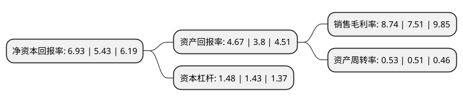

> 本页面由自动化程序生成于 2022年5月20日 01:19
> 内容可能存在错误，如有bug请提交issue至：https://github.com/Eroleice/doc-pi/issues
{.is-warning}

# 上市公司基本情况

## 基本资料

中科院成都信息技术股份有限公司（以下简称“中科信息”）成立于2001年06月26日，成都市。于2017年07月28日在深交所创业板上市。

中科信息注册资本19,759.086万元，主要产品:为客户提供信息化解决方案(包括软件和硬件)及相关服务，主要应用在现场会议，印钞检测，烟草，石油，政府及其他领域。主营业务:以智能识别及分析技术为核心，为客户提供信息化解决方案(包括软件及硬件)及相关服务，目前主要应用在现场会议，印钞检测，烟草，石油，政府及其他领域。以下是详细信息：

- 公司名称: 中科院成都信息技术股份有限公司
- 股票代码: 300678.SZ
- 所在地: 四川 - 成都市
- 成立日期: 2001年06月26日
- 注册资本: 19,759.086万元
- 法定代表人: 史志明
- 主营业务: 主要产品:为客户提供信息化解决方案(包括软件和硬件)及相关服务，主要应用在现场会议，印钞检测，烟草，石油，政府及其他领域主营业务:以智能识别及分析技术为核心，为客户提供信息化解决方案(包括软件及硬件)及相关服务，目前主要应用在现场会议，印钞检测，烟草，石油，政府及其他领域
- 公司官网: www.casit.com.cn
- 公司介绍: 公司是一家以智能识别及分析技术为核心，为客户提供信息化解决方案(包括软件及硬件)及相关服务的企业。公司是中共中央办公厅、全国人大常委会办公厅指定的全国大会的选举设备和服务提供商，在电子政务、办公管理与集群网站建设方面有十余年的技术与经验积累，拥有专业化的技术团队，可为政府办公与管理信息化建设提供专业和良好的服务。公司还是我国烟草行业信息化建设的重点技术依托单位和国家印钞行业重大检测装备的研发、制造提供商，拥有国家信息系统集成二级资质和国家涉密计算机信息系统集成乙级资质。

## 股东及高管情况

上市公司第一大股东为中国科学院控股有限公司，持股60,318,434股，占比30.53%，为上市公司实际控制人。

截至2022年03月31日，上市公司的前十大股东中，共有4名自然人股东，5名机构股东，1个产品账户，其中5%以上大股东共有1名。上市公司前十大股东明细如下：

> 截至2022年03月31日，上市公司前十大股东信息如下：

| 股东名称 | 持股数量（股） | 持股比例 |
| --- | --- | --- |
| 中国科学院控股有限公司 | 60,318,434 | 30.53% |
| 四川埃德凯森科技有限公司 | 4,283,183 | 2.17% |
| 眭昌伟 | 3,951,817 | 2% |
| 王晓宇 | 3,569,980 | 1.81% |
| 招商银行股份有限公司-华夏磐锐一年定期开放混合型证券投资基金 | 2,590,147 | 1.31% |
| 成都中科唯实仪器有限责任公司 | 2,243,882 | 1.14% |
| 上海仝励实业有限公司 | 2,220,564 | 1.12% |
| 付忠良 | 1,934,920 | 0.98% |
| 中国科学院沈阳科学仪器股份有限公司 | 1,575,760 | 0.8% |
| 王伟 | 1,490,071 | 0.75% |

## 利润表分析

上市公司2021年总收入为4.95亿元，净利润为0.43亿元，实现盈利。

## 杜邦分析

> 数据列示周期：2021年 | 2020年 | 2019年
{.is-info}

上市公司的净资产收益率在近一年有所上升，上升幅度为27.62%，其变化情况分解如下：
- 上市公司的销售毛利率在近一年上升了16.38%，可能是生产效率的提升、商品原材料价格下跌或商品价格的上涨所致。
- 上市公司的资产周转率在近一年上升了3.92%，可能是源自于更快的销售回款或库存管理效果提升。
- 上市公司的财务杠杆比率在近一年上升了3.5%，可能是增加负债扩大生产规模。

