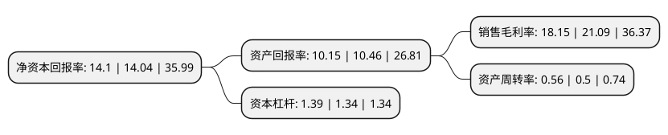

> 本页面由自动化程序生成于 2022年5月20日 01:19
> 内容可能存在错误，如有bug请提交issue至：https://github.com/Eroleice/doc-pi/issues
{.is-warning}

# 上市公司基本情况

## 基本资料

朗新科技集团股份有限公司（以下简称“朗新科技”）成立于2003年05月07日，无锡市。于2017年08月01日在深交所创业板上市。

朗新科技注册资本104,556.312万元，公司业务主要集中于电力信息化行业的用电领域，产品主要包括用电信息采集，远程实时费控，营销业务应用，客户服务管理，服务品质评价，计量生产调度，电能服务管理，营销稽查监控，农电生产管理等，纵向上覆盖输电，配电及电力调度智能化业务领域;横向上已进入燃气，水务及其他公用事业领域。以下是详细信息：

- 公司名称: 朗新科技集团股份有限公司
- 股票代码: 300682.SZ
- 所在地: 江苏 - 无锡市
- 成立日期: 2003年05月07日
- 注册资本: 104,556.312万元
- 法定代表人: 郑新标
- 主营业务: 公司业务主要集中于电力信息化行业的用电领域，产品主要包括用电信息采集，远程实时费控，营销业务应用，客户服务管理，服务品质评价，计量生产调度，电能服务管理，营销稽查监控，农电生产管理等，纵向上覆盖输电，配电及电力调度智能化业务领域;横向上已进入燃气，水务及其他公用事业领域
- 公司官网: www.longshine.com
- 公司介绍: 公司是一家专注于公用事业领域业务信息化系统的技术与服务提供商。公司业务主要集中于电力信息化行业的用电领域，产品主要包括用电信息采集、远程实时费控、营销业务应用、客户服务管理、服务品质评价、计量生产调度、电能服务管理、营销稽查监控、农电生产管理等，纵向上覆盖输电、配电及电力调度智能化业务领域；横向上已进入燃气、水务及其他公用事业领域。此外，公司通过与支付宝等第三方支付平台合作，建设基于互联网的公用事业电子账单处理与支付(EBPP)平台，为消费者提供便捷的能源及其他公用事业缴费服务、消费信息服务，致力于成为能源互联网及其他公用事业服务提供商。

## 股东及高管情况

上市公司第一大股东为Yue Qi Capital Limited，持股139,474,840股，占比13.3%，**疑似为**上市公司实际控制人。

截至2022年04月26日，上市公司的前十大股东中，共有1名自然人股东，7名机构股东，2个海外主体，其中5%以上大股东共有5名。上市公司前十大股东明细如下：

> 未能通过持股比例判定出上市公司实际控制人（持股30%以上）
> 可能存在通过间接持股、联合持股、协议控制等方式拥有实际控制权的主体，具体请参考上市公司定期公告！
{.is-warning}

> 截至2022年04月26日，上市公司前十大股东信息如下：

| 股东名称 | 持股数量（股） | 持股比例 |
| --- | --- | --- |
| Yue Qi Capital Limited | 139,474,840 | 13.3% |
| 无锡朴华股权投资合伙企业(有限合伙) | 126,402,660 | 12.05% |
| 上海云鑫创业投资有限公司 | 116,099,800 | 11.07% |
| 香港中央结算有限公司(陆股通) | 87,234,786 | 8.32% |
| 上海云钜创业投资有限公司 | 63,492,063 | 6.05% |
| 无锡群英股权投资合伙企业(有限合伙) | 50,640,120 | 4.83% |
| 徐长军 | 38,286,207 | 3.65% |
| 无锡杰华投资合伙企业(有限合伙) | 34,849,126 | 3.32% |
| 无锡曦杰智诚投资合伙企业(有限合伙) | 34,177,777 | 3.26% |
| 无锡易朴投资合伙企业(有限合伙) | 33,872,619 | 3.23% |

## 利润表分析

上市公司2021年总收入为46.39亿元，净利润为8.41亿元，实现盈利。

## 杜邦分析

> 数据列示周期：2021年 | 2020年 | 2019年
{.is-info}

上市公司的净资产收益率在近一年有所上升，上升幅度为0.43%，其变化情况分解如下：
- 上市公司的销售毛利率在近一年下降了-13.94%，可能是生产效率的下降、商品原材料价格上涨或商品价格的下跌所致。
- 上市公司的资产周转率在近一年上升了12%，可能是源自于更快的销售回款或库存管理效果提升。
- 上市公司的财务杠杆比率在近一年上升了3.73%，可能是增加负债扩大生产规模。

