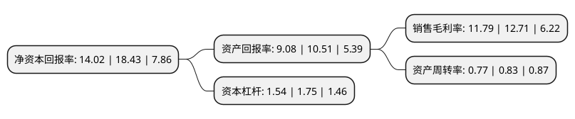

> 本页面由自动化程序生成于 2022年5月20日 01:19
> 内容可能存在错误，如有bug请提交issue至：https://github.com/Eroleice/doc-pi/issues
{.is-warning}

# 上市公司基本情况

## 基本资料

广州赛意信息科技股份有限公司（以下简称“赛意信息”）成立于2005年01月10日，广州市。于2017年08月03日在深交所创业板上市。

赛意信息注册资本39,840.257万元，主要业务:(1)面向制造，零售，服务行业的集团及大中型客户提供基于管理软件的解决方案咨询及实施开发服务;(2)相关管理软件的专业维护服务;(3)相关软硬件的销售业务。其中，企业管理软件领域的解决方案咨询及实施开发服务主要是面向制造，零售，服务行业的信息化及其应用领域，向客户提供从管理咨询，系统规划，软件实施，二次开发的整体解决方案。主要产品:(1)企业资源计划(ERP)领域的实施开发服务，(2)客户关系管理(CRM)领域的实施开发服务，(3)供应商关系管理(SRM)领域的实施开发服务，(4)商务智能(BI)领域的实施开发服务，(5)制造执行系统(MES)及其实施开发服务，(6)企业移动应用平台及其实施开发服务以下是详细信息：

- 公司名称: 广州赛意信息科技股份有限公司
- 股票代码: 300687.SZ
- 所在地: 广东 - 广州市
- 成立日期: 2005年01月10日
- 注册资本: 39,840.257万元
- 法定代表人: 张成康
- 主营业务: (1)面向制造，零售，服务行业的集团及大中型客户提供基于管理软件的解决方案咨询及实施开发服务;(2)相关管理软件的专业维护服务;(3)相关软硬件的销售业务其中，企业管理软件领域的解决方案咨询及实施开发服务主要是面向制造，零售，服务行业的信息化及其应用领域，向客户提供从管理咨询，系统规划，软件实施，二次开发的整体解决方案主要产品:(1)企业资源计划(ERP)领域的实施开发服务，(2)客户关系管理(CRM)领域的实施开发服务，(3)供应商关系管理(SRM)领域的实施开发服务，(4)商务智能(BI)领域的实施开发服务，(5)制造执行系统(MES)及其实施开发服务，(6)企业移动应用平台及其实施开发服务
- 公司官网: www.chinasie.com
- 公司介绍: 公司成立于2005年，是一家专业的企业信息化管理软件解决方案及服务提供商，专注于面向制造、零售、服务等行业领域的集团及大中型客户提供完整的信息化及智能制造解决方案产品及相关实施服务。公司的服务领域自最初的大型核心ERP解决方案，逐渐横向向企业供应链上下端的供应商关系管理及客户关系管理领域解决方案延伸；并通过与国外厂商开展合作及自主研发产品双路径发展，自业务运营层解决方案垂直发展下沉至生产执行层解决方案，提供自研发仿真设计-车间制造执行-设备互联-物流管理一体化的智能制造领域解决方案。公司是国家高新技术企业、广东省诚信示范企业、广州市重点软件企业、广州市科技小巨人企业、企业信用评价AAA级信用企业。

## 股东及高管情况

上市公司第一大股东为张成康，持股57,140,709股，占比14.34%，**疑似为**上市公司实际控制人。

截至2022年05月13日，上市公司的前十大股东中，共有5名自然人股东，1名机构股东，3个产品账户，1个海外主体，其中5%以上大股东共有4名。上市公司前十大股东明细如下：

> 未能通过持股比例判定出上市公司实际控制人（持股30%以上）
> 可能存在通过间接持股、联合持股、协议控制等方式拥有实际控制权的主体，具体请参考上市公司定期公告！
{.is-warning}

> 截至2022年05月13日，上市公司前十大股东信息如下：

| 股东名称 | 持股数量（股） | 持股比例 |
| --- | --- | --- |
| 张成康 | 57,140,709 | 14.34% |
| 佛山市美的投资管理有限公司 | 41,990,400 | 10.54% |
| 刘伟超 | 28,091,840 | 7.05% |
| 刘国华 | 20,893,760 | 5.24% |
| 欧阳湘英 | 18,573,280 | 4.66% |
| 东方证券股份有限公司-中庚价值先锋股票型证券投资基金 | 15,184,542 | 3.81% |
| 曹金乔 | 14,394,560 | 3.61% |
| 全国社保基金一一零组合 | 9,173,032 | 2.3% |
| 广发基金管理有限公司-社保基金四二零组合 | 8,194,700 | 2.06% |
| UBS AG | 4,310,522 | 1.08% |

## 利润表分析

上市公司2021年总收入为19.34亿元，净利润为2.28亿元，实现盈利。

## 杜邦分析

> 数据列示周期：2021年 | 2020年 | 2019年
{.is-info}

上市公司的净资产收益率在近一年有所下降，下降幅度为-23.93%，其变化情况分解如下：
- 上市公司的销售毛利率在近一年下降了-7.24%，可能是生产效率的下降、商品原材料价格上涨或商品价格的下跌所致。
- 上市公司的资产周转率在近一年下降了-7.23%，可能是源自于更慢的销售回款或库存管理效果下降。
- 上市公司的财务杠杆比率在近一年下降了-12%，可能是减少负债降低财务费用。

