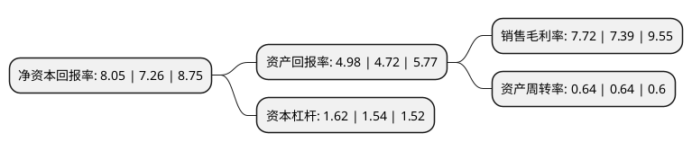

> 本页面由自动化程序生成于 2022年5月20日 01:20
> 内容可能存在错误，如有bug请提交issue至：https://github.com/Eroleice/doc-pi/issues
{.is-warning}

# 上市公司基本情况

## 基本资料

湖南科创信息技术股份有限公司（以下简称“科创信息”）成立于1998年01月13日，长沙市。于2017年12月05日在深交所创业板上市。

科创信息注册资本15,965.69万元，主营业务:软件开发，系统集成，IT运维。主要产品:智慧政务，行业应用等。以下是详细信息：

- 公司名称: 湖南科创信息技术股份有限公司
- 股票代码: 300730.SZ
- 所在地: 湖南 - 长沙市
- 成立日期: 1998年01月13日
- 注册资本: 15,965.69万元
- 法定代表人: 费耀平
- 主营业务: 主营业务:软件开发，系统集成，IT运维主要产品:智慧政务，行业应用等
- 公司官网: www.chinacreator.com
- 公司介绍: 公司成立于1998年，是国内智慧政务及智慧企业领域的信息化综合服务提供商，主要致力于为政企客户提供集软件开发、系统集成、IT运维等于一体的信息化综合解决方案。公司注重在云计算、大数据、物联网等领域的技术研究及产品创新，经过多年的研发投入，已经形成了集传感器数据采集与集成、基础设施集约化管理、数据资源智能化处理、业务应用敏捷化开发等功能于一体的核心技术体系及支撑平台，并以此为基础，针对政企客户的不同需求，开发了多类智慧政务及智慧企业解决方案，客户覆盖湖南、湖北、云南、河南等多省党政机关及下属国土、公安、财政、税务、环保、卫生、教育等各级政府部门，并为中国铁路总公司、中国移动、中国联通、中国电信、中联重科、云南冶金、中玻集团等不同行业领域龙头企业提供了多项信息化综合解决方案。公司解决方案产品曾获得湖南省科技进步奖、国家重点新产品、中国优秀测绘工程奖、中国工业软件杰出贡献奖、中国十佳电子政务解决方案称号、2016最佳智慧城市解决方案提供商奖等奖项，公司荣获国家高新技术企业、国家火炬计划软件产业基地骨干企业、中国服务外包成长型100强企业等诸多荣誉，是首届湖南省最具成长性非公有制企业。

## 股东及高管情况

上市公司第一大股东为湖南财信金融科技服务有限公司，持股21,436,424股，占比13.41%，**疑似为**上市公司实际控制人。

截至2022年03月31日，上市公司的前十大股东中，共有7名自然人股东，3名机构股东，其中5%以上大股东共有5名。上市公司前十大股东明细如下：

> 未能通过持股比例判定出上市公司实际控制人（持股30%以上）
> 可能存在通过间接持股、联合持股、协议控制等方式拥有实际控制权的主体，具体请参考上市公司定期公告！
{.is-warning}

> 截至2022年03月31日，上市公司前十大股东信息如下：

| 股东名称 | 持股数量（股） | 持股比例 |
| --- | --- | --- |
| 湖南财信金融科技服务有限公司 | 21,436,424 | 13.41% |
| 费耀平 | 12,029,904 | 7.53% |
| 李杰 | 11,854,986 | 7.42% |
| 李建华 | 10,658,977 | 6.67% |
| 刘星沙 | 10,088,377 | 6.31% |
| 中南大学资产经营有限公司 | 7,078,587 | 4.43% |
| 刘应龙 | 6,389,145 | 4% |
| 罗昔军 | 1,436,893 | 0.9% |
| 徐晓洁 | 1,206,508 | 0.75% |
| 长沙金信置业控股有限公司 | 1,168,400 | 0.73% |

## 利润表分析

上市公司2021年总收入为4.96亿元，净利润为0.38亿元，实现盈利。

## 杜邦分析

> 数据列示周期：2021年 | 2020年 | 2019年
{.is-info}

上市公司的净资产收益率在近一年有所上升，上升幅度为10.88%，其变化情况分解如下：
- 上市公司的销售毛利率在近一年上升了4.47%，可能是生产效率的提升、商品原材料价格下跌或商品价格的上涨所致。
- 上市公司的资产周转率在近一年下降了0%，可能是源自于更慢的销售回款或库存管理效果下降。
- 上市公司的财务杠杆比率在近一年上升了5.19%，可能是增加负债扩大生产规模。

