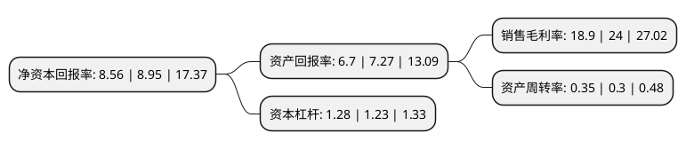

> 本页面由自动化程序生成于 2022年5月20日 01:20
> 内容可能存在错误，如有bug请提交issue至：https://github.com/Eroleice/doc-pi/issues
{.is-warning}

# 上市公司基本情况

## 基本资料

成都唐源电气股份有限公司（以下简称“唐源电气”）成立于2010年11月05日，成都市。于2019年08月28日在深交所创业板上市。

唐源电气注册资本8,276.897万元，公司是一家轨道交通运营维护解决方案提供商，主营业务为轨道交通行业牵引供电和工务工程检测监测及信息化管理系统的研发，制造和销售。主要产品是牵引供电检测监测系统，工务工程检测监测系统，信息化管理系统。以下是详细信息：

- 公司名称: 成都唐源电气股份有限公司
- 股票代码: 300789.SZ
- 所在地: 四川 - 成都市
- 成立日期: 2010年11月05日
- 注册资本: 8,276.897万元
- 法定代表人: 周艳
- 主营业务: 公司是一家轨道交通运营维护解决方案提供商，主营业务为轨道交通行业牵引供电和工务工程检测监测及信息化管理系统的研发，制造和销售主要产品是牵引供电检测监测系统，工务工程检测监测系统，信息化管理系统
- 公司官网: www.cdtye.com
- 公司介绍: 公司是一家轨道交通运营维护解决方案提供商，主营业务为轨道交通行业牵引供电和工务工程检测监测及信息化管理系统的研发、制造和销售。自成立以来，经过持续不断的技术创新、技术积累和人才培养等工作，公司已形成了较为成熟完善的产品研发、生产和服务体系，其技术实力和销售业绩均居行业前列。公司的主要产品是牵引供电检测监测系统、工务工程检测监测系统、信息化管理系统，公司产品定制化特点突出。我国轨道交通线网规模庞大，运行环境复杂，牵引供电、轨道等关键设施及车辆设备的运行状态呈现形态多、结构差异大等特征，公司需要针对客户不同的运营要求和管理特点提供运营维护解决方案，在产品使用过程中还需要提供个性化的技术咨询和维修服务。公司所处的轨道交通行业属于国家重点鼓励发展的战略性新兴产业，公司产品是国家发改委《战略性新兴产业重点产品和服务指导目录(2016年版)》所列示的重点产品，产品附加值高。受国家相关产业政策的大力支持及公司竞争力的不断提升，未来公司盈利能力水平将进一步提升。

## 股东及高管情况

上市公司第一大股东为周艳，持股30,780,000股，占比37.19%，为上市公司实际控制人。

截至2022年03月31日，上市公司的前十大股东中，共有8名自然人股东，2名机构股东，其中5%以上大股东共有3名。上市公司前十大股东明细如下：

> 截至2022年03月31日，上市公司前十大股东信息如下：

| 股东名称 | 持股数量（股） | 持股比例 |
| --- | --- | --- |
| 周艳 | 30,780,000 | 37.19% |
| 成都金楚企业管理中心(有限合伙) | 10,800,000 | 13.05% |
| 成都唐源企业管理中心(有限合伙) | 7,657,966 | 9.25% |
| 周兢 | 2,700,000 | 3.26% |
| 陈悦 | 2,700,000 | 3.26% |
| 杨频 | 2,109,600 | 2.55% |
| 佘朝富 | 1,524,600 | 1.84% |
| 王瑞锋 | 1,494,900 | 1.81% |
| 金友涛 | 1,384,260 | 1.67% |
| 魏超然 | 400,100 | 0.48% |

## 利润表分析

上市公司2021年总收入为3.51亿元，净利润为0.66亿元，实现盈利。

## 杜邦分析

> 数据列示周期：2021年 | 2020年 | 2019年
{.is-info}

上市公司的净资产收益率在近一年有所下降，下降幅度为-4.36%，其变化情况分解如下：
- 上市公司的销售毛利率在近一年下降了-21.25%，可能是生产效率的下降、商品原材料价格上涨或商品价格的下跌所致。
- 上市公司的资产周转率在近一年上升了16.67%，可能是源自于更快的销售回款或库存管理效果提升。
- 上市公司的财务杠杆比率在近一年上升了4.07%，可能是增加负债扩大生产规模。

